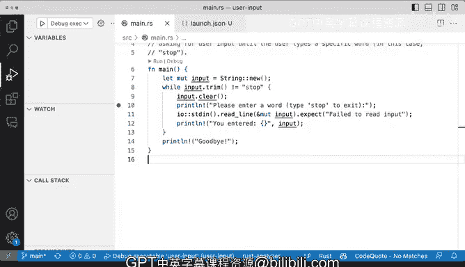

# 杜克大学《rust编程（基础）｜rust programming》中英字幕 - P73：73_04_07_演示：使用调试器.zh_en - GPT中英字幕课程资源 - BV1dx4y1b7Vo

I want to show you a little bit about debugging in this happened while I was trying to come up with a few examples for this course。

 Now this is not exactly the library that we were seeing at the beginning of the lesson。

 but it' is still worthwhile and it's easier to work with because we have a main function and we don't have any tests right now for a CI tools or u package。

 So the first thing that we want to do here is we it's slightly similarre gonna read from standard in we're to read the line and we're going to print out like we've seen or this already。

 like if I'm saying stop， it stops or we we're going to figure out what's going on。

 So we're going to run it and。

If I say stop， it will exit right so if I say stop perfect I enter stop and says goodbye and it exits great。

 but what if I want to continue going？Let's try that case out。

 So I'm gonna to say I don't want to want to say continue going。 Okay。

 and now I want to stop and stop any iterations， but oh like what's going on， No。

 I want to stop and it's not stopping and I keep saying stop but can you see that this is just a things。

 the string is not getting cleared。 So what are we gonna do when I say control C and well。

 I'm not exactly what I' want to do like this looks okay to me what could possibly be the problem。

 So I'm thinking that the input variable is getting polluted。 So I can say input that clear。

 So let's actually try that one out。 I'm to say， yes， I want to say for example， stop。

And now it doesn't want to exit。 So stop again。Is not a pending。But I can't seem to do anything。

 So I was in this position。And so what is going on if I'm doing the clear， this is going。

 this is starting right here and it's doing the clear when when the loop starts again。

 I should be good to go。 So what is exactly going on here， Well， this is kind of tricky so。

This is where we need a debugger and this is where text data or 90 will shine。

 and we'll see how useful it is for what we want to do。

 So let's very quickly install an extension here to help us out。

 I highly recommend Let's actually make this a slightly bigger。

 I highly recommend looking for LLDB and installing code LLDB。

 There might be different extensions for these and different debuggers for what you want to do。

 Let's click on this one。And let's take a look， a native debugger powered by LLDB debug C++ rust in our compile languages。

 so you will get a lot of things that you can do here。

Let's quickly go ahead and install that and it seems like now it's good to go。 it has installed。

 so now we will be able to do something different here we've very frequently used run but we haven't used debug yet。

 so how does debug work if I click debug。It will say， hey， do you want to run and debug these。

I'm going to actually try to make this slightly。Slightly smaller。This is the debug console。

 and you will see that well， this is running， but nothing else is happening。

 So what's what's the deal， We have some controls here。

 we have some controls here and now this is running。

 So what are some of the things that we have we're going to be able to do well。

 we're going to be able to watch variables。 we're going see if anything specific comes up and we're going to see the call stack。

 So I've stopped there right now， you can see that there's an ad configuration。

 but we're going launch the debugger once again， this looks okay and we're going。Back to main arrest。

 And then when I say， I'm going to debug this。Alright， so now that I have the launch configuration。

 I'm going to click， click debug and now we we get the please enter a word type stop to exit。

 So what's the deal here I'm going to say I'm going to put the put here I'm going to say yeah， stop。

Nope， nothing going on， exit， nothing goes on。But then I have this control So what is what is going on so we can disconnect。

 we can stop the debugger， we can restart it so far so far nothing happens now you can see I restarted it and can say a stop。

 Nothing happens again， I'm debugging why is this so unusful so let me stop these。

And let me show you what you need to do in this case。

 I'm going to actually make these slightly smaller。

 And do you see those red dots that appear right here。

 I can actually stop right there for a debugger。 I'm going to say， I want to be。

I want to be right here。 so when I run the debugger， it will stop right there。

 So I'm going to say debug。And look at that。 do you see that highlight is pretty magical。 Now。

 variables is going to get populated。 Now， input is empty。 So what is going on？

 we can see the call stack， all of the things that are getting called。

 you can see that the main and the start are all all the way at the bottom。

 We can see some of the static and registers。 So that is pretty good we have the terminal。

 we have the problems， So we are going to we have now these controls available。 So what are these。

 Well you can step over it。 right That means that we'll execute this and we'll go to the next line。

 you can step into it。 That means that we'll go into the specifics of print line in this case。

 we don't want that。 we want to go to the next line。

 let's go to the next line Oh now this is getting executed。

 So let's actually go and say for example stop。So I'm going to say stop and and then I'm going to go to the next line and what does it happen here。

 Well， we can see stop。 Okay， that's good。 Alright。

 so keep going input that input that clear gets called。

 So now we're going back to the beginning Do you see what happened to the input right there。

 it got cleared out。 there's nothing in。 that is why line number8 is getting highlighted and that is why this is not working because input is no longer it it's empty and why it's empty because I call clear in the wrong spot。

 it's line number 12 So line number12 is making this go away regardless of what I have。

 So if if I hit play will stop again in the red button。 I'm going say yes， I want to step over that。

 Im gonna to。Ty in stop again， and I'm going to hop over the next line。Yes， and this is a stop。

 watch the input how it gets cleared， I'm going to go all the way to the top， then it goes clear。

 clear again。So that is problematic and this is empty。 So now that's the debugger。

 it's all like telling me exactly what I need to do and I can restart here over。

 but I don't want to restart over。 I want to get fix these problem so let's very quickly let's very quickly fix what we have here so I'm I'm going stop the debugger。

 I know that the input clear is the problem。 so I'm going to stop the debugger and I'm going to cut this one out。

 I'm going put it right here。At the very top。 So now let's see what happens when I run the debugger again。

 So when I run the debug。Perfect please please enter a word。 I'm gonna step over it。 Yes。

 I want to say stop so that you don't do anything else andqui line you enter is is this one。

 the input gets populated。 I'm going jump over that。

 And when it goes all the way to input that trim on line number 8， you can see that input is stop。

 So what's going to happen。 Let's see we are going to get the goodbye。 So exactly what we want it。

 so we fixed our bug all because of the debugger。 And at the end。

 I press play so you can see that everything's good to go now。

 So very good we were able to use the debugger。 it is very。

 very useful to have a debugger and we figure it out how we can make use of that and make use of Vicious Studio code to help us out。

