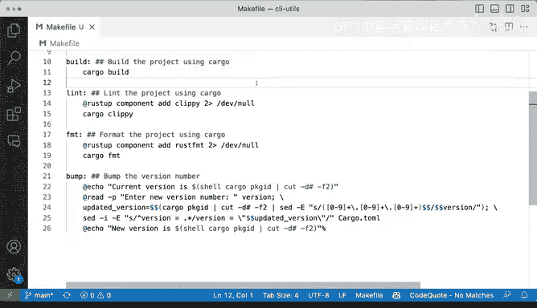

# Rust编程（基础）：P74：使用Makefile自动化构建 🛠️


在本节课中，我们将学习如何使用Makefile来简化和标准化Rust项目的构建与管理流程。Makefile可以帮助我们抽象出常用的命令，使得项目构建过程更加一致和自动化，特别是在团队协作或持续集成环境中。

## 概述

上一节我们介绍了基本的Cargo工具链使用。本节中，我们来看看如何通过创建一个Makefile来封装这些命令，从而建立一个标准化的项目构建流程。

## 创建基本Makefile目标

首先，我们创建一个简单的Makefile，定义一些基本的目标（targets）。目标是Makefile中的可执行单元，类似于子命令。

以下是两个基本目标示例：

*   **`clean`**: 清理项目构建产物。
    ```makefile
    clean:
        cargo clean
    ```
*   **`build`**: 构建项目。
    ```makefile
    build:
        cargo build
    ```

在终端中，你可以通过运行 `make clean` 或 `make build` 来执行这些目标。执行 `make clean` 会运行 `cargo clean` 并删除 `target` 目录；执行 `make build` 则会运行 `cargo build` 进行项目编译。

## 改进：添加帮助目标

目前，我们可能不清楚Makefile中有哪些可用的目标。为了解决这个问题，我们可以设置一个默认目标并创建一个帮助（`help`）目标。

首先，我们指定使用的Shell并设置一个默认的“伪目标”（`.PHONY`），这样当不提供任何参数运行 `make` 时，会执行默认操作。

```makefile
SHELL := /bin/bash
.PHONY: help
help:
```

我们希望 `make` 或 `make help` 能列出所有目标及其描述。以下是一个实现此功能的 `help` 目标：

```makefile
help: ## 显示此帮助信息
    @grep -E '^[a-zA-Z_-]+:.*?## .*$$' $(MAKEFILE_LIST) | sort | awk 'BEGIN {FS = ":.*?## "}; {printf "\033[36m%-20s\033[0m %s\n", $$1, $$2}'
```

这个命令会解析Makefile本身，寻找以 `##` 注释作为描述的目标，并以彩色格式打印出来。现在，我们需要为其他目标添加描述。

## 为目标添加文档

为了使帮助信息生效，我们需要在每个目标后面使用 `##` 添加描述。

以下是添加了描述的目标：

*   **`clean`**: 使用Cargo清理项目。
    ```makefile
    clean: ## 使用Cargo清理项目
        cargo clean
    ```
*   **`build`**: 使用Cargo构建项目。
    ```makefile
    build: ## 使用Cargo构建项目
        cargo build
    ```
*   **`clippy`**: 使用Clippy进行代码检查。
    ```makefile
    clippy: ## 使用Clippy进行代码检查
        cargo clippy
    ```
*   **`format`**: 使用Cargo格式化代码。
    ```makefile
    format: ## 使用Cargo格式化代码
        cargo fmt
    ```

现在，运行 `make help` 或直接运行 `make`，就会看到一个清晰、文档化的目标列表。

## 增强健壮性：处理依赖

某些工具（如 `rustfmt` 或 `clippy`）可能没有预先安装。在自动化环境（如CI/CD管道）中，我们希望命令能自动处理这些依赖。

例如，我们可以改进 `format` 目标，确保 `rustfmt` 组件已安装：

```makefile
format: ## 使用Cargo格式化代码
    rustup component add rustfmt 2>/dev/null || true
    cargo fmt
```

`2>/dev/null` 将错误输出重定向到空设备，`|| true` 确保即使组件已安装，命令也不会失败。这样，无论在哪种系统上运行 `make format`，它都能“正常工作”。

你可以对 `clippy` 目标进行类似的增强。

## 高级自动化：版本号管理

Makefile的强大之处在于可以封装更复杂的逻辑。例如，我们可以创建一个目标来自动更新项目的版本号。

假设我们想更新 `Cargo.toml` 中的版本。以下是一个 `bump` 目标的示例：

```makefile
bump: ## 交互式地提升项目版本号
    @echo "Current version is $$(cargo pkgid | cut -d# -f2)"
    @read -p "New version: " new_version; \
    old_version=$$(cargo pkgid | cut -d# -f2); \
    sed -i.bak "s/version = \"$$old_version\"/version = \"$$new_version\"/" Cargo.toml; \
    echo "New version is $$(cargo pkgid | cut -d# -f2)"
```

这个脚本会：
1.  显示当前版本。
2.  提示用户输入新版本。
3.  使用 `sed` 命令在 `Cargo.toml` 中替换版本号，并自动创建一个备份文件（`Cargo.toml.bak`）。
4.  显示更新后的版本。

运行 `make bump` 即可交互式地完成版本升级，这比手动编辑文件更可靠，尤其适合自动化流程。

## 总结

本节课中我们一起学习了如何为Rust项目创建和使用Makefile。我们从一个简单的命令封装开始，逐步添加了帮助文档、依赖处理以及复杂的版本管理自动化。

关键要点包括：
*   Makefile可以**标准化**你的构建命令（`build`, `test`, `clean`）。
*   **`help` 目标**能极大提升Makefile的可用性。
*   通过处理工具链依赖（如 `rustup component add`），可以使Makefile在**各种环境（包括CI/CD）中更健壮**。
*   Makefile能封装**复杂操作**（如版本号更新），实现一键自动化。



即使你只实现一个带帮助的简单Makefile，也能为你管理Rust项目（乃至其他语言的项目）带来一致性，并为后续集成到持续集成/持续交付系统打下良好基础。