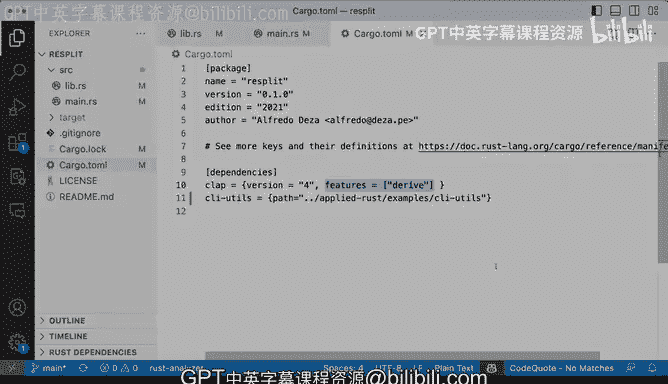

# 杜克大学《rust编程（基础）｜rust programming》中英字幕 - P77：77_04_03_演示：使用Cargo管理依赖.zh_en - GPT中英字幕课程资源 - BV1dx4y1b7Vo

We've made a lot of progress in our library， a Ru library。 we've added a function here。

 which is the RE standard in and now it's time like it's very well organized， we have the basic。

 we have the make file， we don't have dependencies yet。But now that we have this here。

 what I want is to actually use what we've created right there like the read standard in。

 remember weed extracted that function away from another package that I had So how does how does this work。

 well we're going to go back to this other project and then pull these pull these in。

 Now I know what the path is for for this library， this Ci u。

 So let's go ahead and see how we can do that。 So this is the re split project。

 remember if I go to Libs， the read standard in used to be here。

 So I'm going to instead of like call it right there。

 this is read standard in and that is let's check where thats getting used。

 It's not getting used here it's actually let's see mains。So in main that arrest。

 you can see it comes right there。So instead of doing that。

 we are going to go ahead and to try it out， let's just comment this out。

 I'm going save that as soon as I say that we'll get a lot of red and the reason is because now read standardering is not being is not available from the create resp。

 this is the resp project， the cr and so this is no longer available so that's fine。

s how can we get the read standarding function from the other project that we have right from this one。

 the Ci u so we we have it right there， we have even the examples on how to use it。

 how can we do that So let's take a look at the cargo that Tom file in the cargo that Tom file we have the ability to the not only the details of the package but like the version and what the name is but we also can。

Set the dependencies here so in this case this project the re split is using clap。

 which is a command line tool framework that allows you to build command line tools very easily and that's fine you can see once the version 4 and some features。

But there's a different way that we can actually define a library。That has not yet been released。

 I have not released my library。 so how can I do that。

 Well I can say C I us and I want to do open the curly brackets and I can also passing a path so I can say path equals。

And then pass in the actual path to CLI Us project CI Us cr that I've built I when I use a relative path for these and I know that in the parent directory and that's in applied rust which I built and then I have examples and then CLI Us so if I do that and save it you will see rust analyzer did a lot of work there things are looking good okay here lets let's one more time figure out what is happening right there I'm defining CI Us as a dependencym because this is unreleased I'm going to use a path and I'm passing a relative path the points to the destination of the CLI Us project and the path is let's see applied rust。

And examples and C I U。 And that's my C I U crate。 So perfect。 So I verify that works。

 The dependencies look okay。 Next step， I can go to。Not live that rest。 This is still commented out。

 but my main that rest is still all messed up。 So what I'm going to do is I am going to get this read standard in。

I'm going to do that from let's to use CI us and then read standard in and then I am going to define it again like that。

 and then that all works so now this is getting pulled from the library project that we just created and built and worked and document it on these other path and that's getting pulled in by cargo。

 so that is a cool way that you can develop your libraries and pull them from elsewhere。

 especially if you haven't published them yet another way that you can do these and that's more in depth。

 you can use Git as an identifier， it will pull it from the repository。

 you can even specify specific branches otherwise you can if you're looking forward to getting published。

Polish dependencies like Claap， you can definitely do that by specifying the version and some of the features as well。

