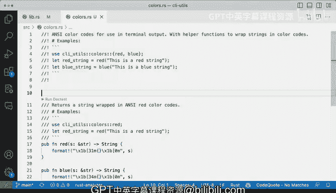

# Rust编程（基础）：P79：使用文档测试验证代码 📝


在本节课中，我们将学习Rust中一个强大的功能——文档测试。我们将了解如何通过编写文档注释来同时生成文档和可执行的测试用例，从而确保代码示例的正确性，并验证模块的公开接口是否按预期工作。

## 概述

上一节我们介绍了如何为代码添加文档注释。本节中我们来看看如何利用这些注释来验证代码功能。当我们在库项目中编写了大量函数和模块，却没有一个可执行的 `main` 函数时，文档测试提供了一种便捷的方式来确保一切工作正常。

## 文档测试的基本原理

我们通过在代码上方添加三个反斜杠 `///` 来编写文档注释。这种注释不仅能生成项目文档，其内部的代码示例还可以被自动执行和测试。这就是所谓的“文档测试”。

例如，以下是一个文档注释，它包含了一个使用 `utils::colors::red` 函数的示例：
```rust
/// 这个函数返回红色字符串。
/// # 示例
/// ```
/// use my_crate::utils::colors::red;
/// let red_str = red();
/// assert_eq!(red_str, "red");
/// ```
```
请注意示例中的 `use` 语句。它是必需的，因为它告诉测试运行器如何找到被测试的函数。当我们运行 `cargo test` 时，Rust会提取这些注释中的代码块，编译并运行它们，以此验证示例是否仍然有效。

## 运行文档测试

在IDE中，你可能会在文档注释旁边看到一个“Run doctest”的按钮或链接。点击它，测试结果会输出在控制台中，显示“test result: ok”或具体的失败信息。

文档测试实际上在执行我们写在注释里的例子。它验证了文档中的代码片段在当前代码环境下能够正确编译和运行。

## 文档测试的验证作用

文档测试的核心价值在于它能自动验证文档与代码的一致性。假设我们在 `lib.rs` 中公开了模块 `utils::colors`，文档示例才能正常工作。

如果我们忘记公开模块（例如，注释掉 `pub mod colors;`），文档测试将立即失败，并给出类似“file not included in module tree”的错误。这能让我们立刻发现问题。

同样，如果文档示例中调用的函数名或返回值与代码实际不符（例如，示例中写的是 `red()`，但函数返回的是 `"blue"`），文档测试也会编译失败，提示“no `red` in `colors`”。这确保了我们的文档始终是准确、可运行的。

## 模块级文档注释

除了为函数添加文档，我们还可以为整个模块添加顶层的文档注释。这使用 `//!` 符号，并放置在模块文件的开头。

以下是在 `colors.rs` 模块文件顶部添加文档的示例：
```rust
//! 颜色模块，提供终端输出用的颜色字符串。
//! 包含一些辅助函数。
//! # 示例
//! ```
//! use my_crate::utils::colors::{red, blue};
//! let r = red();
//! let b = blue();
//! assert_eq!(r, "red");
//! assert_eq!(b, "blue");
//! ```
```
模块级文档适合放置一些更综合性的示例，展示模块中多个功能的协同使用。添加模块级文档后，在 `lib.rs` 中导入该模块时，也会出现“Run doctest”的选项，点击它可以运行该模块内所有的文档测试。

## 文档测试的优势

以下是文档测试带来的主要好处：

1.  **确保文档准确性**：代码变动时，过时的文档示例会导致测试失败，迫使开发者更新文档。
2.  **提供可执行示例**：用户可以直接复制文档中的代码并运行，降低了学习成本。
3.  **辅助开发验证**：在编写正式的单元测试或集成测试之前，开发者可以通过文档测试快速验证接口的基本功能。
4.  **增强信心**：在重构或移动代码时，运行文档测试可以快速确认公开API是否仍然可用，包括在 `lib.rs` 主模块中定义的内容。

## 总结



本节课中我们一起学习了Rust的文档测试功能。我们了解到，通过编写包含代码示例的 `///` 注释或 `//!` 模块注释，我们不仅能生成漂亮的文档，还能创建一套可自动执行的测试用例。这套机制强制保证了文档示例的正确性，并在开发过程中为我们提供了快速的反馈，是编写高质量、可维护Rust库的重要工具。