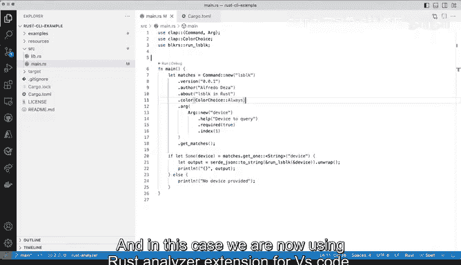
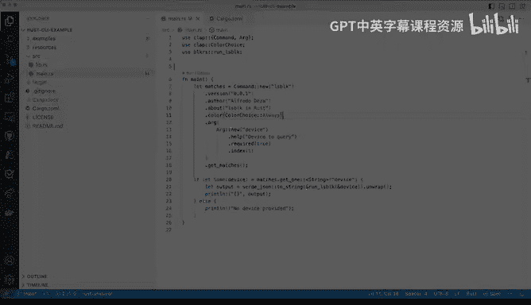

# 杜克大学《rust编程（基础）｜rust programming》中英字幕 - P7：07_01_07_演示：使用Rust分析器.zh_en - GPT中英字幕课程资源 - BV1dx4y1b7Vo

The next thing that we want to do now that the rust analyzer is installed is how would I use it。

 what are some of the benefits So without getting into the details yet of what these actual piece of code is doing。

 let's go and start a plane around so we have some of these statements might look weird if you've never've seen rust before which is fine but let's just assume that I have no idea what these things are so I'm going to hover and I'm getting a little bit of information it that there's nine implementations of these so I'm getting some extra information。

 It seems that these represents the color preferences program output that sounds pretty useful if I'm not entirely sure So that's definitely like if I click here on implementations I'll get these up anywhere it tells me where these things are coming from all of these are meant to give you extra context and。

It is useful to have there so when I close this out it open up this other file you can see here there's a new tab I I close it out because I don want to go through those details so that is pretty need another thing that will start happening is that I can get more context when I'm trying to find where things are coming from so let's just say for example if I want to do something with clap let's just reuse some of the examples here again don't worry about the details on how this is working and what does the use keyword do exactly but let's just figure out how the auto completion works so you'll see here there's a lot of different things to choose from and you will get the documentation right there when you double click that double column you will get the examples you can get pretty good。

mentation over here that can give you extra context on what the things are that you want to use。

 So in this case， if I want to use art， the abstract representation of a commandline argument。

 So clap behind the scenes not behind the scenes， but it' actually a library So it's something that we're going to use for building a command line tool that you can actually use is an extension It's a package rather than extension that will allow us to help us out to build commandline tools the specifics are not important。

 but you can see here this is already pretty cool because I I'm getting a lot of information here that that is pretty pretty useful So this is all possible because of the rust analyzer and it is pretty pretty good。

 So beyond that like if I click like say for example。

 that one I could do that and that's fine that's pretty cool but another thing that is very useful is to see what are the errors that I'm going come up with。

 So say for example。if I have a typo here， this is help how about I call it like uppercase help and then I save that you will immediately tell me it like this is probably not very good and I'm getting or diagnostic information So there is a method with a similar name underscore help and this is coming from you can see rust C So behind the scenes rust analyzer is calling rust C and all these other tools to provide me context on what is it that I'm doing wrong so pretty good help error here because I know I half a typo so let me let me do that and save it and as soon as I save it the red underline goes away this is also pretty useful if I want to do something here that is say。

 for example， unknown and I'm going to say true。And I'm going to save that and I am going to start getting multiple red lines。

 one， this one here and another one here， because things are going to get out of hand so。

TheThe compiler and we'll see what the compiler is doing later， but the compiler is complaining。

 but I don't need to go and switch context and run the compiler or run some other external tool to get this information in the editor。

 This is what I would expect from a very good extension in this case。

 rust analyzer shines because we are not necessarily need to go back to the terminal or back to the command prompt and do some some command interaction and parse that output。

 Now， if we were so inclined to take a look at the output。

 we could click here for the compiler message。 And this is how and we'll take a look at compiler messages and error later。

 but this is what the output would look like。 So this is pretty good and again。

 we don't worry too much about the details on what things are showing up here because well learn what those mean and how to interact with those error messages later。

 it's just enough to know that the rustonr。Is very good here because it allows us to try to get these things in working order。

 So I'm going save these and get to to now a working spot another thing that I want to show you is with the dependencies if I go to cargo Ta again。

 we haven't looked into this yet。 this is a spot where you can put dependencies。

 So there's a clap is that the name of the library。 this is the version。

 So let me change to something that is very old like say， for example，2。0 I'm gonna save this。

 And as soon as I save you have to take a look here at the bottom right here you will see some output。

 So I'm gonna gonna click save and fetching metadata and stuff is happening right rust andizer is happening indexing things are happening and all of a sudden I am getting red all over。

 we have main here with red， my tap is now red。 So let's take a look and we're getting。

All kinds of different problems so what are those problems I hover again and I get an unresolved import like that's not able to get import and why is that Because I change the versions and suddenly none of these things exist because I was using an older version of the library so if I go quickly and make that update to 4。

2 as before everything goes back back to work order you can see here that the pens are pulling down and everything builds and everything is back again。

So definitely the rust analyzer has tons of features and I just show you two or three things that are very high level but are very useful and it will definitely help you in your learning journey of rust now again don't worry so much about the code just yet will just go bit by bit and in this case we are now using rust analyzer extension for VS code that will help us out。

