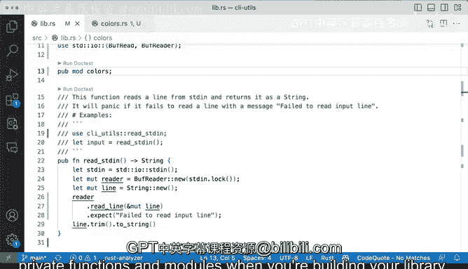

# Rust编程（基础）：P80：演示：定义公有与私有模块 🧱


在本节课中，我们将学习Rust中模块（module）的**公有（public）**与**私有（private）**访问控制。理解这个概念对于构建结构良好、封装性强的库至关重要。我们将通过代码示例，清晰地展示`pub`关键字的作用以及默认的私有行为。

## 概述

之前我们已经学习了如何验证和使用模块。本节我们将重点探讨如何控制模块、函数和数据结构的可见性。通过使用`pub`关键字，我们可以决定哪些部分可以被外部代码访问，哪些部分只能在模块内部使用。默认情况下，Rust中的所有项（item）都是私有的。

## 公有与私有的基本概念

在Rust中，`pub`是一个关键字，用于使一个模块、函数或数据结构对外部公开。这意味着它可以在定义它的模块之外被使用。

**公式/概念**：
*   **公有**：`pub` 关键字修饰。
*   **私有**：默认状态，无 `pub` 关键字。

如果一个项没有`pub`关键字，那么它就是私有的，只能在定义它的模块及其子模块内部访问。

## 演示：函数可见性

让我们通过一个具体的例子来理解。假设我们有一个公开的函数`red_string`。

```rust
pub fn red_string() -> String {
    String::from("red")
}
```

因为它是`pub`的，所以可以在模块外部被调用。

现在，如果我们移除`pub`关键字：

```rust
fn red_string() -> String { // 移除了 pub
    String::from("red")
}
```

然后运行测试（`cargo test`），测试将会失败。错误信息会指出`red_string`现在是一个私有函数。虽然我们没有显式声明它为私有，但移除`pub`关键字后，它就变成了私有的。这是Rust的默认行为：**所有项默认都是私有的**。

## 演示：模块可见性

同样的规则也适用于模块本身。如果一个模块没有被声明为`pub`，那么外部代码就无法使用它。

例如，在`lib.rs`中：
```rust
mod colors; // 这是一个私有模块
```

如果`colors`模块是私有的，那么任何尝试从`lib.rs`模块外部（例如另一个crate）通过`use crate::colors`来引入它的操作都会失败。错误信息会提示“私有模块”。

## 模块内部的可见性规则

模块内部的代码可以自由访问该模块内的所有私有项。这是一个关键点。

考虑以下在`colors`模块内部的代码：
```rust
// 在 colors 模块内部
fn red() -> String { ... } // 私有函数
fn blue() -> String { ... } // 私有函数

fn example() { // 这也是一个私有函数
    let r = red();   // 可以访问私有的 red
    let b = blue();  // 可以访问私有的 blue
}
```

`example`函数可以调用同模块内的私有函数`red`和`blue`，因为它们都在同一个作用域（`colors`模块）内。私有性主要是针对模块外部的访问限制。

## 测试与可见性

这引出了一个关于测试的常见问题。如果我们想从模块外部（例如在测试代码中）测试一个私有函数，应该怎么办？因为测试通常写在单独的`tests`目录或使用`#[cfg(test)]`，它们被视为模块外部代码。

有以下几种常见的解决方法：
1.  **将需要测试的函数设为`pub`**：这是最简单直接的方法。
2.  **将测试写在模块内部**：使用`#[cfg(test)]`在模块内部编写测试，这样测试代码就可以访问私有项。
3.  **通过公有接口测试私有逻辑**：只测试对外公开的函数，这些函数内部会调用私有逻辑。

在当前的演示中，为了确保测试通过，我们将恢复`pub`关键字。

## 库设计的考量

在构建库时，你需要仔细考虑哪些模块和函数应该公开。例如，你可能希望`colors`模块仅用于`lib.rs`内部的代码组织，而不想暴露给库的使用者。

你可以这样组织：
```rust
// 在 lib.rs 中
mod colors; // 私有模块，仅内部使用

pub fn some_public_api() {
    // 可以在内部使用 colors 模块
    let red = colors::red();
    // ...
}
```

这样，库的使用者无法直接访问`crate::colors`，但你的库内部代码可以自由使用它。这有助于保持清晰的公共API边界。

## 总结

本节课我们一起学习了Rust中公有与私有访问控制的核心机制：
1.  Rust中所有项（模块、函数、结构体等）**默认都是私有的**。
2.  使用 **`pub`关键字** 可以使一项变为公有，从而允许在定义它的模块之外被访问。
3.  模块内部的代码可以访问该模块的所有项，无论其是公有还是私有。
4.  在设计库时，需要仔细规划公有API，通过有选择地使用`pub`关键字来暴露必要的功能，同时隐藏实现细节，这有助于构建稳定、易于维护的代码库。



理解并正确运用可见性规则，是编写高质量、模块化Rust代码的关键一步。