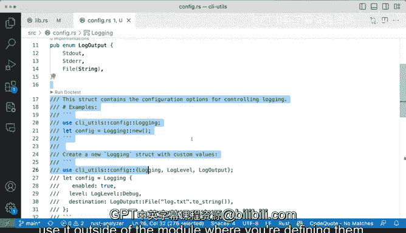

# 杜克大学《rust编程（基础）｜rust programming》中英字幕 - P81：81_04_07_演示：结构体中的私有与公有字段.zh_en - GPT中英字幕课程资源 - BV1dx4y1b7Vo

We now know how to verify things with doc test， we also know how to control publicly versus private availability or scope。

 so let's actually go ahead and create a new module is going to be called config NRS and we're going to say this module contains the configuration。

Options for the application。 and what we're going to do here is we're going to start creating a logging configuration。

 So we're going to say public inum log level， How about log level and for log level。

 We'll have debug info1 and error that looks correct to me。

 We'll start creating all of the configuration options that we want for these。

 And now we're going say how about log output。And for log output。

 we're going to have standard out standard error files string， which is a string。

 is going to say if like if we want to configure a log output to go to a path or just to standard out or just a standard error and we'll figure that we'll figure that out。

 next， we're going to have astruct called logging and're going to say yes。

 this is going to be astruct and this is going to be logging and we're going to say enabled is going to be a bull in I want to know if it's enabled or not level is going to be。

Level is going to be log level。 So we're going to reuse the inum in line 4。And finally。

 we're going to say destination is going to be the log output。

 so we can say either it's going to be the standard out standard error or going to go to a file。

 So that looks good。 How about we extend this implement implement logging。And actually。

 it is uppercase L。 And we say we add a constructor for this。 So when I say pub function new。

 we' going to try to make these very according to kind of like the normal expectations of Ra code。

 when I say self。 and we are going to return some of that。 So that looks。

 that looks very good to me by the fault is going to be info。 enable enable is going to be false。

' going to go to standard out。 So that's pretty good。 lets a little bit， a little bit off。

Documentation so that we can actually verify some of these things working。

 so we've defined certain things here。 Everything's public。 it's in configar arrest。

 let's put our configar arrest right here when I make it public for now。

 we don't need to but we're just going to make it make a publicly available So that's fine。

 we see zero implementation，01 implementation。 we're getting some curly we're getting some curly underlines。

 So here we're saying these things are not used and that's fine。

 So let's go ahead and document and get a do test coin。

 So this truck contains configuration option for bo not for application， but for controlling logging。

And we're going to say some examples of these are going to be triple backwards。

 use CI us config longing looks correct to me。 then let let config。And we can say config new。

 And that seems to me pretty correct。 And another thing that I want to do is be besides。

 besides just using this construct， I want to use an our example as well， where we can create。

With a new loginstruct with custom values right so we can try that。

 So we're going very fast here with coppilo giving us suggestions。 So we're going to say Cil config。

 We're going to use all of those and then we're going to build our structures So enabled we're going change it from false to true and we'm going to say the debug level and the log output is going to go to a log that text to string。

 and then looks great。 And I'm going to save it。 So there we go， we have we have some some examples。

 This looks very comprehensive。 if I take away the file Exper。 We have log level log output。

 We're able to to have these documentation over here。

 we produce a very nice configuration module in rust。 So let's run the doc test。

 which seems correct to me and see what happens and verify this。 So all kinds of failures here。

 So I'm scroll。😊，All the way to the top。 And we're going to get into some issues here。

Let's see it's saying that enabled is a private field。

 level is a private field and destination is a private field。

Final field destination ofstruct logging is private。

 So we're getting a lot of these things that are private。 What does that mean。

 So let's take a look here at what we have and even the the compiler is in rust and laserr is nice enough that it gets the little。

 do you see that the little red thing right there， this one， that one and that one。

 if I hover I'll get filled enabled ofstruct logging is private。

 if I do this one level is private and destination is private。 So what is going on。

What is going on here is that I have the struct， but by default， all of these fields are。Private。

That means that they are only visible for the config at RRS or the config module if I want to for those to be publicly available using this type of construction where we're importing config from CLI U and then we're constructing this login thing here。

 then it has to be publicly available， the way to fix that would be to say pub。Pub。And pop over here。

 if I do that and I run these。We will get things passing。

 No problem right now you may want to build things like so this is going to be very similar to private and public modules。

 if you say， well you know I don't want users to be fiddling around with a destination so I'm going make that private ones so you can you can do that so this example would would not work and destination will have to be different so then that's how you would tweak you have the ability to configure these with whatever type of access you want for others。

 however these things will be available if you want to have some sort of an implementation here。

 so if we have let's say a function。And we say example， logging， new， login enabled。

 we could try that and we can say。An example function， I'm going to say examples， that's right。

 triple backs use。Yeah， so we start getting into trouble because it's going to require us to do this import。

 but if we were to run this example， this would probably not a problem because we have access to these functions that if these function will destruct this public。

 but if it was like that we would be able to make it work now。If if it was like that without a pub。

 thesestruct login would only be available to anywhere within this module。

 it would be available only for example， for the fields is something similar but we're controlling the access to what things are enabled and what where is the access and where we don't have the access This is kind of tricky to verify with doc test you saw me there fumbling because like I wasn't able I have to define these use statement with the right things that I want to be pulling in into the scope so。

That is how we control the access to public and private fields and we essentially to have to get that p going if I run this do test you'll see that we're going to fail again because struggling is private。

 even if we make it public we will have to make sure that every single thing including destination。

 let's actually go ahead and do that。To be publicly available especially if we want to verify it in this way now or to testpa and it is no longer a problem。

 So there you go that is a very good overview of controlling some of the field access and this is the same by the way this is the same for inum like in this case log level and log output so these fields didn't cause me any trouble because these are not used right now outside of of the config that arrest so those work no problem but they they work because they are being used right here for logging these are not exposed so this is probably like like a problematic implementation because if you want to create your logging very nicely well you're gonna get into trouble because new will just get you one that has some defaults that you can't change because you don't have access to any to any of to any。

Of these fields that are private for now unless you are in the config that are rest so I know that that's a lot to take in is just I would suggest playing around with some of these fields and some of the variants in this case for the inum and fields for thestruct and making them private or publicly available and try to either write a doc test or try to use it outside of the module where you're defining them。

