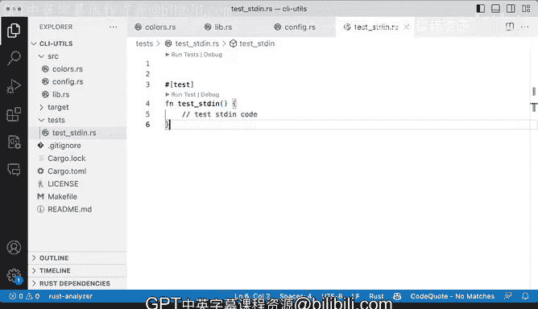

# Rust编程（基础）：P84：演示：组织测试文件 📂

在本节课中，我们将学习如何在Rust项目中组织测试文件。我们将了解测试代码可以放置的不同位置，以及每种组织方式的适用场景。


## 概述

Rust项目中的测试代码可以放置在不同的位置。理解这些组织方式有助于我们编写更清晰、更易于维护的测试。本节将介绍两种主要的测试组织模式：在`tests`目录中创建独立的测试文件，以及在源代码文件中内联编写测试模块。

## 测试目录结构

在我们的项目中，虽然还没有编写实际的测试代码，但我们已经添加了几个不同的内容，例如我们一直在使用的`dog`测试。


在编写测试时，你可能会思考最佳策略是什么。Rust提供了几种不同的方式。

## 独立的测试目录

首先，我们来看一种常见的组织方式：使用独立的`tests`目录。

以下是项目结构的一个示例：

```
tests/
└── test_standard.rs
```

在`test_standard.rs`文件中，我们可以为其他文件添加一些测试。这是一种可行的测试组织方式。

为了更直观地展示实际结构，我喜欢使用`tree`命令，而不是仅仅在这里用文字描述。让我演示一下。如果我打开终端并执行`ls`命令，你会看到我有`tests`目录、`src`目录、`target`目录以及`README`文件和其他文件。

如果我执行`tree tests`命令，你会看到目前只有一个文件。

```bash
tree tests
```

随着项目不断扩展，你可以向`tests`目录中添加更多文件。那么，为什么要这样做呢？原因在于，任何位于`tests`目录中的内容，在构建项目或发布crate时，**不会**被包含在最终的产物中。因为`tests`是一个特殊的目录，Cargo能够识别它，并知道这些文件包含测试代码，从而在发布时排除它们。

## 源代码文件中的内联测试

然而，`tests`目录并不是唯一可以放置测试的地方。你可能会在其他地方看到测试，例如在源代码文件内部。

让我们看一个具体的文件，比如`config.rs`。我滚动到文件底部。以`lib.rs`文件为例，我滚动到最底部，你会看到里面有几个不同的函数。

我们在第43行附近有一个`mod tests`模块。实际上，在第3行我们也有一个`#[cfg(test)]`属性。这是一个属性（attribute），它告诉Rust（实际上是Cargo）这是一个测试模块，应该被自动发现并执行。

让我们回到`lib.rs`文件。这里有几个测试。那么，这背后的逻辑是什么呢？逻辑在于，有时你可能会在一个模块（比如这里的`lib.rs`）内部发现一个测试模块。这样做的原因可能是，我们需要访问模块内部某些**非公开**（private）的内容。

因此，在一个模块内部看到一个`tests`模块，并且里面有一些（甚至很多）测试，这并不奇怪。可以说，这是一个在模块内部编写测试的充分理由。

## 总结

本节课中，我们一起学习了Rust项目组织测试的两种主要方式。

*   一种是将测试代码放在项目根目录下的**独立`tests`目录**中。这种方式适合集成测试或需要测试多个模块协作的场景，并且测试代码不会被打包到最终发布的crate中。
*   另一种是在**源代码文件内部**使用`#[cfg(test)]`属性和`mod tests`模块来编写单元测试。这种方式特别适合测试模块内部的私有函数或逻辑。

通常，你可以根据测试的目标来选择组织方式：对于涉及多个模块的“集成测试”，使用`tests`目录；对于测试单个模块内部功能的“单元测试”，则内联在源代码中编写。随着项目的构建，你可以开始按照这些方式来组织你的测试。



