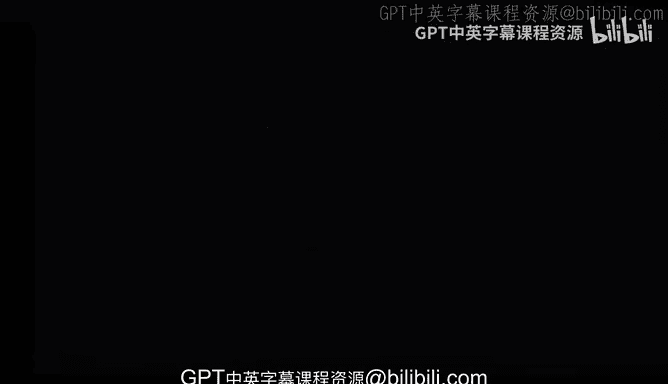
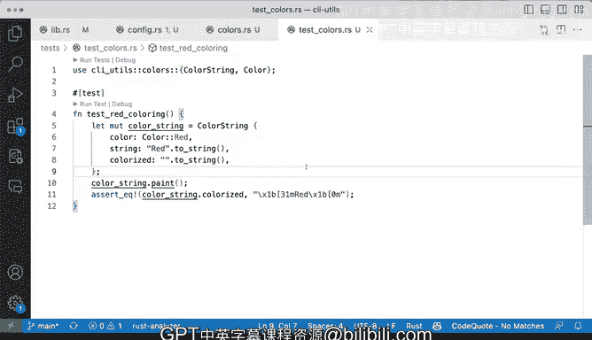

# Rust编程（基础）：P86：为代码编写测试 🧪

在本节课中，我们将学习如何为一个已有的Rust模块编写测试。我们将从一个没有测试的`colors`模块开始，逐步为其添加测试用例，以验证其功能的正确性。通过这个过程，你将掌握为现有代码库添加测试的基本流程和方法。

---

## 模块概览

我们有一个名为`colors`的模块，它包含一些之前未见过的额外功能。该模块提供了将字符串着色为红色、绿色、蓝色和粗体的函数。实现相当直接：我们传入一个字符串，得到一个着色的输出。

这些是ANSI转义码。其作用是，将来自参数`s`的字符串进行着色，使其在终端上显示为彩色输出。我们处理的就是这些功能，包括红色、绿色、蓝色、粗体，以及一个重置功能。

我们将重点关注`reset`函数来编写测试。原因是，`reset`允许我们传入一个先前已被着色的字符串（例如蓝色），它会移除转义码，使其没有任何格式。这是一个非常好的测试用例。

让我们看看这些函数是如何被使用的。这实际上也是你在处理代码时会遇到的情况。很可能你不会从头开始编写所有内容，而是会被抛入类似的问题中，例如，你可能需要查看像`colors`这样的模块，并被告知：“嘿，这些功能需要一些测试覆盖。目前还没有测试，你打算如何着手进行？”

## 代码结构分析

我们有一个名为`Color`的枚举，包含`Red`、`Green`、`Blue`和`Bold`。还有一个`ColorString`结构体，它是公开的，包含`color`（颜色）、`original`（原始字符串）和`colorized`（着色后的字符串）字段。原始字符串不会改变，增加的是着色后的输出。这样为想要同时使用两者的用户提供了更大的灵活性。

我们通过一个`paint`函数来扩展`ColorString`，该函数根据颜色进行特定的转换。你可以看到，`colorized`字段在颜色为`Red`时，会使用我们的`red`函数来更新。我们在这里做了很多事情，并且使用了`match`表达式，这很好。

最后，这里还有一个名为`reset`的方法，它基本上将字符串重置为仅使用我们之前看到的`reset`函数。

## 开始编写测试

那么，我们如何开始编写测试呢？首先，我们将创建一个测试目录。在该目录中，创建一个新文件，命名为`test_colors.rs`。

在这个`test_colors.rs`文件中，我们首先要导入或引入我们想要测试的内容，这些内容来自`colors`模块。因此，我们使用`use crate::colors::ColorString;`。这正我们想要测试的结构体。

确保`lib.rs`中正确定义了`colors`模块。如果注释掉模块定义，测试文件将会报错，因为无法找到模块。

当我们将其引入作用域后，首先要做的就是编写一个测试。我们使用`#[test]`属性来标记一个测试函数。我们将开始为`ColorString`编写测试。

## 编写第一个测试用例

这看起来还不错，但我们还不完全接受它。我们需要先弄清楚我们想要测试什么。

我想测试的是，如果我有一个`ColorString`，我这样定义它，然后调用`paint`方法，根据颜色进行验证。让我们从红色开始进行验证。

我们将测试命名为`test_red_coloring`。在这个测试中，我们创建`ColorString`结构体实例。我们使用`Color::Red`枚举值。然后我们调用`paint`方法，并使用`assert_eq!`宏进行断言，验证着色后的字符串是否符合预期。

让我们运行一下测试，看看会发生什么。

我们得到了第一个运行的测试，显示一切正常，验证通过。这看起来很不错。现在，我注意到一个实现细节看起来不太正确：`colorized`字段的初衷可能不是必须在构造函数中添加。也许为`ColorString`添加一个新的构造函数方法会更有帮助，以便为我们设置这些内容。但这目前是可行的。

我们所做的是：构造我们想要测试的对象，调用`paint`方法，然后进行断言。断言来自`assert_eq!`宏，它用于判断两个值是否相等。

## 验证测试失败情况

让我们故意制造一点错误，保存并再次运行测试，看看会发生什么。

我们得到了一个失败。如果我们滚动到顶部，会看到左侧和右侧的值。这里我移除了括号，所以那里缺失了，本质上导致了验证失败。

我将重新添加那个括号，保存并再次运行测试，测试就会通过。这基本上就是我们编写第一个测试的方式：我们确定测试用例，尝试弄清楚需要做什么，然后引入来自我们项目（库）中`colors`模块的相关内容（本例中是`ColorString`和`Color`枚举），接着构造对象，对其进行一些更改，最后对期望结果进行断言。

## 总结

本节课中，我们一起学习了如何为一个没有测试的普通Rust项目添加测试。我们通过使用`#[test]`属性来标记测试函数，并利用`assert_eq!`宏进行断言，成功地验证了代码功能。这个过程包括：识别测试用例、引入待测试模块、构造测试对象、执行操作，最后断言期望结果。这就是为现有Rust代码库添加测试的基本方法。