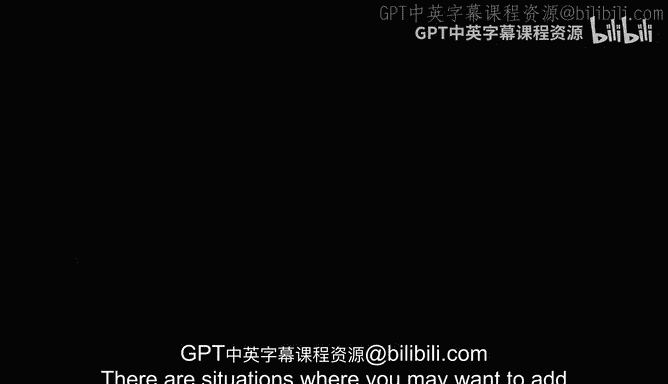
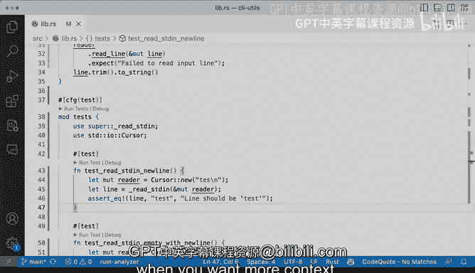

# Rust编程（基础）：P88：使用测试失败信息 📝



在本节课中，我们将学习如何在Rust测试中为失败情况添加上下文信息。当测试失败时，清晰的错误信息能帮助我们更快地定位问题。

## 为测试失败添加上下文

上一节我们介绍了基本的测试断言。本节中我们来看看如何为断言失败提供更详细的说明信息。

在某些情况下，你可能希望为测试可能出现的失败添加更多上下文信息。例如，在我们创建测试读取标准输入并处理换行符的场景中，我们可以通过扩展 `assert_eq!` 宏来实现这一点。这个方法同样适用于 `assert_ne!` 宏。

以下是具体操作方法：

```rust
assert_ne!(line, "test");
```

这行代码会失败，因为 `line` 实际上等于 `"test"`。运行测试时，我们会看到失败信息。如果向上滚动查看失败详情，可以看到“左边不等于右边”的提示，这是因为断言失败了。

## 添加自定义失败信息

让我们假设在某些情况下我们预期会出现失败。如果测试失败，我们希望提供更多上下文信息。实现方法是在断言宏后添加一个逗号，然后传入额外的参数。

以下是具体操作示例：

```rust
assert_eq!(line, "test", "line should be 'test' but it wasn't");
```

这两个参数是必需的。如果我们运行这个测试并且它失败了（例如，将 `"test"` 改为 `"des"`），我们将在失败信息中看到我们添加的自定义消息：“line should be 'test' but it wasn't”。

当你希望为测试失败提供更多上下文信息时，这无疑是正确的方法。如果测试名称不够清晰，或者测试逻辑变得相当复杂，又或者在一个测试中有多个断言语句，这实际上是最佳实践。

## 测试命名建议

我有几个建议：尽量使测试函数名称有意义。如果名称有用，那么失败信息应该相当自解释。例如，`test_read_standard_in` 这个名称不够好。

让我们改进一下：

```rust
fn test_read_standard_in_empty_with_new_line() {
    // 测试逻辑
}
```

这样我就能更好地组织我的预期：标准输入为空且带有换行符。这听起来更好，也让我能够更清晰地编写测试。这个测试应该能正常工作。

## 使用注意事项

这些技巧非常有用，但不要过度使用。如果你发现添加这些信息很繁琐，而收益不大（就像这个简单示例一样），那么可能不值得这样做。特别是当你的测试开始变得更加复杂，或者断言变得更加复杂时，需要仔细考虑。

在这个例子中，我们使用 `assert_eq!`，这相当直接。这只是三行代码，我们的预期相当清晰。



本节课中我们一起学习了如何在Rust测试中添加失败信息。当你需要更多上下文来解释测试失败的原因时，这是非常有用的技巧。记住要保持测试名称有意义，并根据需要适度使用自定义失败信息。