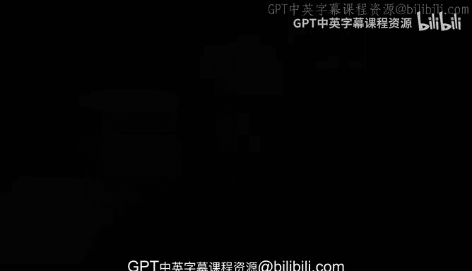

# 杜克大学《rust编程（基础）｜rust programming》中英字幕 - P9：09_01_09_Rust与Visual Studio Code安装总结.zh_en - GPT中英字幕课程资源 - BV1dx4y1b7Vo

One of the most important first steps that you have to do is， of course。

 set up your environment and we've seen how to use some of my recommendations。

 including the text data again you don't have to use Fi Studioco but I highly recommend it and now you know how to set it up if you're using something else。

 well you can kind of like figure out some of the components that we saw kind of like the rust analyzer to see where you might need some extra help so hopefully by now you have a solid good start to actually start developing rust with more confidence with the right environment。

