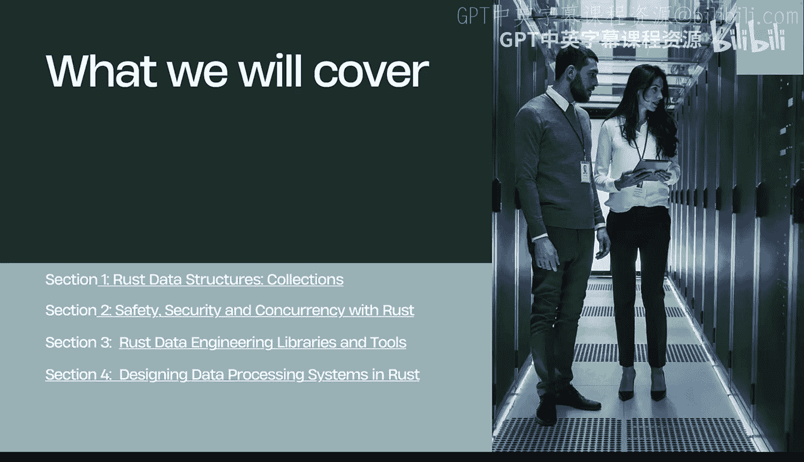
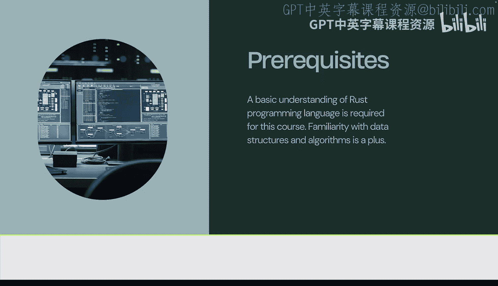
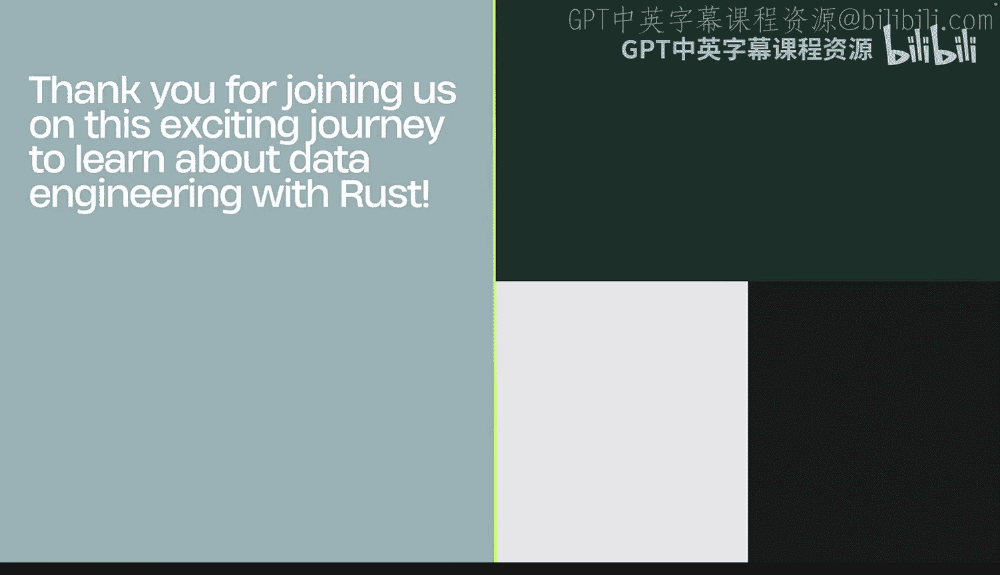

# 001：课程概述与讲师介绍 🚀

在本节课中，我们将要学习《Rust编程2-3（数据工程、DevOps）》课程的概述，了解课程的核心内容、结构以及讲师的背景。Rust语言以其安全性、速度和底层控制能力，为系统编程和数据工程提供了强大的支持。

## 课程概述

欢迎来到《使用Rust进行数据工程》课程。Rust为系统编程提供了安全性、速度和底层控制，本课程将对此进行详细讲解。本课程教授如何构建高性能的数据管道，这些管道可以应用于数据工程、MLOps以及传统的软件工程领域。

本课程将涵盖四个关键部分。第一部分是Rust数据结构。我们将探讨Rust的核心特性，包括哈希映射和向量。在第二部分，我们将探讨Rust的安全性与并发性。我们将介绍Rust的一些关键能力，例如Rayon库，它允许你以最小的努力进行多线程编程。在第三部分，我们将介绍流行的Rust数据工程库和工具。其中包括Polars库，这是一个用于处理数据框的新兴工具，以及如何与云服务商交互，例如使用AWS SDK进行异步通信。在第四部分，我们将深入探讨如何在Rust中设计数据处理系统。这涉及到构建现实世界的解决方案，将这些解决方案整合在一起，并协调处理流程，例如使用AWS Step Functions或处理执行ETL的数据管道，这些都是第四部分涵盖的主题。

现在，我们为什么要学习Rust？因为Rust是一种快速、内存高效且安全的语言，它提供了底层控制能力，同时也易于维护。它是一种现代的编译型语言，并且借助生成式AI编码工具，它变得更加易于上手。本课程的先决条件是，需要对Rust编程语言有基本的了解，同时熟悉数据结构和算法会更有帮助。

## 课程结构详解

接下来，让我们更详细地了解一下课程的核心结构。

### 第一部分：Rust数据结构

在第一部分，我们将首先深入了解现代Rust开发生态系统的入门知识。这意味着我们将学习如何使用结对编程工具、提示工程，以及了解持续集成。

在下一课“序列与映射”中，我们将探讨一些常见的数据结构，包括向量、向量双端队列以及哈希映射，并学习如何在这些数据结构中构建解决方案。

在第三课中，我们将更深入地探讨数据结构，包括高级数据结构，如图、优先队列以及其他项目，如PageRank算法。这将真正完成对数据工程所需的Rust数据结构的核心理解。

### 第二部分：Rust的安全性与并发性

接下来，在第二部分，我们将深入探讨Rust的安全性与并发性。为此，我们将介绍Rust在安全和安全性方面的一些核心特性，例如理解多因素身份验证、理解加密，以及如何处理可变和不可变的数据结构。

在第二课中，我们将探讨更多的安全概念，包括密码和加密，甚至事件响应与合规性。

最后，在本部分的最后一课“并发性”中，我们将探讨一些经典问题，如哲学家就餐问题，使用Rayon进行一些网络爬虫，并且我们还将构建智能聊天机器人。

### 第三部分：Rust数据工程库与工具

在第三部分“Rust数据工程库与工具”中，我们首先从使用Rust管理数据文件和网络存储开始。我们将学习使用Cargo Lambda构建CSV文件以部署到AWS Lambda，以及通过AWS提供的Async库与S3存储进行通信。

在第二课中，我们将深入探讨数据框，包括Rust中的数据框处理，并处理笔记本环境。一些示例包括使用Colab处理预期寿命数据、处理Polars等，这些都是本部分涵盖的内容。

现在，在第三课中，我们将更详细地探讨基于云的SDK，包括使用Rust的Google Cloud Shell、使用Rust的AWS Cloud Shell、使用CodeWhisperer和Rust的Cloud 9，并且还将使用Rust部署一些微服务。

### 第四部分：在Rust中设计数据处理系统

在第四部分，我们将深入探讨如何在Rust中设计数据处理系统，这主要包括数据管道本身。涵盖的项目包括Rust AWS Step Functions、Rust AWS Lambda，讨论Distroless（一个新兴的容器标准）。

接着在第二课中，我们将简要介绍NLP管道，包括语言模型、ONNX、Hugging Face、PyTorch管道，并围绕这些技术构建一些解决方案。

最后，在第三课中，我们将深入探讨SQL，并研究如何将Rust与SQL结合使用，包括与SQLite、Hugging Face、BigQuery的结合，同时查看公共数据集，并讨论一些关于选择正确数据库的理论。

## 讲师介绍

我是你们的讲师，Noah Gift，很高兴欢迎你们加入Rust的学习之旅。接下来我将简要介绍一下我的背景。

大家好，我的名字是Noah Gift，我是你们《Rust数据工程》课程的讲师。让我简单介绍一下我的背景，以及为什么这与本课程相关。我是杜克大学的驻校高管，曾在数据科学系（MIDS）以及AIPI（产品创新人工智能）部门工作。我教授的课程包括数据科学、云计算和MLOps，我也曾在西北大学、加州大学伯克利分校、加州大学戴维斯分校等大学讲授过类似的主题。我的职业生涯始于好莱坞的电视和电影行业，我曾参与许多大型电影的制作，包括《阿凡达》、迪士尼动画长片，以及索尼图形图像运作公司的电影如《蜘蛛侠》。之后，我来到了湾区，在初创公司担任首席技术官。这使我走到了今天这一步，即将我的知识与学生们分享。在本课程中，我们将围绕数据工程代码和MLOps代码的运维化展开大量讨论，而Rust是实现这一目标的绝佳选择。我发现，对于许多身处数据工程和MLOps领域的人来说，Rust将是非常有益的补充。我很高兴能与你们分享我的知识，并期待看到你们的成果。

## 总结

本节课中我们一起学习了《Rust编程2-3（数据工程、DevOps）》课程的概述。我们了解了Rust在数据工程领域的优势，课程将涵盖的四个核心部分（数据结构、安全与并发、工具库、系统设计），以及讲师Noah Gift的相关背景。课程旨在通过实际案例和工具，帮助你掌握使用Rust构建高性能、安全的数据处理系统的技能。

好了，介绍就到这里。我真的很期待你们开始使用Rust构建解决方案。让我们开始这门课程吧！