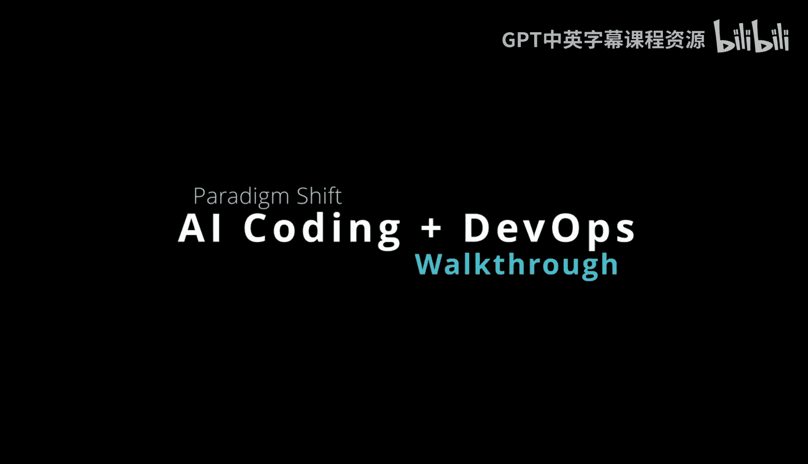
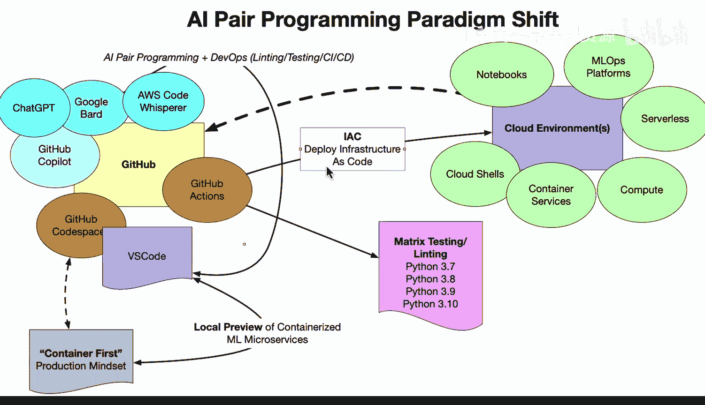

# 002：人工智能编程范式转变介绍 🚀

在本节课中，我们将要学习人工智能（AI）如何与编程实践相结合，催生出一种新的范式——AI结对编程。我们将探讨它如何与现有的DevOps最佳实践协同工作，并了解开发者可以如何利用多种AI工具来提升效率。

---

## 人工智能编程范式

这里出现了一种新的范式转变，即AI结对编程。它与现有的最佳实践（包括DevOps）结合得非常好。

上一节我们介绍了编程范式的演变，本节中我们来看看AI如何融入其中。

## 与现有生态的协同

在左侧，我们有GitHub生态系统。你可以用它做许多了不起的事情，例如使用GitHub Actions。这是一个CI/CD服务器，可以自动进行矩阵测试、代码检查、为你构建软件包，甚至在Rust的情况下编译软件。然后你还有Codespaces，这是一个专门为特定环境（例如Rust、Python或某个特定版本的Ubuntu）设置的、触手可及的环境。因此，你在这里获得的是一个真正以生产为先的容器化环境。

此外，你可以使用像Visual Studio Code这样的顶级编辑器。它是最流行的编辑器之一，内置了各种钩子和插件，能让你非常高效地工作。

## 多工具协作的工作流

然而，当你完成所有这些设置后，未来你将看到的是，你不仅会使用像GitHub Copilot这样的AI结对编程工具，还可能将其与其他工具结合使用。

以下是开发者可能采用的一种典型工作流程：

1.  **咨询与构思**：首先，你可以就某个特定问题向ChatGPT提问。
2.  **实现与迭代**：将得到的思路放入Copilot，让它协助完成代码。
3.  **验证与补充**：在某些场景下，你可能不完全满意得到的结果，或者存在限制（例如ChatGPT的输入文本长度限制）。这时，你可以转向另一个工具，如Google Bard，来双重检查ChatGPT所讨论的内容。
4.  **切换与深化**：你甚至可能在某一段编码（例如30分钟内）坚持使用Google Bard，直到遇到瓶颈。然后，你实际上可以切换到另一个工具，例如AWS Code Whisperer。

我认为我们将看到人们使用许多不同的资源，就像在AI结对编程出现之前一样——那时你会去Stack Overflow、Google，或者去学习平台查看某些内容。现在，你将把所有这些东西结合起来，在进行结对编程时获得最佳的混合体验。

## DevOps基础设施的价值提升

同时请注意，DevOps基础设施并不会消失。事实上，它变得更有价值，因为它是自动化的最佳实践。当你从AI结对编程工具得到一个结果时，你可以利用这些实践来验证那些操作是否合适。

你可以使用代码检查和格式化工具来清理结果。最后，如果你使用基础设施即代码（Infrastructure as Code），它将以编程方式将该结果部署到特定环境。

因此，使用这些AI结对编程工具不仅仅是一种替代，它实际上是与你正在使用的现有最佳实践产生的协同效应。事实上，使用AI结对编程的最佳方式就是拥有持续交付和持续集成的最佳实践，然后用AI结对编程来增强它。

---

本节课中我们一起学习了AI结对编程这一新范式。我们了解到，它并非要取代现有的开发流程和DevOps实践，而是与之形成强大的协同。通过结合GitHub生态系统、多种AI辅助工具（如Copilot、ChatGPT、Bard）以及自动化的CI/CD管道，开发者可以构建一个更高效、更可靠且以生产为先的现代化工作流。关键在于利用自动化最佳实践来验证和增强AI的产出，从而实现“1+1>2”的效果。