# Rust编程：2-3：基于云的开发环境介绍 🚀

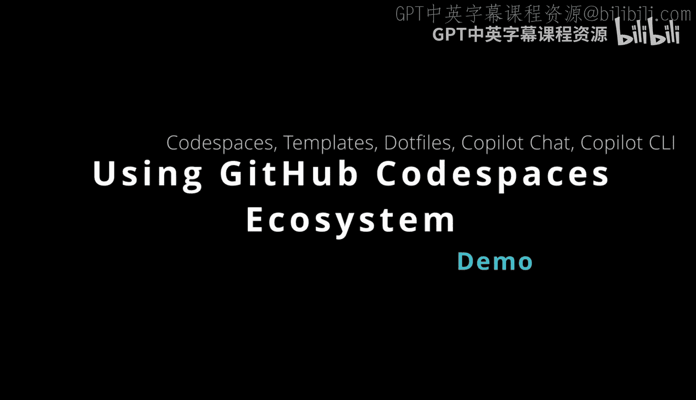

在本节课中，我们将学习如何使用GitHub Codespaces这一强大的云端开发环境。我们将从创建仓库、配置环境开始，逐步探索其核心功能，包括使用模板、配置点文件、利用GitHub Copilot进行编程辅助等。

---

## 创建与配置仓库 🏗️

首先，我们需要进入GitHub组织并创建一个新的代码仓库。创建时，有几个重要选项需要考虑。

以下是创建新仓库时的关键步骤：
*   **可见性**：选择仓库是公开（Public）还是私有（Private）。
*   **使用模板**：从模板创建可以节省大量时间。你可以为不同语言创建模板，这样所有环境都已预先配置好。

例如，我们可以搜索并选择一个Rust项目模板。如果你想创建自己的点文件仓库，只需重复创建过程，并在仓库中放置如 `.bashrc` 这样的配置文件。

---

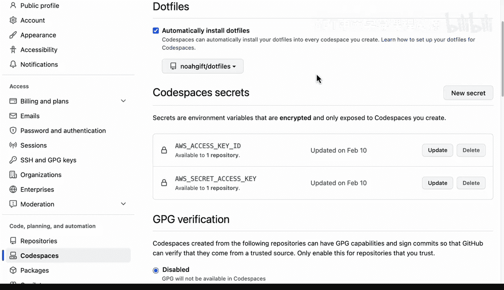

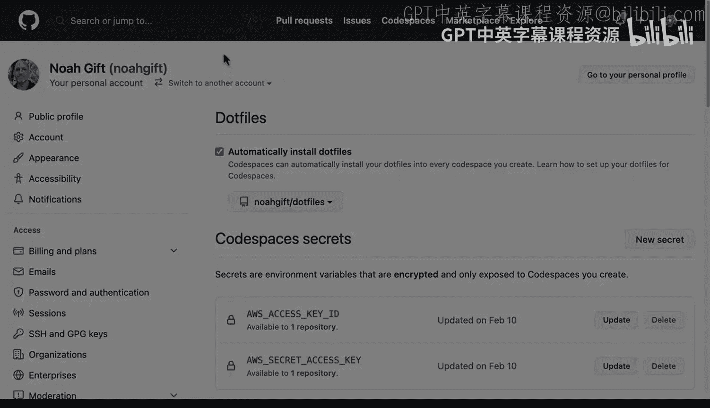

## 深入Codespaces环境 ☁️

上一节我们介绍了如何创建仓库，本节中我们来看看如何启动并配置一个Codespace。

Codespaces是一个基于云的环境，允许你在浏览器中直接编辑代码。创建仓库后，你可以选择“Code”按钮，然后“Open with Codespace”。你可以选择默认配置，或点击“New with options”进行自定义。

以下是启动Codespace时的配置选项：
*   **选择配置**：为你的项目选择预置的开发容器配置（例如Rust配置）。
*   **选择机器类型**：根据项目需求，选择从2核到16核，甚至带GPU的不同规格虚拟机。

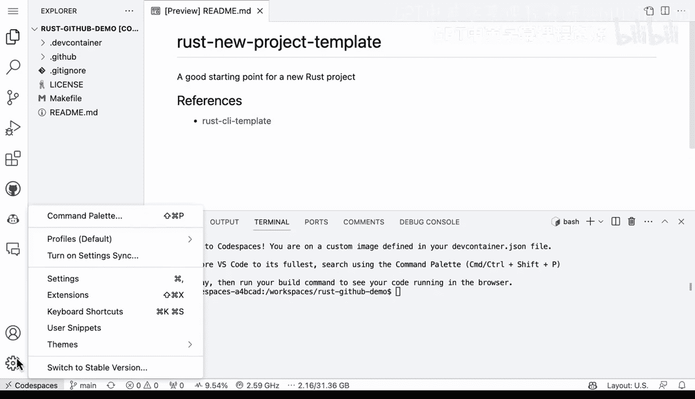

启动后，系统会构建容器。为了加速后续启动，可以配置“预构建”功能，它会自动安装所有配置好的软件。

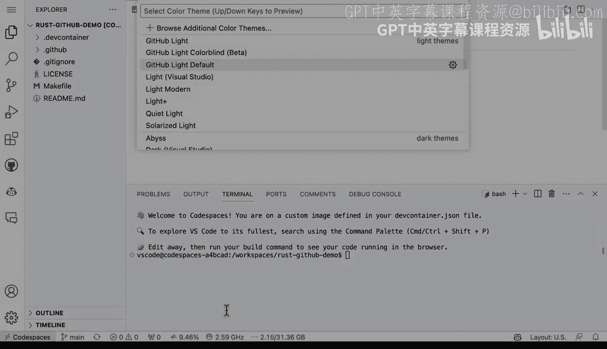

---

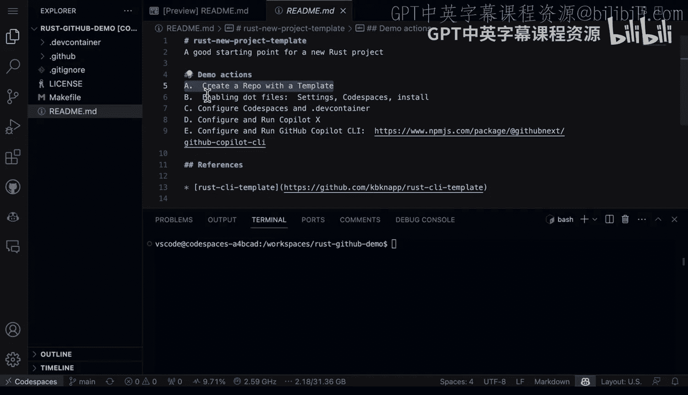

## 个性化与模板化 ⚙️

进入Codespace后，我们可以个性化开发体验，例如更改编辑器主题。更重要的是，我们可以将配置好的仓库保存为模板，供未来或其他用户使用。

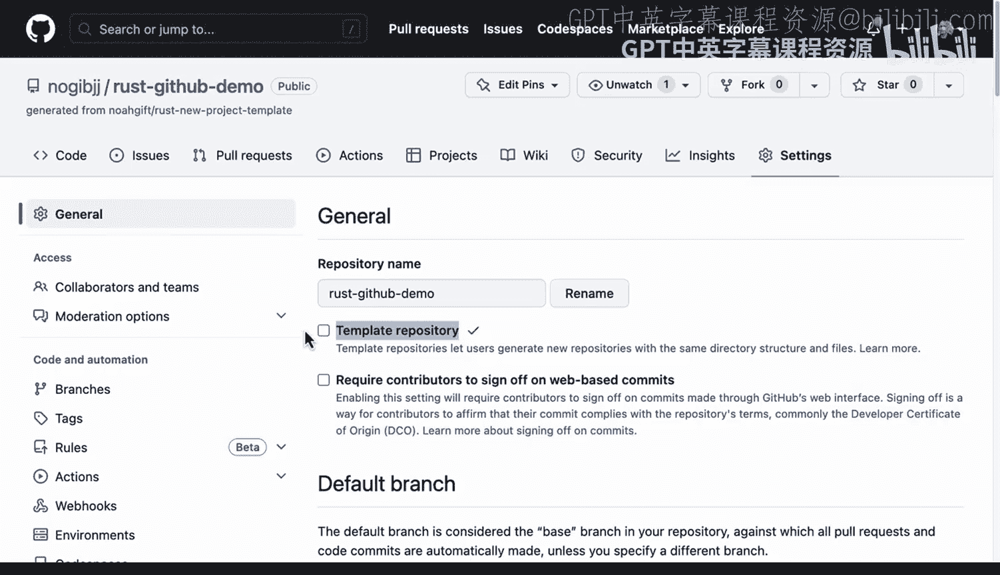

若想将当前仓库设为模板，只需进入仓库的“Settings”，找到并启用“Template repository”选项。这是一个提高个人或团队效率的好方法。

---

## 探索开发容器配置 🐳

每个Codespace背后都是一个开发容器，其配置由 `Dockerfile` 和 `devcontainer.json` 等文件定义。

以Rust模板为例，其 `Dockerfile` 通常继承自微软提供的Rust基础镜像。你可以在其中添加自定义命令，例如安装额外的工具链（如 `clang`、`lld`）。由于使用了预构建，这些安装只需一次。

你还可以在 `devcontainer.json` 中配置每次启动时自动安装的VSCode扩展。

---

## 使用GitHub Copilot编程助手 🤖

现在我们已经配置好了环境，接下来可以体验一个强大的功能：GitHub Copilot。它可以像一个结对编程伙伴一样协助你。

在Codespace中安装“GitHub Copilot Chat”扩展后，你可以通过聊天界面与它交互。例如，你可以要求它“创建一个新的Rust项目”。它会指导你运行 `cargo new hello_world` 命令。

创建项目后，你可以继续与Copilot对话，例如让它“创建一个add函数”。它会生成相应的Rust代码。你可以在主函数中调用这个新函数，并通过 `cargo run` 来运行和测试。

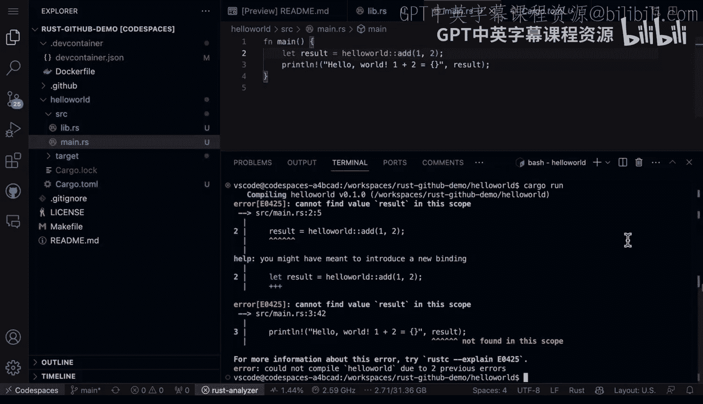

---

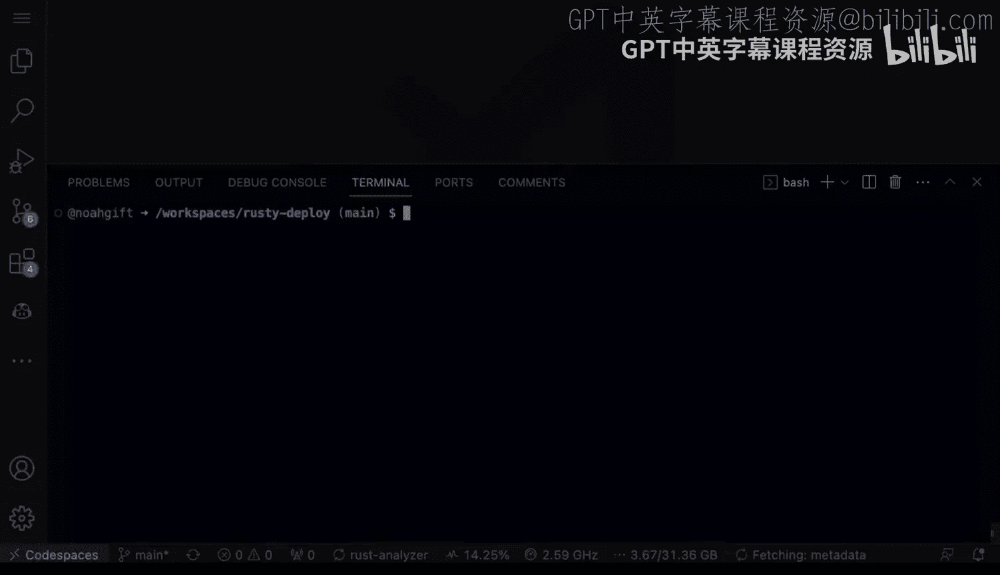

## 命令行辅助工具：Copilot CLI 💻

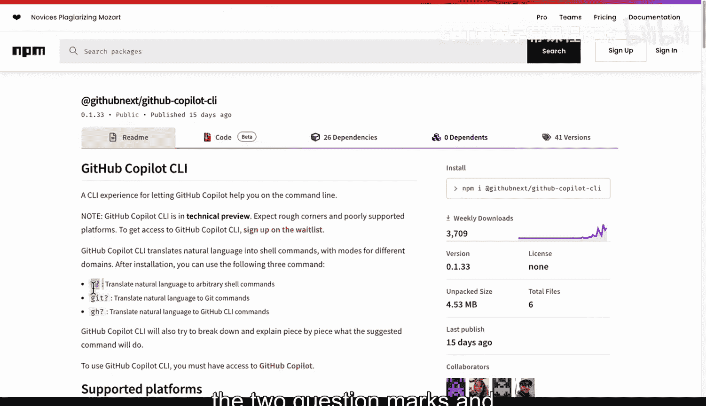

除了聊天界面，GitHub Copilot还提供了一个命令行辅助工具（Copilot CLI，技术预览版），它可以直接在终端中帮助你。

在终端中输入 `??` 后跟你的问题，即可获得建议。例如，输入 `?? 显示目录结构`，它会建议你运行 `tree` 命令。你还可以进一步优化请求，例如 `?? 运行tree命令，但只显示源文件，不显示构建产物`，它会生成过滤了 `target/` 目录的命令。

---

## 总结 📚

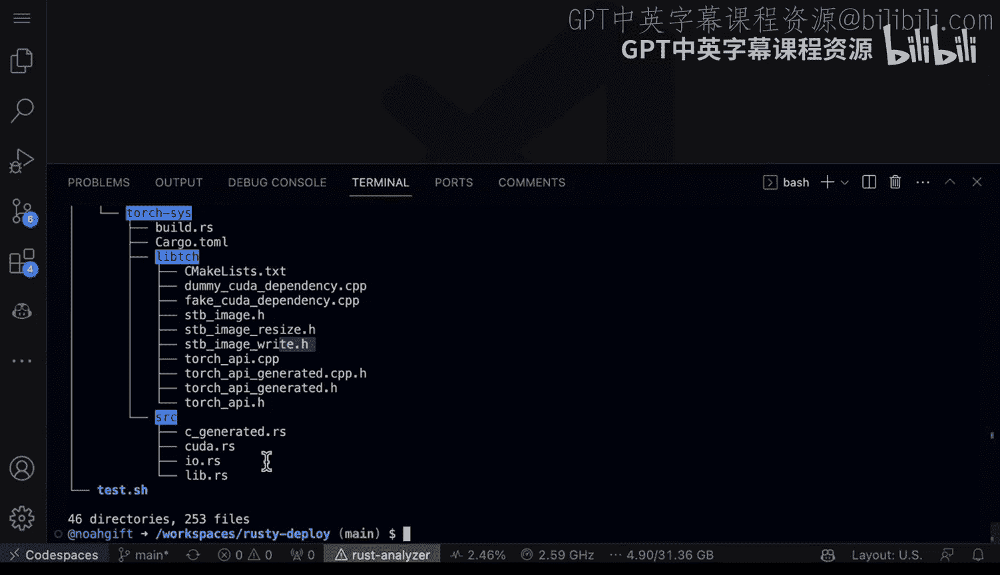

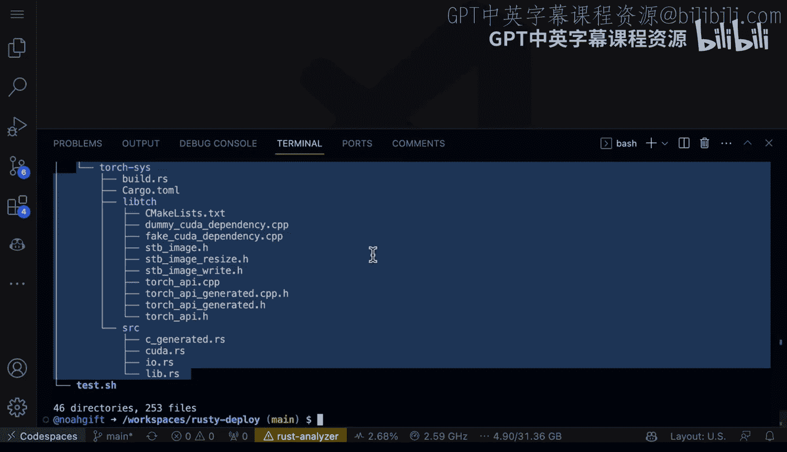

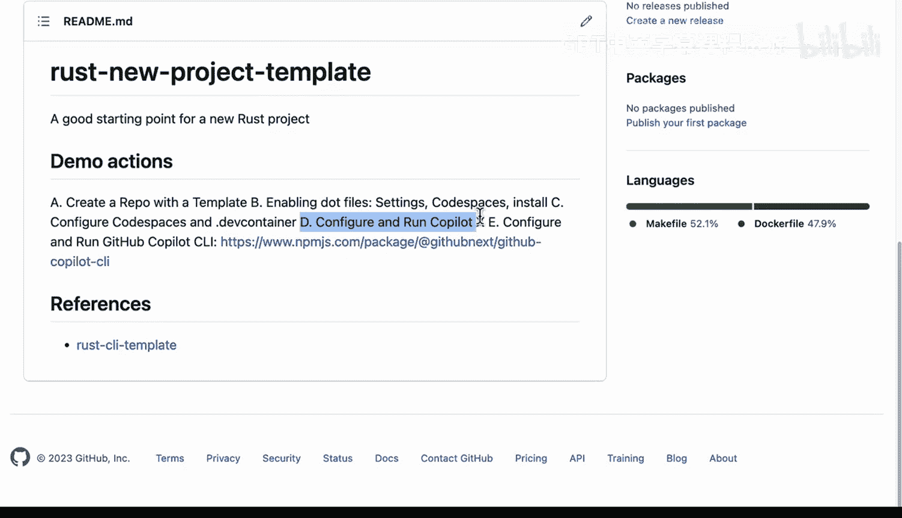

本节课中我们一起学习了GitHub Codespaces的完整工作流程。我们从创建仓库和配置模板开始，然后启动并个性化Codespace环境。我们探索了开发容器的配置，并实践了如何使用GitHub Copilot Chat进行交互式编程辅助，以及如何使用Copilot CLI来优化命令行操作。这些工具共同构成了一个强大、高效的云端开发环境。