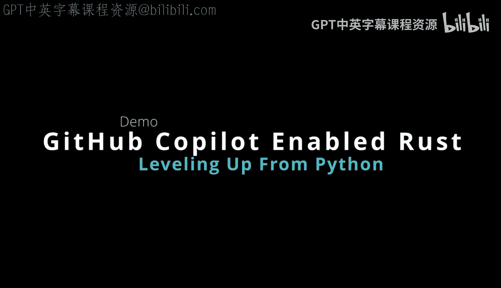
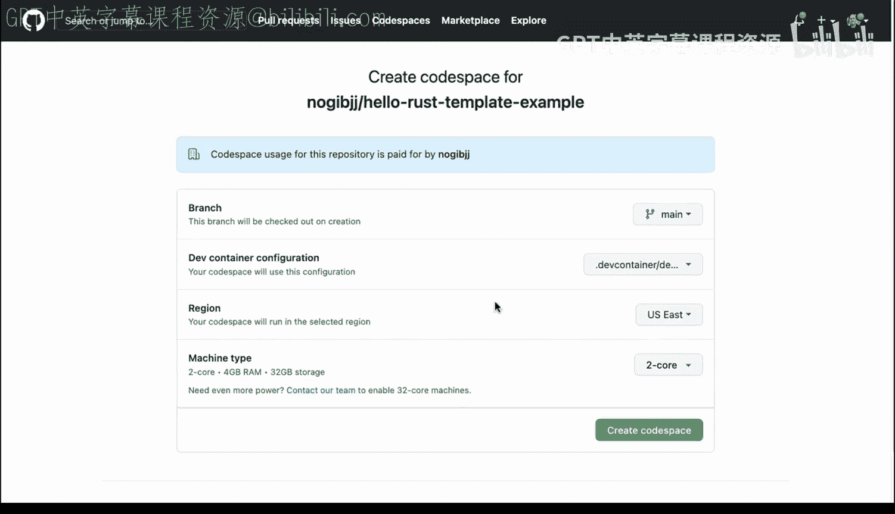
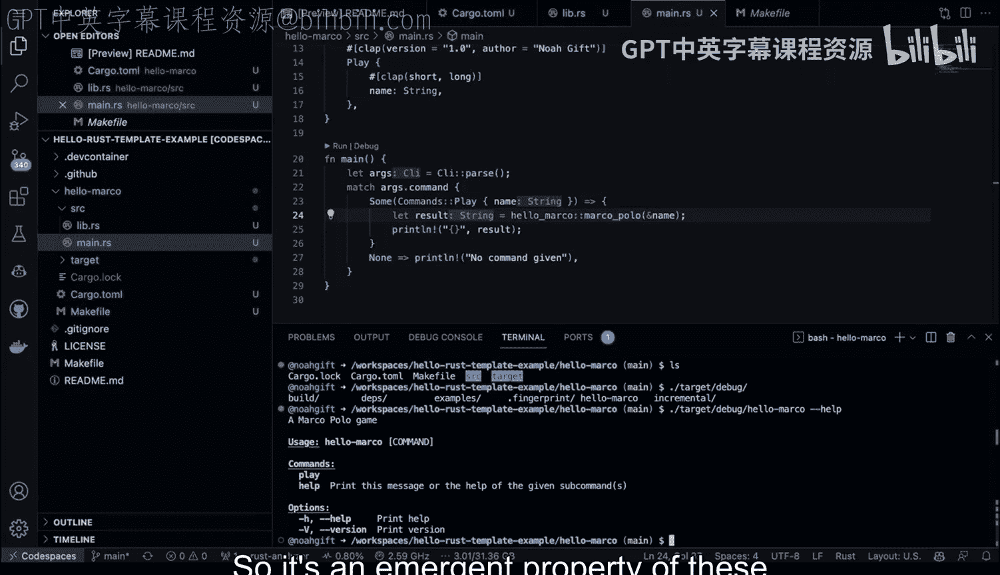

# 004：GitHub Copilot与Rust生态系统介绍 🚀



在本节课中，我们将学习如何利用GitHub生态系统（特别是GitHub Copilot、Visual Studio Code和GitHub Codespaces）来提升Rust编程的效率。我们将通过一个简单的“Marco Polo”游戏示例，演示如何结合这些现代工具来加速开发流程，并体验Rust语言在性能、内存效率和安全性方面的优势。

---

## 概述

作为一名软件工程师，使用GitHub生态系统内的Copilot是一种令人兴奋的工作方式。这不仅仅是单独使用Copilot，而是将其与Visual Studio Code、GitHub Codespaces和GitHub本身结合使用。这种组合能显著提升开发效率。

回想最初学习Python时，那种能够快速编写脚本、高效完成任务的感觉非常棒。如今，使用Copilot配合像Rust这样更强大的语言，能带来类似的体验，但效果更佳。Rust提供了现代的语言特性、现代的包管理系统、至少50倍以上的能效提升、25倍以上的计算性能提升，以及出色的内存效率。此外，从安全角度看，Rust编译器能构建出安全的并发程序，并在网络安全方面提供保障。

因此，核心问题是：**是否值得为了这些优势而学习一门稍复杂的语言（Rust）并配合Copilot使用？答案是肯定的。** 因为你可以利用已有的Python编程知识，通过即将展示的技巧，将其应用到Rust中，从而提升个人和公司的技术水平。这将成为2023年一项新兴的技能，Python程序员无需抛弃所学，只需应用这些新方法即可。

---

## 开始实践

接下来，让我们看看如何使用GitHub生态系统中的Rust新项目模板。这正是Copilot的魔力所在，它能让现有的Python程序员提升到新的水平。强烈推荐使用GitHub Codespaces、Copilot和Visual Studio Code的组合，这是实现飞跃的“秘密武器”。

在这个环境中，我们有一个Dockerfile来配置所需的所有环境，还有一个开发容器配置文件来设置例如Copilot等功能。这意味着我可以随时为新项目启动这个环境。只需使用这个模板，创建新仓库，选择额外选项，并挑选一台性能强大的机器来编译代码即可。

---

## 检查环境与创建项目



进入环境后，首先检查一切是否正常工作。我们可以查看这里的`Makefile`，在项目初期包含它是一个好主意。输入`make rust-version`，它会显示Rust版本等信息。与Python不同，这一切都是现成的，无需额外设置。

要创建新项目，只需输入：
```bash
cargo new hello_marco
```
我们将构建一个“Marco Polo”应用。进入项目目录后，可以看到包管理系统已准备就绪。接下来，需要在`Cargo.toml`文件中添加所需的依赖项。

我将添加一个名为`Clap`的流行命令行工具库。然后，由我决定项目结构。对于Python程序员，我建议进入`src`目录。

实际上，首先进入项目目录，然后创建`src/lib.rs`文件。我喜欢在这里放置核心逻辑。通过使用Copilot，我们可以在这里构建出令人惊叹的功能，这本质上让我们能够利用来自Python的技能。

---

## 编写核心逻辑与使用Copilot

首先，创建一个注释来描述这是一个“Marco Polo游戏”。然后，由我来创建正确的提示词。我会写：“如果给出的名字是‘Marco’，程序回应‘Polo’；否则，询问‘What‘s your name?’”。这看起来不错，就像在和真人对话一样，我们只需要正确地引导它。

我还会添加一些额外的提示词。同样，这需要我们引导Copilot。我们希望它完成一些工作。看，只要我们一路提供帮助，它就会给出良好的回应。

在这种情况下，我们声明函数为`pub`（公开），以便暴露给主模块使用，主模块将用于命令行工具。然后看看生成的Rust代码，实际上非常直观：我们有一个字符串类型的`name`参数，进行一些字符串处理，然后返回一个字符串。

---

## 编写主程序与集成

现在转到`main.rs`。这里的技巧在于，很多命令行工具库的代码都是样板代码。因此，我通常会从其他程序复制粘贴一些内容，以帮助我们的提示。

我会在这里放入一些内容：“一个用于玩Marco Polo游戏的命令行工具”。这些都是样板代码。关键点在于，你需要将子命令映射到在库中创建的函数。这与Python几乎相同，但区别在于，我获得了25倍的性能提升，并且可以部署二进制文件等很酷的功能。

完成这些后，我只需查看并确认：我想将一个名字传递到这个函数中。然后，我让Copilot为我完成剩下的工作。看看它做了什么：它生成了一个合理的建议，但并非完美。我想稍微调整一下。

我不希望它在这里直接打印名字，那不是我的本意。我想让它调用Marco Polo逻辑。因此，我会按Tab键，然后输入`let result =`，并引导它使用我模块中的命名空间。

---

## 调试与完善

当你刚开始使用Rust时，命名空间可能会让你有点困惑。例如，“这是什么？这个命名空间是什么？”实际上，它是在`Cargo.toml`文件中定义的名字。因此，你必须将其映射为相同的名字。

现在，我可以运行`cargo fmt`来格式化代码，看看会发生什么。它是否能清理一下代码？这里它提示“fail to use unresolved crate”。实际上，这是因为crate名称不正确，linter给出了正确的提示。所以我们必须将其改为`hello_marco`。

看，这就是Cargo工具链和Copilot协同工作的地方：格式化工具、linter等所有东西一起工作。然后我只需不断迭代以获得解决方案。如果linter通过，我们就处于良好状态。

---

## 编译与运行

现在我可以使用最后一部分：实际运行`cargo`来执行程序。这很像从Python解释器运行东西。我只需输入：
```bash
cargo run --
```
这里的双破折号会将一些命令传递到我们的程序中。现在它将首次编译。Rust编译器非常出色，因为它会做很多很酷的事情来确保程序的安全和快速。我们可以看到它正常工作。

现在我可以输入`play`，然后输入`Marco`，这应该会返回“Polo”。实际上，出现了“unexpected argument ‘play‘”，因为我们需要使用`--name`参数。看，成功了：“Polo”。如果我输入“Bob”，它会说“What‘s your name?”。这是一个很好的反馈循环。

---

## 成果与优势

再看这里的`target`目录。如果我进入`target/debug`，并输入`./hello_marco`，会看到那个可执行文件。在我看来，这相对于常规Python是一个巨大的胜利，因为它提供了快速的反馈循环、利用Copilot提升水平的能力，以及利用现有工具链获得反馈的能力。这是Copilot这类新结对编程工具带来的新兴特性。

---

## 总结



本节课中，我们一起学习了如何将GitHub Copilot与Rust生态系统结合使用，以加速开发流程并提升代码质量。我们通过构建一个简单的命令行应用，体验了从项目初始化、依赖管理、代码编写（借助Copilot）、调试到最终编译运行的完整流程。关键在于利用现代工具链（如Cargo、GitHub Codespaces）和AI辅助编程，将已有的编程知识（例如来自Python的经验）高效地应用到Rust开发中，从而获得性能、安全性和开发效率的多重提升。