# 005：GCP BigQuery SQL提示工程 🚀

在本节课中，我们将学习如何利用提示工程（Prompt Engineering）来辅助编写和优化Google BigQuery中的SQL查询。我们将通过一个具体的例子，展示如何与大型语言模型（如ChatGPT）交互，逐步改进一个查询，使其满足更复杂的需求。

## 概述

提示工程的核心思想是，通过向大型语言模型提供清晰的指令或示例，引导其生成、解释或修改代码。在数据工程领域，这可以极大地帮助我们理解现有查询、调整查询逻辑，甚至构建更复杂的分析语句。本节我们将以Google BigQuery中的Google Trends数据集为例，演示这一过程。

## 从解释查询开始

当你面对一个不熟悉的SQL查询时，一个很好的起点是让AI模型为你解释它。这有助于你理解查询的结构和目的。

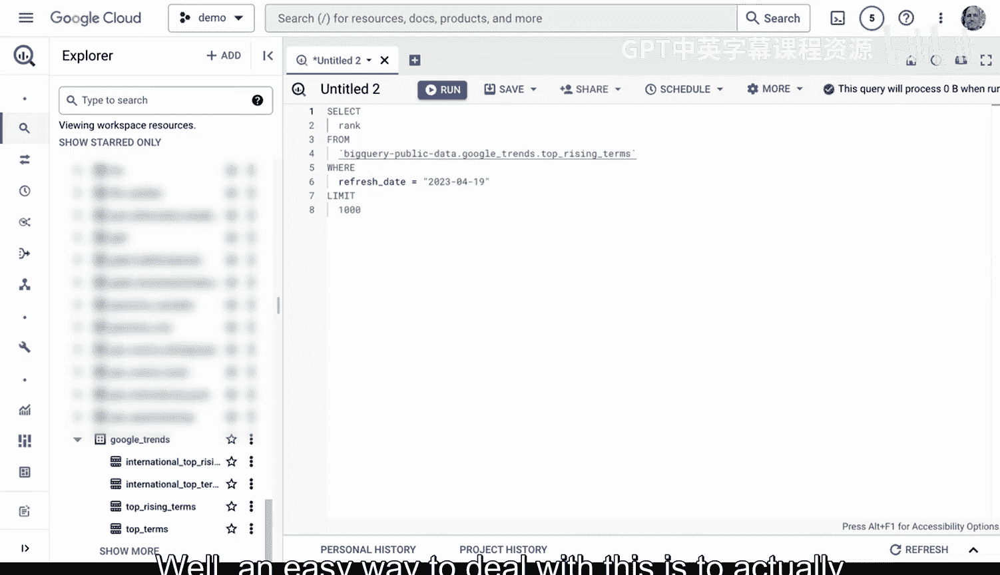

以下是具体步骤：

1.  首先，在BigQuery中找到一个你想了解的查询。例如，一个从Google Trends数据集中提取特定日期范围内前100个上升搜索词的查询。
2.  将该查询的代码复制到ChatGPT等工具中。
3.  向模型提出解释请求，例如：“请为我解释这个Google BigQuery查询。”

模型会返回查询的详细分解，说明每个部分（如`SELECT`、`FROM`、`WHERE`、`GROUP BY`）的作用。这是理解复杂查询的快速方法。

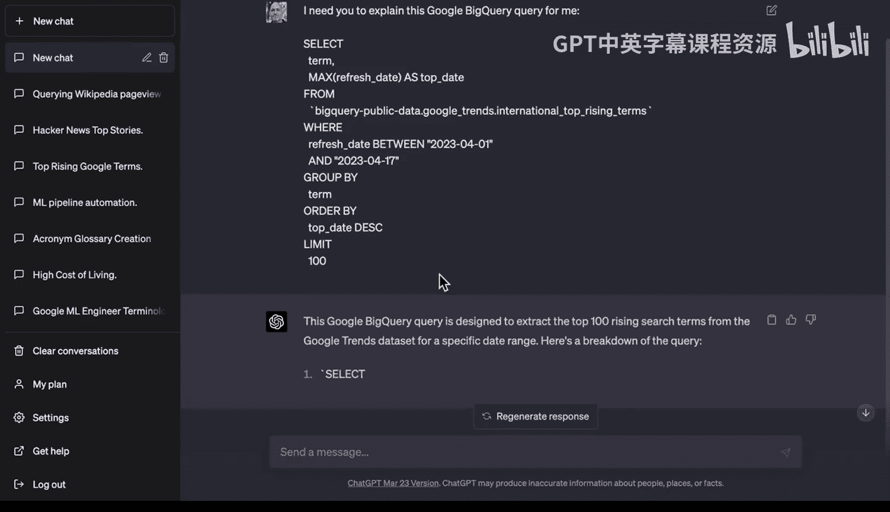

## 修改查询：获取前10条结果

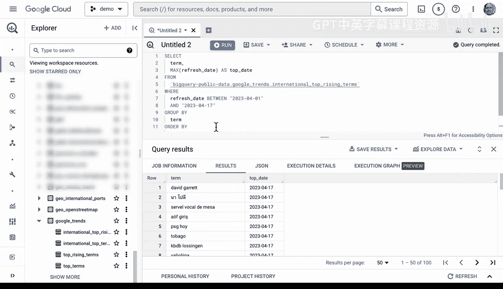

理解了基础查询后，你可能需要对其进行调整。假设我们只需要前10条结果，而不是原来的100条。

以下是具体步骤：

1.  将原始查询再次提供给模型。
2.  给出明确的修改指令，例如：“请修改这个查询，只获取前10条结果。”
3.  模型会生成修改后的代码，通常是将`LIMIT`子句的值从100改为10。
4.  将新生成的SQL代码复制回BigQuery并运行，验证结果是否符合预期。

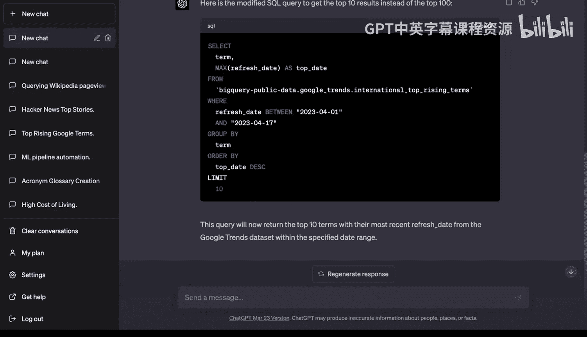

通过这种方式，你可以快速获得一个可工作的代码变体，而无需手动查找语法。

## 进阶调整：格式化结果

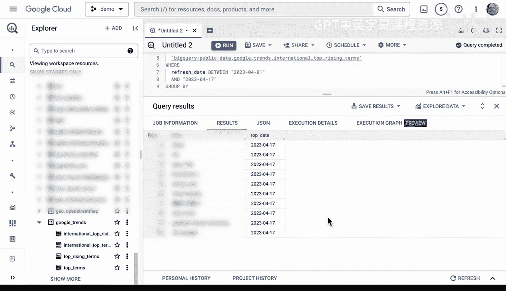

有时，我们需要对查询结果进行格式化。例如，将结果中的所有文本转换为大写字母。

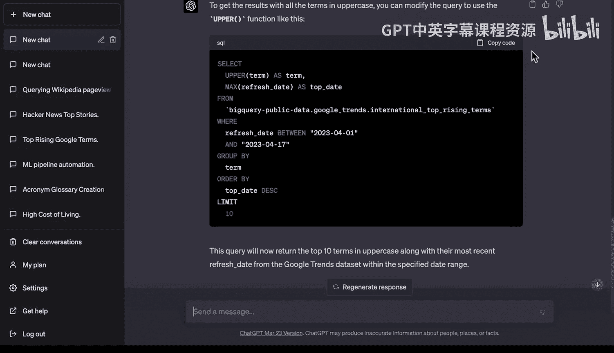

以下是具体步骤：

1.  基于上一步修改后的查询，继续向模型提出新要求。
2.  给出指令，例如：“现在我需要所有结果都显示为大写字母。”
3.  模型会建议使用`UPPER()`函数来包装相应的列，并生成新的查询代码。
4.  在BigQuery中测试新查询，确认结果已全部转为大写。

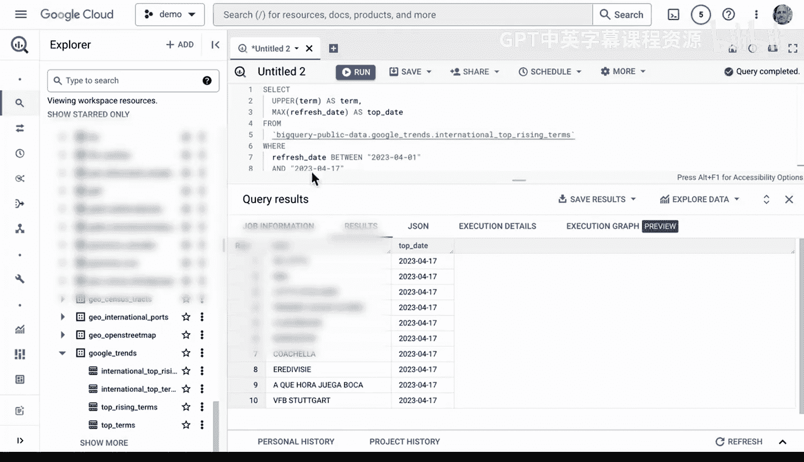

这就像身边有一位数据库专家，可以随时回答你如何实现特定数据转换的问题。

## 更复杂的转换：替换字符

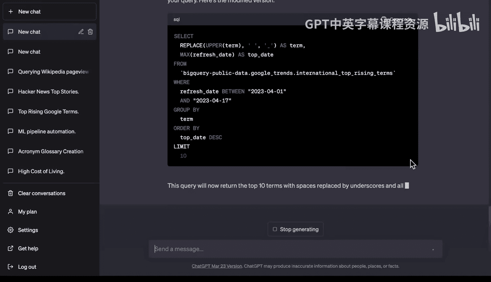

格式化可以更进一步。例如，我们可能希望将结果中的空格替换为下划线。

以下是具体步骤：

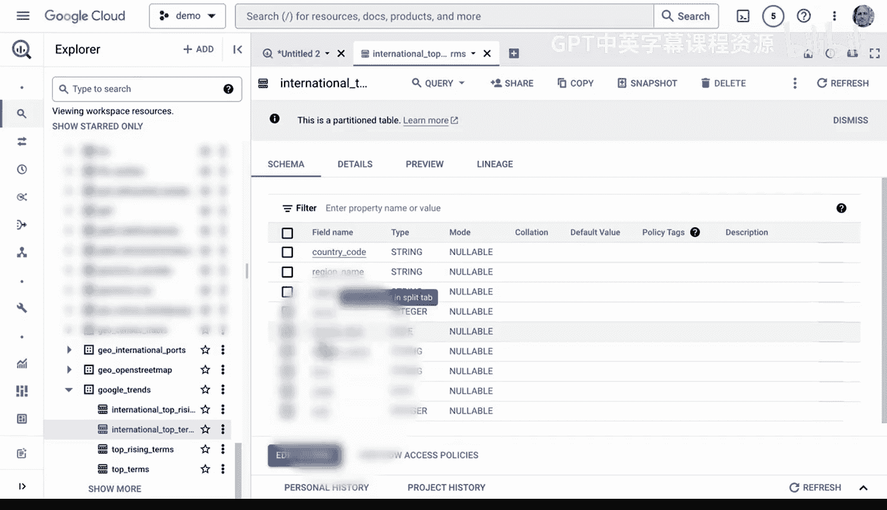

1.  继续向模型提出请求：“请将结果中的所有空格替换为下划线。”
2.  模型会建议使用`REPLACE()`函数，例如 `REPLACE(term, ‘ ‘, ‘_’)`。
3.  这是一个很好的起点。你可以直接使用模型提供的代码，也可以在此基础上自行调整，比如将下划线换成其他字符。
4.  运行修改后的查询，验证转换是否成功。

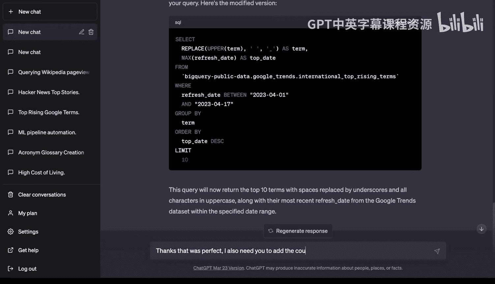

## 增量构建复杂查询

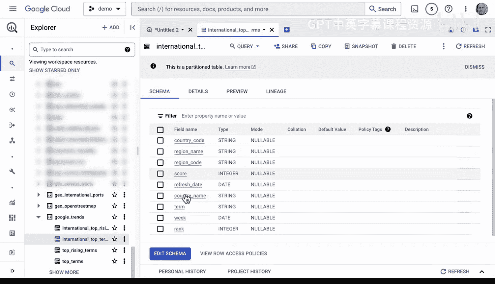

提示工程最有效的方式之一是进行增量式修改。我们可以在已有查询的基础上，逐步添加新的功能。

上一节我们修改了结果的格式，本节我们来看看如何为查询添加更多数据维度。例如，原始查询可能包含国家代码（`country_code`），我们希望将对应的国家名称（`country_name`）也加入结果中。

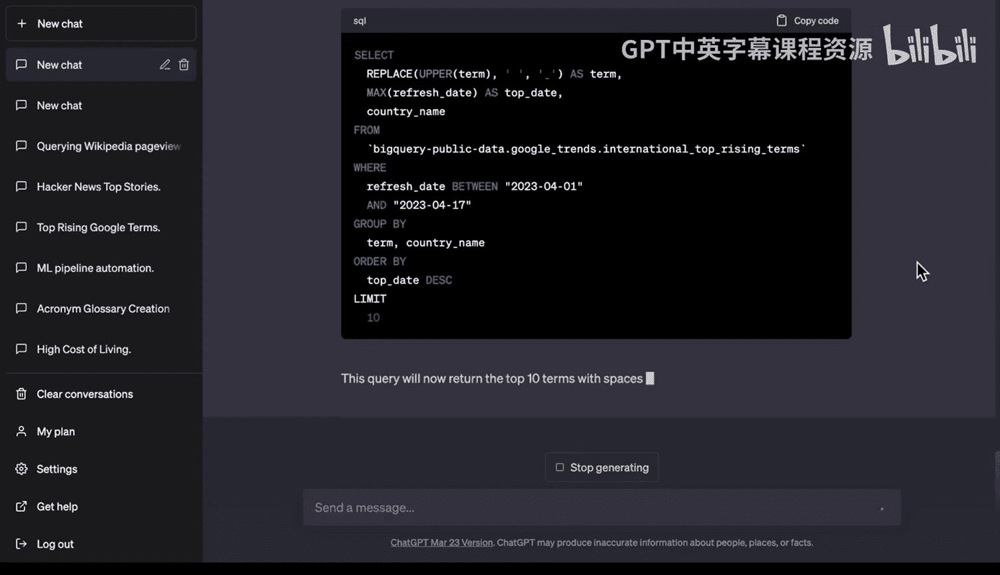

以下是具体步骤：

1.  向模型说明需求：“之前的修改很完美。现在我还需要在查询结果中加入`country_name`列。”
2.  模型会指导你需要在`SELECT`子句中添加该列，并在`GROUP BY`子句中也包含它（如果使用了聚合函数）。
3.  将整合了所有修改（如前10条、大写转换、空格替换、添加国家名）的新查询代码复制到BigQuery中执行。

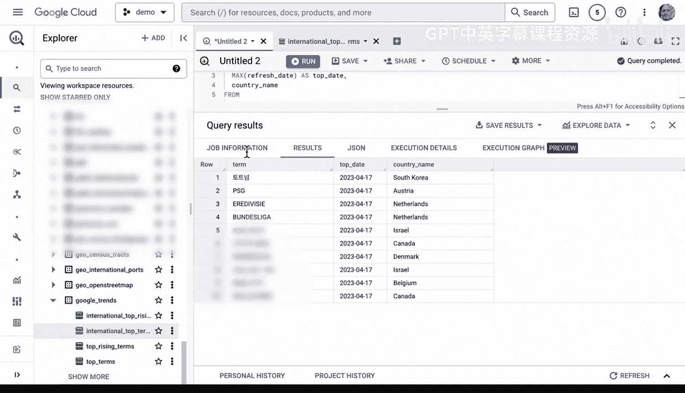

## 最终挑战：添加自定义聚合列

最后，让我们尝试一个更复杂的请求：扩展查询以返回更多结果，并添加一个自定义的计算列。

以下是具体步骤：

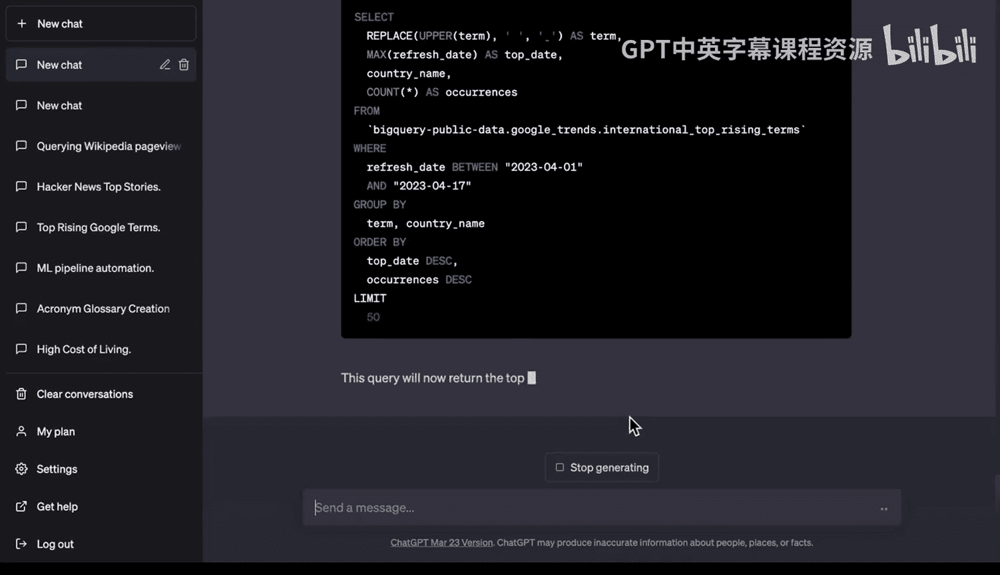

1.  向模型提出综合性请求：“现在，请将查询扩展为返回前50条结果，并添加一个我们自己生成的列。该列用于统计每个结果（搜索词）在不同国家出现的次数，并将这个计数包含在输出中。”
2.  这是一个相当复杂的自然语言指令。模型需要理解并执行以下操作：将`LIMIT`改为50，使用`COUNT()`聚合函数按国家和词条进行计数，并将该计数作为新列输出。
3.  模型生成的查询可能会使用窗口函数或子查询来实现此计数。将最终代码粘贴到BigQuery中运行。

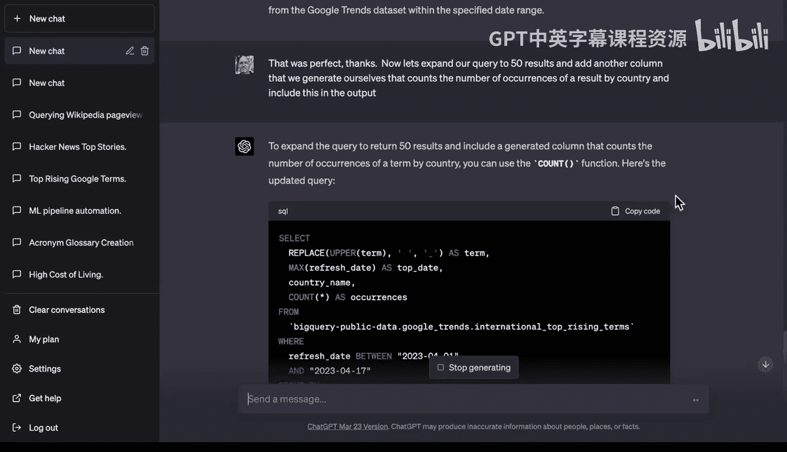

如果成功，你将得到一个包含国家名称、处理后的搜索词（大写、下划线连接）以及该词条在不同国家出现次数的结果集。这些处理后的数据非常适合为后续的机器学习模型训练做准备。

## 总结

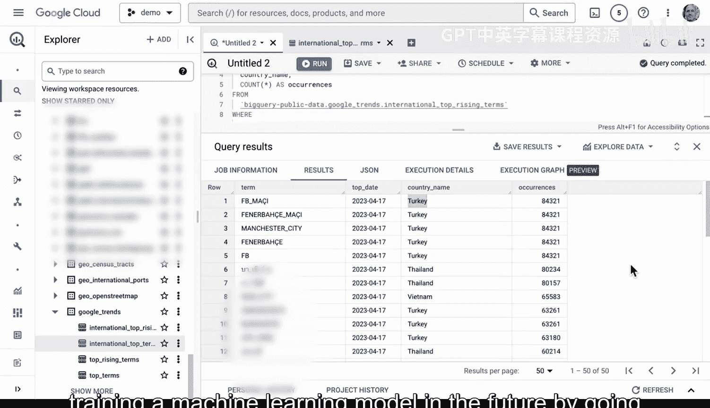

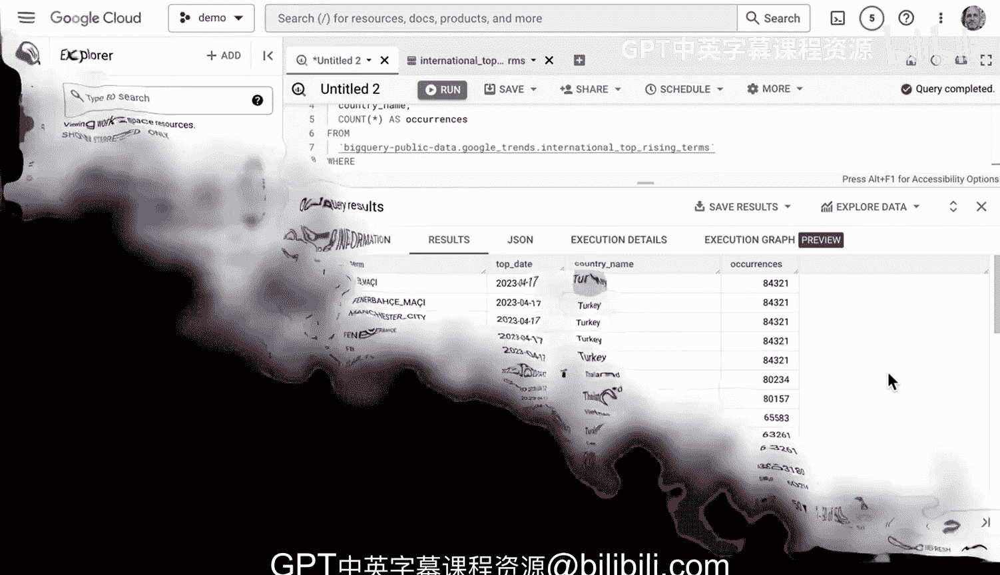

本节课中，我们一起学习了如何将提示工程应用于Google BigQuery的SQL开发。我们从**解释一个现有查询**开始，逐步学会了如何**修改查询以限制结果数量**、**格式化输出结果**（如转大写、替换字符），并通过**增量式交互**添加了新的数据列。最后，我们尝试了**构建一个包含自定义聚合列的复杂查询**。整个过程表明，结合BigQuery这样的强大数据平台与提示工程，可以显著提高数据查询和探索的效率，使你能够更灵活地与数据对话。