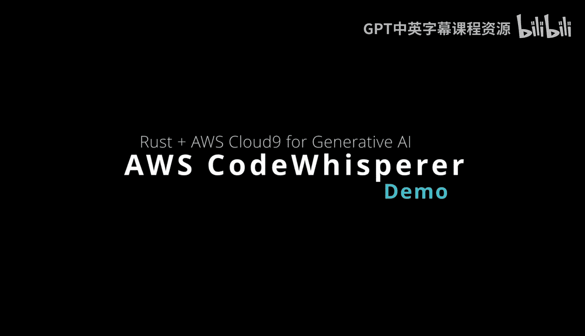
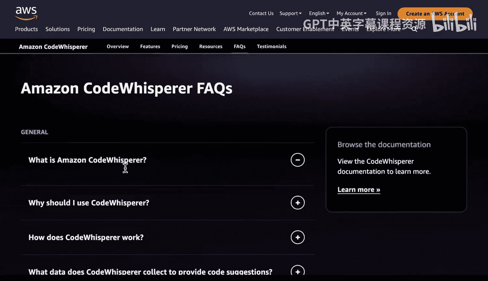
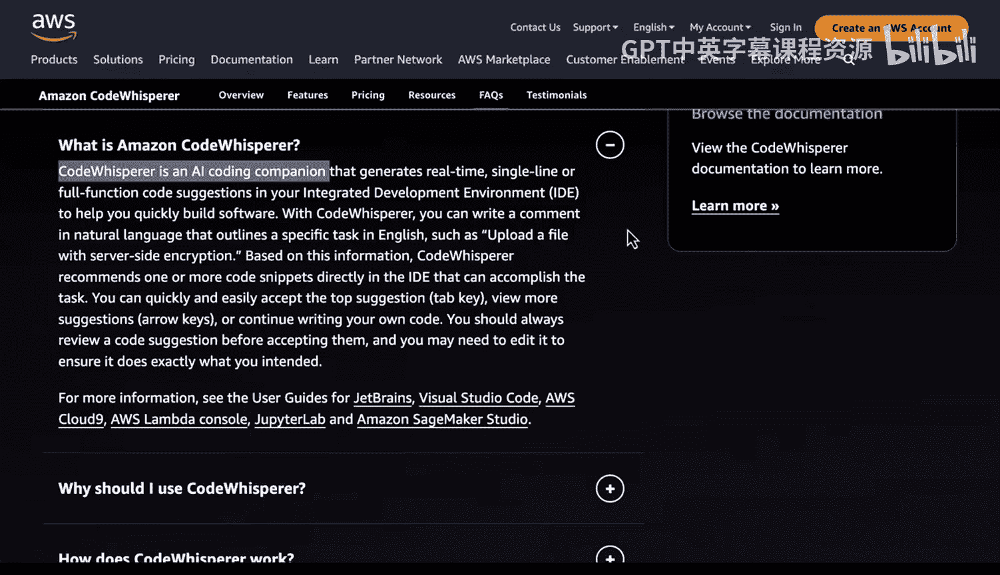
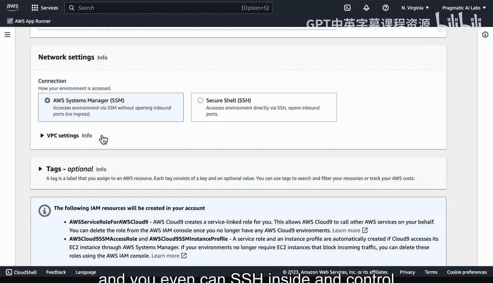
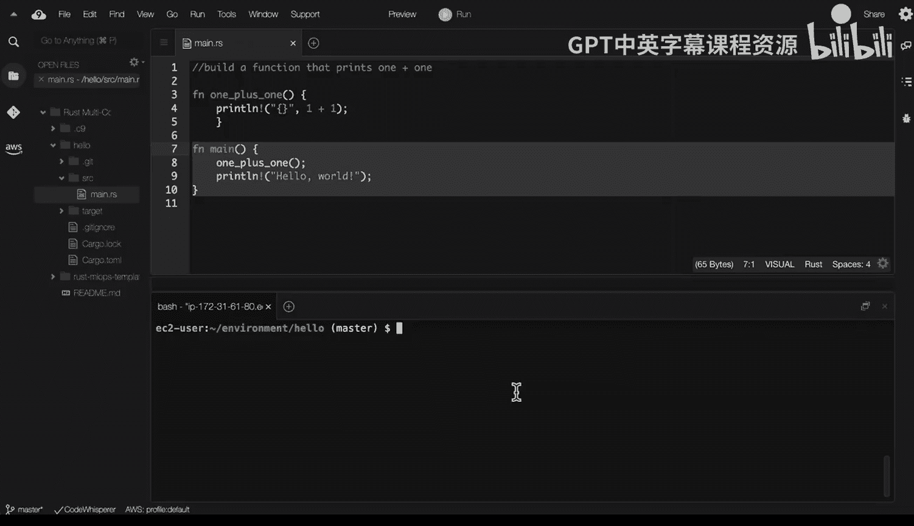
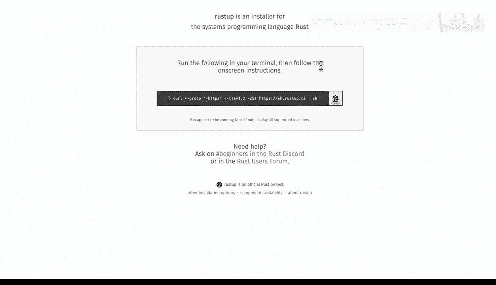
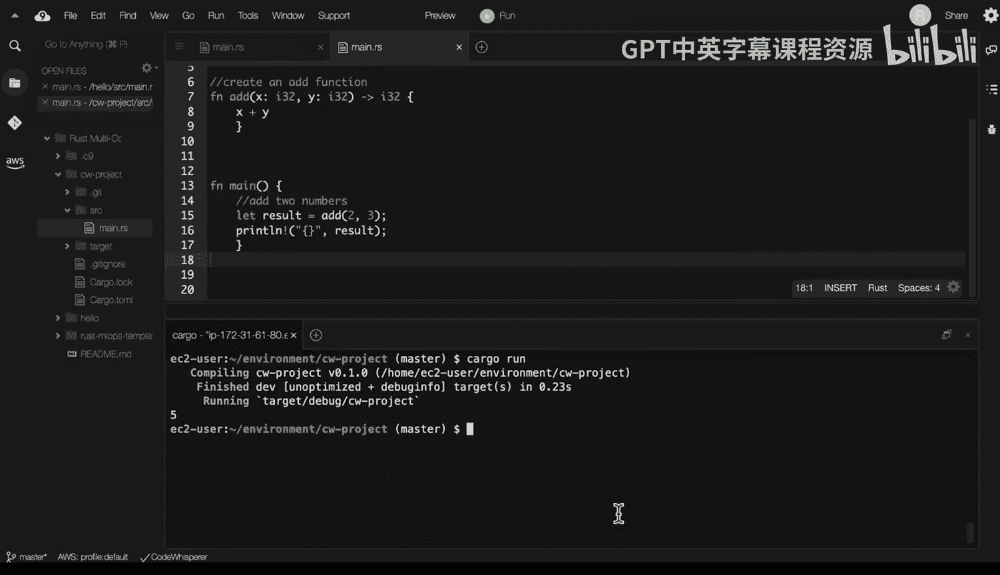
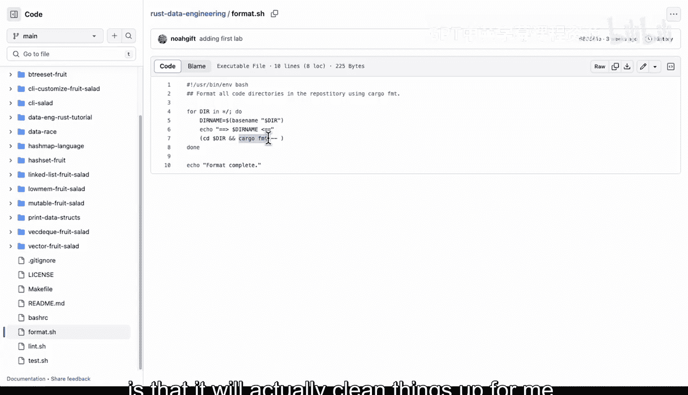
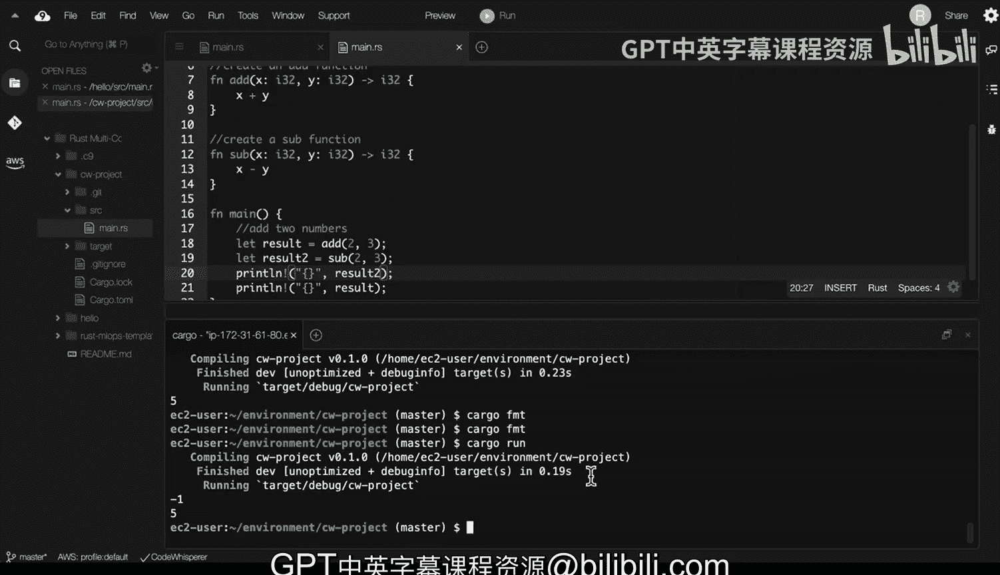

# 006：AWS CodeWhisperer Rust功能介绍 🚀

在本节课中，我们将学习如何使用AWS CodeWhisperer这一AI编程工具来辅助Rust开发。我们将了解其基本功能、如何在AWS Cloud9环境中进行设置，并通过一个简单的计算器项目演示如何与AI结对编程，以高效地编写和调试Rust代码。

---

Amazon CodeWhisperer是一个AI驱动的编程工具，它能以编程方式帮助你构建代码。

我们来看一下它的文档。你可以看到它是一个AI编码伴侣，并且能与IDE集成。它既可以在Visual Studio Code中使用，也可以在AWS Cloud9环境中工作。

首先，让我们看看Cloud9。我喜欢Cloud9的一点是，它可以轻松创建新的、一次性的环境来测试代码。

如果我在这里选择“创建环境”，并命名为“test”，我可以从许多不同的选项中进行选择，包括一些性能强大的机器。例如，这里有一个包含大型机器（甚至裸金属服务器）的庞大列表。如果我想进行实验，我也可以在Amazon Linux上构建环境，这有助于确保我编写的代码能在亚马逊环境中良好运行。

你还可以在这里设置超时时间，这是一种很好的配置方式。你甚至可以通过SSH进入环境进行控制，或者将其放入VPC中。

我已经有一个正在运行的环境，并且已经集成了AWS CodeWhisperer。让我们看看它是如何工作的。

如果我们点击这里的AWS图标，可以看到关于AWS的一些信息，我可以控制不同的服务。我也可以转到“开发者工具”，在这里我已经打开了CodeWhisperer，你可以看到它正在为我的代码提供建议。

---

让我们来看一个具体的例子。注意，在Rust中，我可以先输入一个注释。在这个例子中，我写道“构建一个打印1+1的函数”，我成功地做到了这一点，然后我添加了这段代码。让我们找到它在哪里，它在`hello`项目中。让我们进入`hello`目录。

从这里，如果我输入`cargo run`，你会看到我能够使用这些建议并修改我的代码。

这里需要指出的一点是，为了让Rust在Cloud9上运行，你需要运行`rustup`命令。我们按照屏幕上的说明操作，只需复制并粘贴，非常容易设置。它会询问你是否继续安装、自定义安装或取消。我已经完成了这个步骤，所以我会取消，不需要再次操作。

---

现在，让我们从头开始构建更多内容。我们先向上退一个目录，然后输入`cargo new cw_project`来创建一个名为“cw_project”的CodeWhisperer项目。

创建完成后，我们进入这个目录。在这里，如果我查看`src`目录下创建的`main.rs`文件，这个文件包含了所有入门级的内容，它给了我们一个“Hello, world!”程序。让我们运行`cargo run`来执行它。

现在，让我们开始使用CodeWhisperer。我要做的是，先构建一个多行Rust注释，这是开始的好方法。我会写：“这是一个充当基本计算器的脚本。”

这是在为我们的程序设置上下文。在使用AI结对编程工具时，首先设置上下文非常重要。

接下来，我将开始引导它。例如，我会输入“使用标准输入输出库”，然后开始编写代码，它会给我们建议。我们不一定非要接受这些建议。实际上，在这个案例中，我不打算接受，我会输入自己的引导。我会说：“创建一个加法函数。”

这完全取决于你如何引导它，就像你与同事协作一样。看，它给出了一个看起来不错的函数。现在，它会完成这个特定函数的最后部分。

完美。从这里，我还可以继续整合。例如，我可以说“将两个数字相加”。我们可以这样做：定义一个变量来存储结果，然后打印出来。注意，它会进行替换以使代码工作。

现在，如果我运行`cargo run`，我们会执行它。哦，看起来有个问题，它提示“未闭合的分隔符”。实际上，这确实是个问题。

使用像Rust这样强大的语言，结合CodeWhisperer，好处之一就体现出来了。编译器告诉我哪里错了，然后AI结对编程工具帮助我构建代码。它会怎么做？它会补全那个代码块。

现在，让我们再次运行`cargo run`，它会构建并执行。

---

这里还有几个有趣的地方值得指出。如果我转到另一个已经设置好的项目，查看其中的`Makefile`，我注意到我喜欢做代码格式化。`cargo fmt`的好处是它能帮我整理代码。

所以，如果我们回到这个环境，输入`cargo fmt`，注意它实际上清理了代码。因此，结合请求构建正确的东西（即设置提示）、逐步引导、然后运行（`cargo run`）和格式化（`cargo fmt`），你真正获得了AI结对编程的所有优势，以及编译器带来的好处。

---

最后，让我们做一件事：扩展功能。如果我输入“创建一个减法函数”，它很聪明，知道我想做什么。它会给出相应的代码。完美。

然后，我们可以添加第二个结果。我们可以定义`let res2`，然后将其改为`result2`。接着，我们运行`cargo fmt`进行格式化，再运行`cargo run`。看，我们得到了-1和5。

我认为，利用结对编程环境的方法之一就是：在某些情况下，选择确切的部署目标（这里是Cloud9，因为它运行Amazon Linux），请求建议，运行编译器，但同时使用结对编程工具来真正创建一个反馈循环，以获得最佳可能的结果。

---

**总结**

本节课中，我们一起学习了AWS CodeWhisperer在Rust开发中的应用。我们了解了如何在AWS Cloud9环境中设置Rust和CodeWhisperer，并通过构建一个基础计算器项目，实践了如何通过注释设置上下文、逐步引导AI生成代码、利用编译器反馈调试，以及使用`cargo fmt`保持代码整洁。这种结合AI辅助编程与Rust强大编译器的工作流，能有效提升开发效率与代码质量。