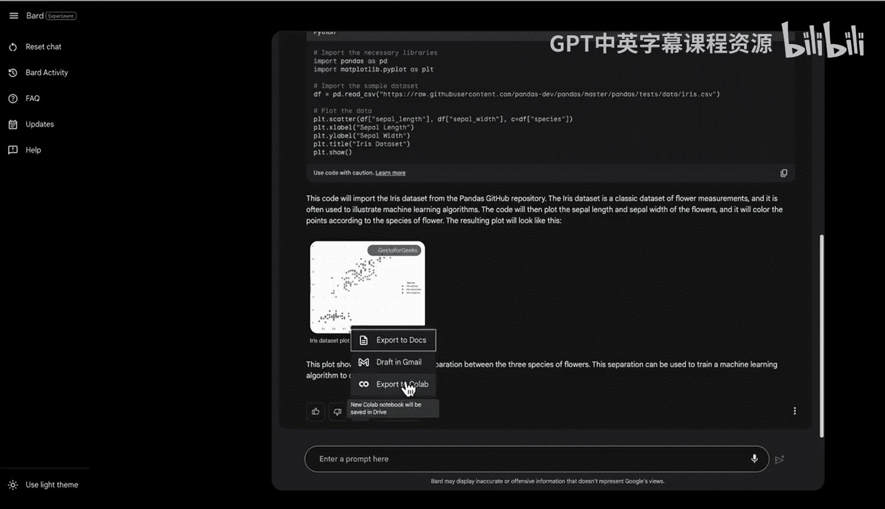
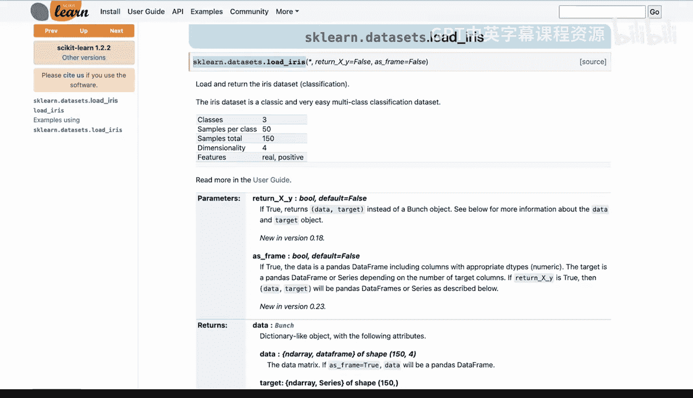
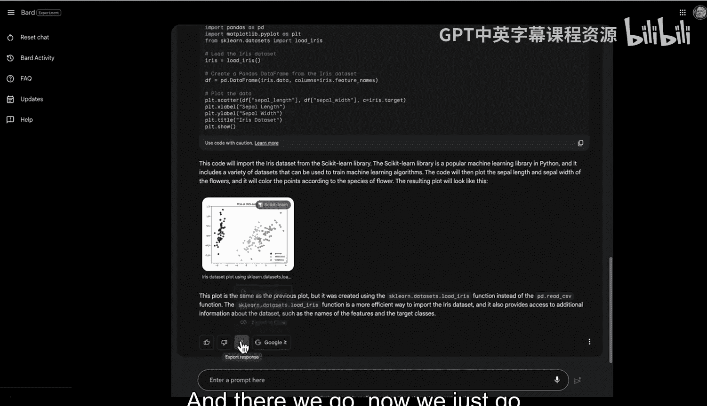
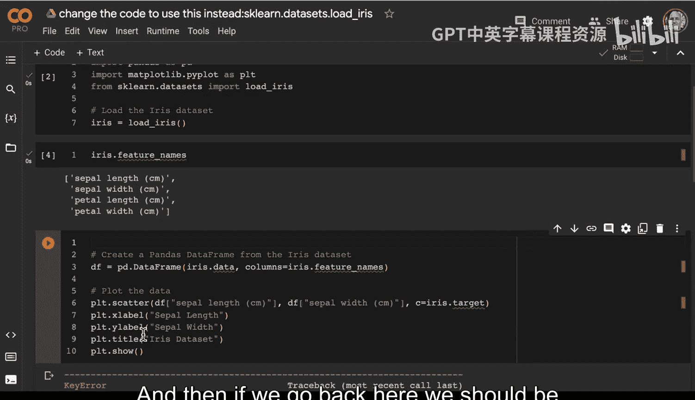
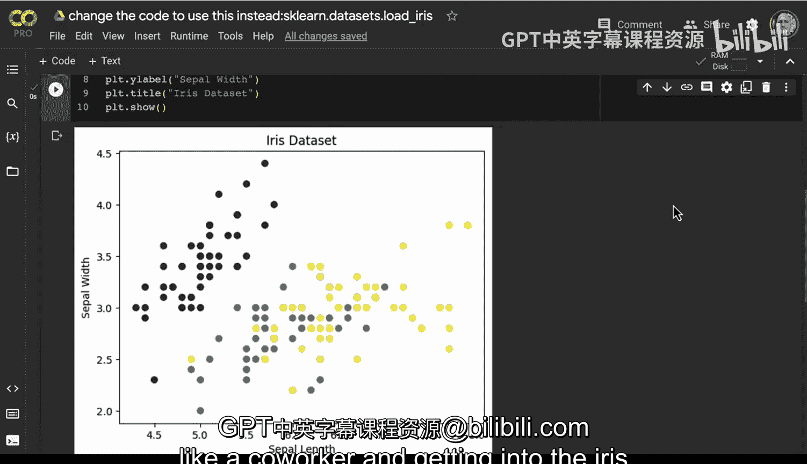

# Rust编程2-3（数据工程、DevOps）：07：使用Google Bard提升生产力 🚀

## 概述
在本节课中，我们将学习如何利用现代AI结对编程工具，特别是Google Bard，来辅助软件开发和学习。我们将通过一个具体的例子，展示如何向Bard提问以获取知识、生成代码，并学习如何调试和迭代AI生成的代码，最终完成一个数据可视化任务。

---

## 知识获取：向Bard提问 📚

现代软件工程的一个令人兴奋的方面是能够使用AI结对程序员来帮助构建项目，甚至为认证考试学习。

让我们先来看一个向Bard提问的例子。第一步，假设我正在为Google云平台的认证考试学习，我可以向Bard提问：“Google云平台安全的三个关键方面是什么？”

以下是Bard给出的关键方面：
*   **数据安全**
*   **身份和访问管理**
*   **合规性**

此外，Bard还提供了一些其他功能。这为我如何学习提供了很好的思路。这主要是从知识获取的角度出发。

---

## 代码生成：获取编程助手 💻

那么，如果我想进行一些编码工作呢？

我可以向Bard提出更具体的编程请求。例如，我说：“构建一个Python Colab笔记本，用于从pandas导入一个样本数据集并进行图表绘制。”

此时，我可以从Bard那里获得一个入门工具包。我甚至可以直接获得代码。例如，代码可能包含 `import pandas as pd` 和 `import matplotlib.pyplot as plt` 这样的片段。

如果我需要，我还可以将这个响应直接导出到笔记本中。例如，我可以说“导出到Colab笔记本”。这样做的好处是，我既能获得Bard的结对编程协助，又能直接深入到一个示例笔记本中。

---

## 实践与调试：迭代完善代码 🔧

上一节我们介绍了如何从Bard获取代码，本节中我们来看看如何运行和调试这些代码。

让我们在Colab中更改运行时类型，并分配更多内存。然后，我们可以尝试运行这个示例。这是快速上手特定库的一个好方法。

然而，我们遇到了一个问题：代码报错，提示某个数据集未找到。像这样的错误很常见。那么，如何解决这个问题呢？

我们可以进行调试。一个方法是打开新标签页搜索正确的数据集加载方法。例如，搜索“iris dataset pandas”，我们可能会找到使用 `from sklearn.datasets import load_iris` 的正确调用方式。

于是，我回到Bard的提示框，要求它更改代码以使用这个新的导入方式。理解如何迭代是重要的一部分，即要能接受代码可能存在问题的现实。

我们再次导出响应，并在新的Colab笔记本中打开。现在代码变成了 `from sklearn.datasets import load_iris`。我们更改运行时设置并保存，然后再次运行。

重要的是要明白，你不能指望生成的代码是完美的。你必须具备来回调试的能力。现在，我们又遇到了一个新问题：某个列名可能有问题。

---

## 深入调试：检查数据与修正错误 🐛

那么，我们如何修复这个问题呢？其实很简单。

我们可以通过深入代码来调试。通常，我会先尝试单独加载数据，看看是否成功。我新建一个代码单元格，粘贴数据加载部分的代码并运行。这一步成功了。

接着，我在下面再添加一个代码单元格，查看 `iris.data` 和 `iris.feature_names`。我们发现，实际的特征名（例如 `sepal length (cm)`）与代码中预期的列名（例如 `sepal_length`）略有不同。

这个问题很容易修复。我只需要回到绘图代码中，将 `sepal_length` 改为 `sepal length (cm)`，将 `sepal_width` 改为 `sepal width (cm)`。

修改之后，我们再次运行代码，现在图表成功显示了。使用结对编程助手确实需要一点耐心，但同时进行编码。

在这个具体的例子中，我们坚持了下来，通过将结对编程工具视为协作者，并深入处理Iris数据和进行可视化，我们获得了相当大的进展。

---

## 总结
本节课中，我们一起学习了如何利用Google Bard作为AI结对编程工具来提升生产力。我们从向Bard提问获取知识开始，然后学习了如何让它生成初始代码片段。更重要的是，我们实践了运行、调试和迭代AI生成代码的过程，包括处理导入错误和数据列名不匹配等常见问题。这个过程表明，将AI助手作为协作工具，并结合开发者自身的调试能力，可以高效地完成编程和学习任务。