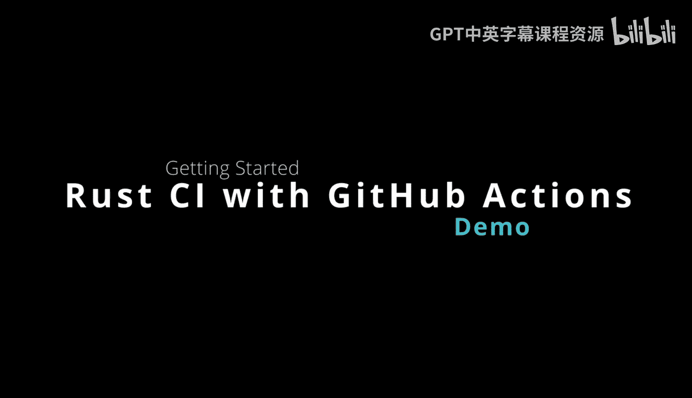
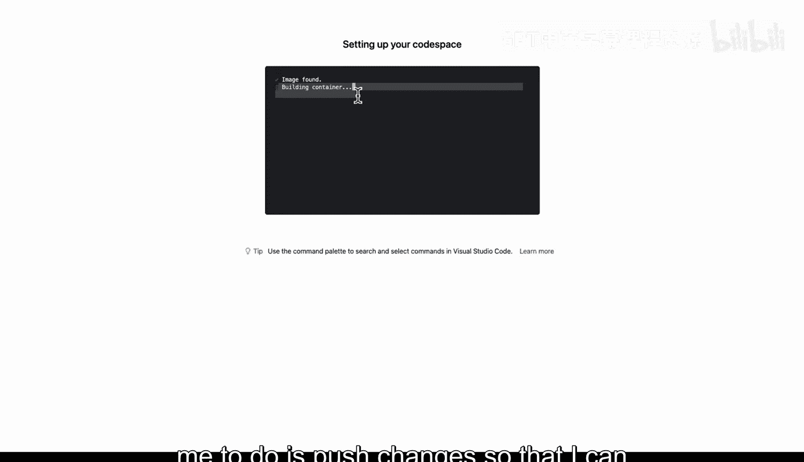
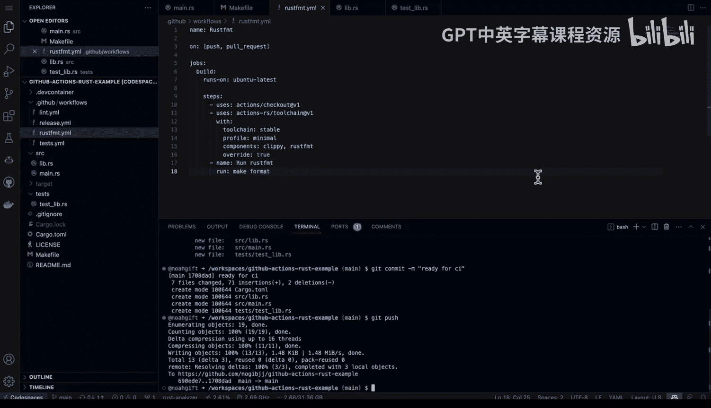
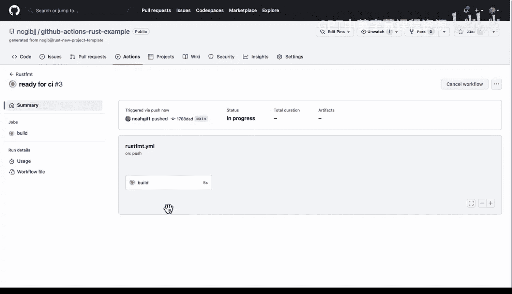
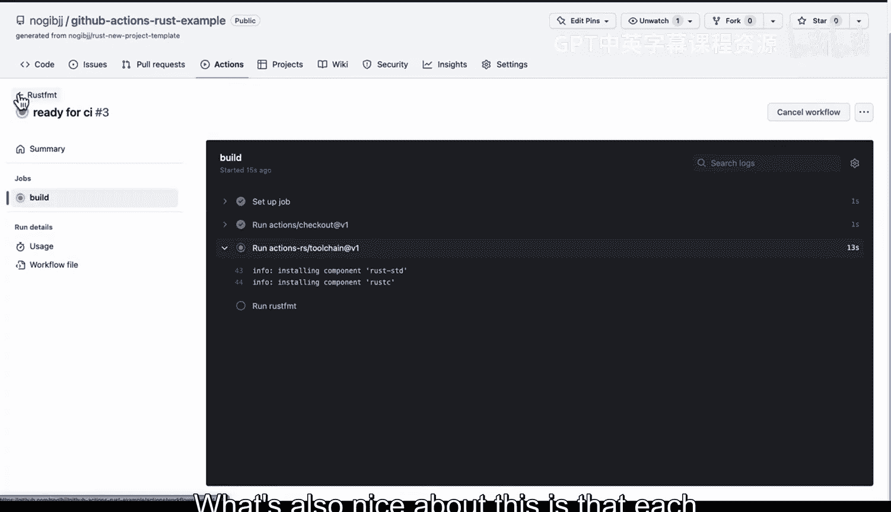
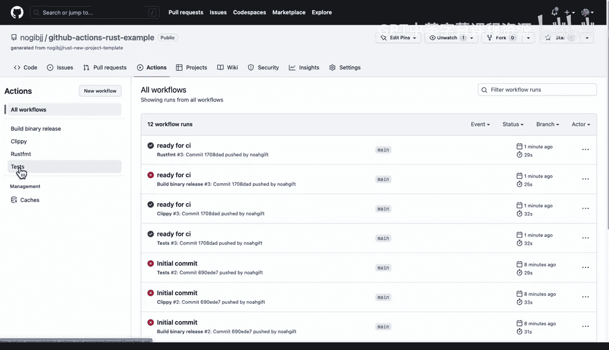
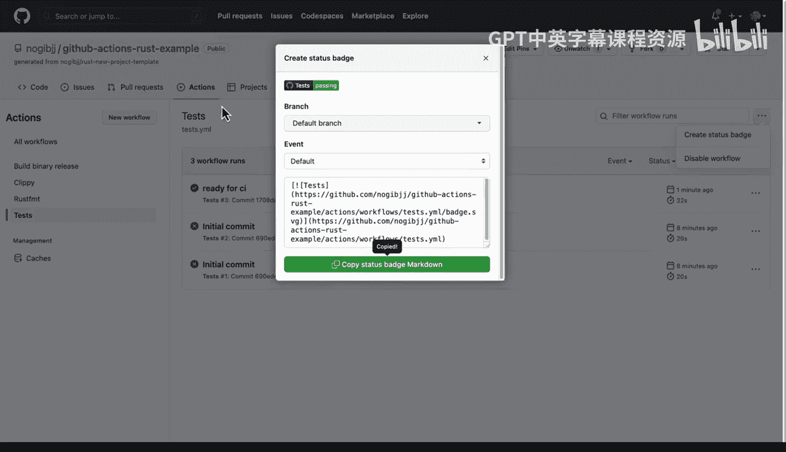
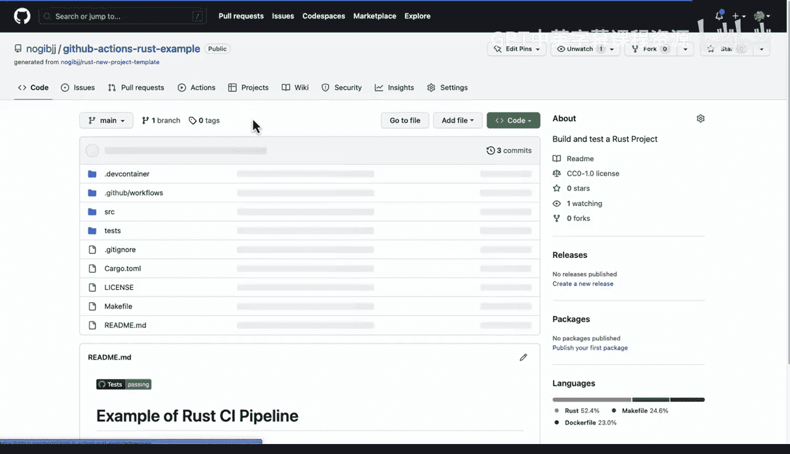
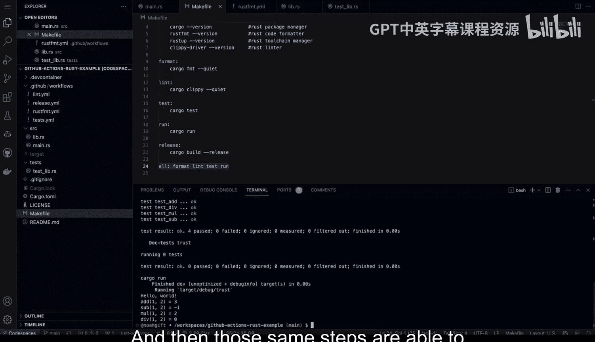
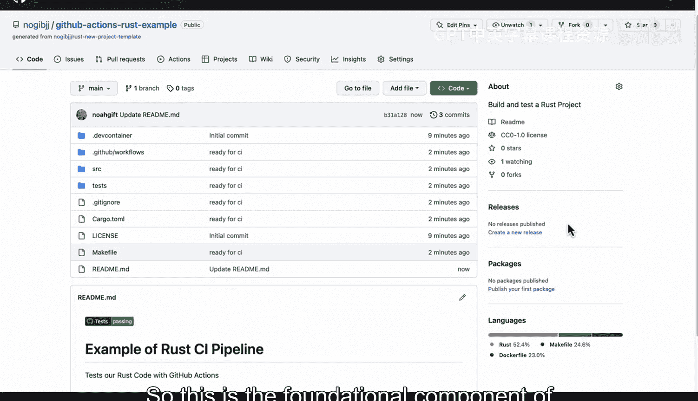

# 008：Rust与GitHub Actions持续集成 🚀



在本节课中，我们将学习如何为一个Rust项目设置GitHub Actions持续集成（CI）流程。我们将从创建一个新项目开始，配置必要的构建和测试步骤，并最终在GitHub Actions中自动运行这些步骤，以确保代码质量。

---

## 概述

持续集成是DevOps的核心实践之一，它允许我们自动测试和验证代码。通过使用GitHub Actions，我们可以为Rust项目设置一个自动化的构建、代码检查、格式化和测试流程。这有助于在开发早期发现问题，并确保代码库始终保持高质量。

---

## 创建新项目与仓库

首先，我们需要创建一个新的Rust项目，并将其设置为使用GitHub Actions进行持续集成。以下是具体步骤。

我们将使用一个项目模板来创建一个新的GitHub仓库。这个模板已经预配置了CI所需的基础结构。

1.  使用模板创建新仓库。
2.  将仓库命名为 `github-actions-rust-example`。
3.  描述为“构建和测试一个Rust项目”。



设置新项目的目标是，从一开始就为其配置持续集成。这是DevOps的最佳实践，能帮助你更快地构建微服务，因为质量控制流程会随着时间的推移不断改进你的代码。

---

## 配置开发环境

为了高效工作，我们将在GitHub Codespaces中配置一个强大的Rust开发环境。

在GitHub Codespaces内部，环境已经为我们准备好了Rust工具链。我们可以通过输入 `which cargo` 来验证。接下来，我们将初始化一个新的Rust项目。

我们将执行以下命令来创建项目结构：
```bash
cargo new test_rust
```
这将创建一个名为 `test_rust` 的新项目目录。

我们还需要创建一些额外的文件来组织我们的代码和测试。
以下是需要创建的文件列表：
*   `src/lib.rs`：库文件。
*   `Makefile`：用于定义构建命令。
*   `tests/test_lib.rs`：测试文件。

使用 `touch` 命令创建这些文件：
```bash
touch src/lib.rs
mkdir -p tests
touch tests/test_lib.rs
```

---

## 编写与测试代码

现在，项目结构已经搭建完成，我们需要向其中添加一些代码并进行本地测试。

我将从一个现有项目中复制一些示例代码，粘贴到我们的新文件中。

1.  将代码粘贴到 `src/main.rs` 中。
2.  将库代码粘贴到 `src/lib.rs` 中。
3.  将测试代码粘贴到 `tests/test_lib.rs` 中。

粘贴完成后，我们需要对代码做一点小修改，例如将某个结构体或函数重命名以符合当前项目上下文。Rust的工具链非常智能，我们可以使用编辑器的查找替换功能轻松完成这个任务。

现在，我们可以利用 `Makefile` 来运行各种质量检查命令。`Makefile` 中预定义了多个任务。

以下是 `Makefile` 中可用的关键命令：
*   `make format`：使用 `rustfmt` 自动格式化代码。
*   `make lint`：使用 `clippy` 进行代码检查，发现潜在问题。
*   `make test`：运行项目中的所有测试。

我们在本地依次运行这些命令，以确保一切正常。例如，运行 `make test` 后，应该能看到所有测试都成功通过。

---

## 配置GitHub Actions工作流

上一节我们验证了代码在本地可以正常工作，本节中我们来看看如何将这些步骤自动化。核心是配置GitHub Actions工作流文件。

GitHub Actions的工作流定义在 `.github/workflows` 目录下的YAML文件中。我们需要确保工作流中的步骤与我们本地运行的 `make` 命令一致。

检查现有的工作流文件，我们发现它已经配置了在Ubuntu环境下运行，并会拉取Rust工具链。它计划执行 `make lint` 等步骤。由于我们已经在本地测试过，可以确信这些步骤会成功。

不过，工作流中有一个步骤调用了 `make format-check`，而我们的 `Makefile` 中没有定义这个命令。因此，我们需要将其改为我们已经定义好的 `make format`。



修改完成后，我们就可以提交更改并触发GitHub Actions了。



---

## 提交更改并触发CI

所有配置都已完成，现在我们将更改提交到仓库，并观察GitHub Actions的自动执行过程。

首先，我们使用Git命令添加所有更改的文件并提交。
```bash
git add .
git commit -m “Ready for continuous integration”
git push
```
提交信息“Ready for continuous integration”会触发GitHub Actions开始运行。



提交后，我们可以转到GitHub仓库的“Actions”选项卡查看工作流的执行情况。

---

## 验证CI结果与创建状态徽章

工作流触发后，GitHub Actions会自动执行我们定义的所有步骤。我们需要查看每个步骤的执行结果是否成功。





在Actions页面，我们可以看到工作流被分解为多个独立的步骤，例如构建二进制文件、代码检查（linting）、代码格式化（formatting）和运行测试（testing）。每个步骤旁边会显示成功（✓）或失败（✗）的状态。

如果所有步骤都显示为成功，则表明我们的持续集成管道配置正确。这是一个重要的里程碑。



为了让项目的质量状态一目了然，我们可以创建一个状态徽章（Status Badge）并添加到项目的README文件中。

在GitHub Actions页面，可以找到“Create status badge”的选项。复制生成的Markdown代码，将其粘贴到项目的 `README.md` 文件中。例如：
```markdown

```
我们还可以更新README的标题，例如改为“一个Rust CI管道示例”，并说明本项目使用GitHub Actions测试Rust代码。

---

## 总结

本节课中我们一起学习了为Rust项目设置GitHub Actions持续集成的完整流程。

持续集成的核心在于：你可以在本地进行开发，并通过一个统一的命令（如 `make all`）验证所有构建和测试步骤。然后，这些相同的步骤可以在构建系统（如GitHub Actions、GCP Cloud Run等）中自动复现。最后，通过状态徽章向所有人展示你的代码处于高质量且可用的状态。





这是实现DevOps的基础组件——持续集成，并且设置过程相当简单直接。在此基础上，你可以进一步构建持续交付（CD）流程。