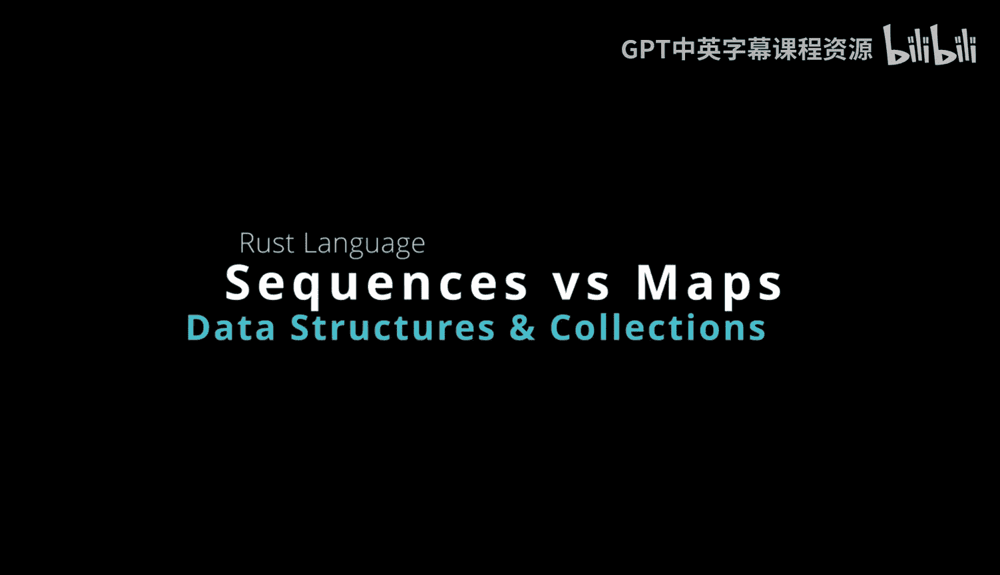
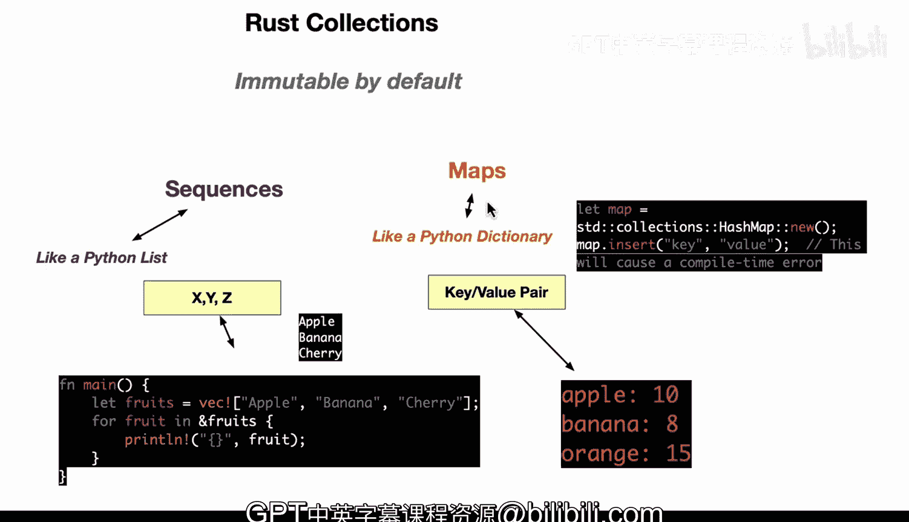

# Rust编程2-3（数据工程、DevOps）：09：Rust序列与映射结构介绍 🦀



在本节课中，我们将要学习Rust中的两种核心集合类型：序列（Sequence）和映射（Map）。我们将探讨它们的基本概念、与Python中类似结构的异同，以及Rust在类型安全和可变性方面的独特设计。

## 概述

Rust的集合库提供了多种数据结构来存储和操作数据。其中，序列和映射是最常用的两种。它们与Python中的列表（List）和字典（Dictionary）有相似之处，但在可变性、类型安全和迭代顺序等方面存在关键差异。理解这些差异对于编写安全、高效的Rust代码至关重要。

## 序列（Sequence）

序列类似于Python中的列表。在Rust中，一个常见的序列实现是向量（`Vec`），它是一种动态数组。

以下是一个创建不可变序列的例子：

```rust
let fruits = ["apple", "banana", "cherry"];
```

这行代码创建了一个名为`fruits`的不可变数组。这意味着一旦创建，你就无法修改其内容（例如，添加、删除或更改元素）。这是Rust的一项安全特性，旨在防止意外的数据修改。如果你打印这个数组，输出将是：

```
["apple", "banana", "cherry"]
```

## 映射（Map）

映射类似于Python中的字典，是一种键值对（Key-Value）存储结构。Rust标准库中常用的映射是`HashMap`。

默认情况下，Rust中的映射也是不可变的。例如，如果你尝试向一个默认创建的`HashMap`中插入值，但没有将其声明为可变的（`mut`），操作将会失败：

```rust
use std::collections::HashMap;

let mut scores = HashMap::new(); // 注意这里的 `mut` 关键字
scores.insert(String::from("Apple"), 10);
scores.insert(String::from("Banana"), 8);
scores.insert(String::from("Oranges"), 15);
```

只有使用`mut`关键字声明后，`scores`这个映射才是可变的，才能进行插入操作。打印这个映射，输出类似于键值对的形式：

```
{"Apple": 10, "Banana": 8, "Oranges": 15}
```

上一节我们介绍了Rust中序列和映射的基本创建方式，本节中我们来看看它们与Python中对应结构的详细对比。

## 与Python的对比

Rust的序列和映射与Python的列表和字典在概念上相似，但在实现和行为上有重要区别。

以下是它们之间的一些核心异同点：

*   **数据结构类比**
    *   Python的列表（List）是动态数组，类似于Rust中的向量（`Vec<T>`）。
    *   Python的字典（Dictionary）和Rust的映射（如`HashMap<K, V>`）都是键值存储。

*   **访问模式**
    *   在Python列表和Rust序列中，元素都通过它们在集合中的**位置（索引）** 来访问。

*   **重复值**
    *   Python列表和Rust序列都**允许**存储重复的值。
    *   Python字典和Rust映射都**不允许**有重复的键。每个键必须是唯一的。

*   **迭代顺序**
    *   这是一个重要区别。在较新版本的Python中，字典默认会**保持**元素的插入顺序。
    *   在Rust的`HashMap`中，迭代顺序是**不保证**的，它可能因哈希函数和内部布局而不同。

*   **类型安全**
    *   这是使用Rust的一个关键原因。Python的列表和字典是**动态类型**的，意味着你可以在一个列表中放入字符串、整数、对象等任何类型的数据。
    *   Rust的序列和映射是**静态类型**的。你必须在编译时明确指定它们所能包含的数据类型。例如，一个`Vec<i32>`只能包含整数，一个`HashMap<String, i32>`的键必须是字符串，值必须是整数。这为程序提供了强大的类型安全保障，能在编译期捕获许多错误。

## 总结

本节课中我们一起学习了Rust中两种基础的集合类型：序列和映射。

我们了解到，Rust的序列（如数组和向量）类似于Python的列表，而映射（如`HashMap`）类似于Python的字典。然而，Rust通过默认的不可变性、不保证顺序的映射迭代以及最重要的**静态类型系统**，与Python区分开来。这种类型安全特性要求开发者在编码时更明确地定义数据结构，从而在程序运行前就避免了大量的潜在错误，这是Rust追求内存安全和并发安全的核心体现。



理解这些集合的特性和它们与动态语言中对应结构的区别，是掌握Rust编程的重要一步。