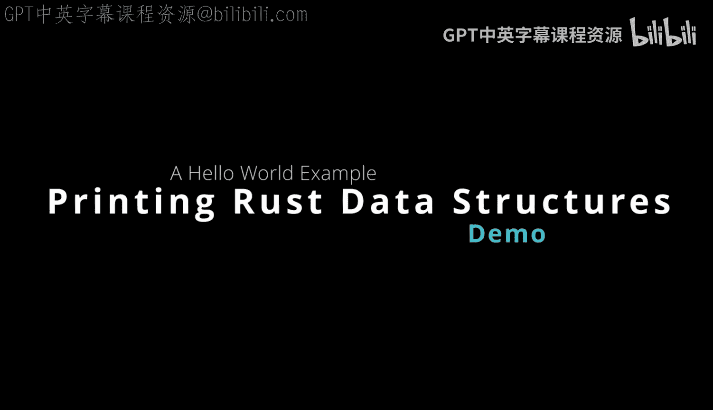
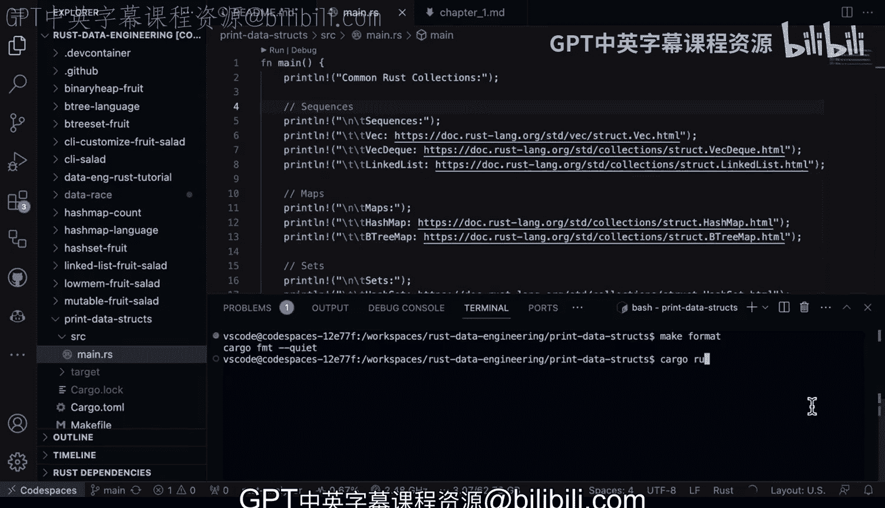

# Rust编程：2-3：数据结构打印演示 🖨️



在本节课中，我们将学习如何在控制台中打印Rust的各种数据结构。我们将逐一介绍Rust中流行的数据结构，并通过代码示例展示如何打印它们。涵盖的数据类型包括整数、浮点数、字符串、数组、向量、哈希映射和结构体。

## 项目初始化与运行

首先，我们使用Cargo创建一个新的Rust项目。在终端中执行以下命令：

```bash
cargo new print_datastructs
```

这将在当前目录下创建一个名为`print_datastructs`的新项目。进入项目目录后，可以看到默认生成的`src/main.rs`文件，其中包含一个简单的`main`函数。

以下是项目的基本结构：

```rust
fn main() {
    println!("Hello, world!");
}
```

为了运行这个项目，我们使用`cargo run`命令。在项目根目录下执行：

```bash
cargo run
```

这将编译并运行项目，在控制台输出“Hello, world!”。

## 常用Rust集合概览

在深入打印具体数据结构之前，我们先简要了解Rust中常用的集合类型。根据官方文档，这些集合可以分为以下几类：

*   **序列**：`Vec`（向量）、`VecDeque`（双端队列）、`LinkedList`（链表）
*   **映射**：`HashMap`（哈希映射）、`BTreeMap`（B树映射）
*   **集合**：`HashSet`（哈希集合）、`BTreeSet`（B树集合）
*   **其他**：`BinaryHeap`（二叉堆）

这些集合类型将在后续的演示中逐一介绍。

## 使用Makefile简化开发流程

在Rust项目开发中，使用Makefile可以简化常见的开发命令，如格式化、代码检查和运行。以下是一个示例Makefile的内容：

```makefile
format:
    cargo fmt

lint:
    cargo clippy

test:
    cargo test

run:
    cargo run
```

将上述内容保存为项目根目录下的`Makefile`文件后，可以通过以下命令执行相应操作：

*   `make format`：使用`rustfmt`工具格式化代码。
*   `make lint`：使用`clippy`工具进行代码检查，发现潜在问题。
*   `make test`：运行项目中的所有测试。
*   `make run`：编译并运行项目。

例如，如果代码中有多余的空格，执行`make format`可以自动清理并格式化代码。同样，执行`make lint`可以帮助发现代码中的常见错误或不良实践。

## 打印基本数据类型

上一节我们介绍了项目设置和开发工具，本节中我们来看看如何打印Rust的基本数据类型。以下是几种基本数据类型的打印示例：

```rust
fn main() {
    // 整数
    let integer: i32 = 42;
    println!("整数: {}", integer);

    // 浮点数
    let float: f64 = 3.14;
    println!("浮点数: {}", float);

    // 字符串
    let string: &str = "Hello, Rust!";
    println!("字符串: {}", string);
}
```

执行上述代码，将在控制台输出相应的值。

## 打印集合类型

接下来，我们学习如何打印Rust中的集合类型。以下是几种常见集合的打印示例：

```rust
use std::collections::{HashMap, HashSet, VecDeque, BinaryHeap};

fn main() {
    // 数组
    let array: [i32; 3] = [1, 2, 3];
    println!("数组: {:?}", array);

    // 向量
    let vector: Vec<i32> = vec![4, 5, 6];
    println!("向量: {:?}", vector);

    // 哈希映射
    let mut hash_map = HashMap::new();
    hash_map.insert("key1", "value1");
    hash_map.insert("key2", "value2");
    println!("哈希映射: {:?}", hash_map);

    // 哈希集合
    let hash_set: HashSet<i32> = [7, 8, 9].iter().cloned().collect();
    println!("哈希集合: {:?}", hash_set);
}
```

注意，打印集合类型时使用了`{:?}`格式化占位符，这是因为这些类型实现了`Debug` trait，允许以调试格式输出。

## 打印结构体

最后，我们看看如何打印自定义的结构体。为了使结构体能够打印，需要为其派生`Debug` trait。以下是一个示例：

```rust
#[derive(Debug)]
struct Person {
    name: String,
    age: u32,
}

fn main() {
    let person = Person {
        name: String::from("Alice"),
        age: 30,
    };
    println!("结构体: {:?}", person);
}
```

通过`#[derive(Debug)]`属性，我们为`Person`结构体自动实现了`Debug` trait，从而可以使用`{:?}`占位符打印其内容。

## 总结



本节课中我们一起学习了如何在Rust中打印各种数据结构。我们从项目初始化开始，介绍了使用Cargo创建和运行项目的基本步骤。然后，我们探讨了如何使用Makefile简化开发流程，包括代码格式化、检查和运行。接着，我们通过示例代码演示了如何打印基本数据类型、集合类型以及自定义结构体。掌握这些打印技巧对于调试和理解Rust程序中的数据流非常有帮助。