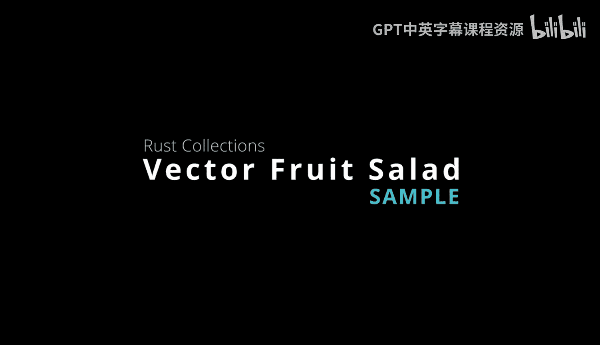
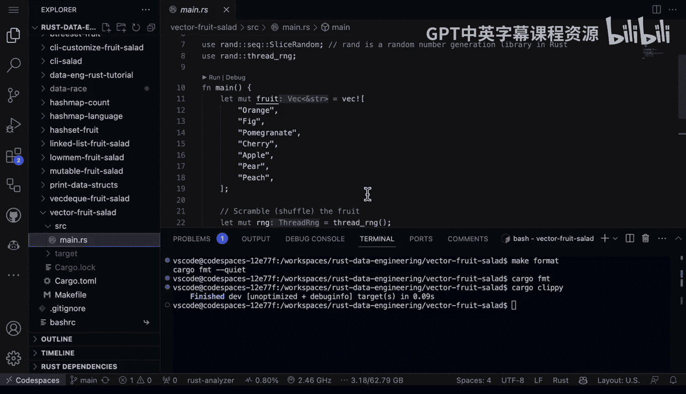

# 011：向量数据结构演示 🍇



在本节课中，我们将学习如何使用Rust中的向量数据结构。向量是Rust中最常用、最灵活的数据结构之一，类似于Python中的列表。我们将通过一个“水果沙拉”的示例程序，演示如何创建向量、动态添加/移除元素、访问元素，并展示其核心特性和优势。

## 概述

向量是一个可增长的数组，其大小可以在运行时动态调整。它是Rust标准库提供的一个核心集合类型，对于处理一系列同类型数据非常有用。本节我们将通过一个具体的例子，直观地理解向量的基本操作。

## 代码结构与依赖

首先，我们来看示例程序的基本结构和外部依赖。这个程序使用了`rand`库来生成随机数，以实现对水果列表的随机打乱。

在Rust项目中，如果需要使用标准库之外的功能，我们需要在`Cargo.toml`文件中声明依赖。以下是本示例的依赖项：

```toml
[dependencies]
rand = "0.8"
```

## 创建与初始化向量

上一节我们介绍了程序的基本结构，本节中我们来看看如何创建和初始化一个向量。在Rust中，使用`vec!`宏可以方便地创建一个包含初始元素的向量。

在`main`函数中，我们定义了一个可变的字符串向量来存放各种水果：

```rust
let mut fruit = vec!["Orange", "Fig", "Pomegranate", "Cherry", "Apple", "Pear", "Peach"];
```

这里的关键点：
*   `let mut` 声明了一个可变变量`fruit`，这意味着我们后续可以修改这个向量。
*   `vec!` 是一个宏，用于便捷地初始化向量。
*   如果不需要修改向量，可以声明为`let fruit`，使其成为不可变的。

## 操作向量元素

创建向量后，我们可以对其进行各种操作。以下是本示例中演示的几个核心操作：

**打乱向量顺序**
我们使用`rand`库中的`shuffle`方法来随机打乱向量中元素的顺序。这体现了向量内容可以被修改的特性。
```rust
fruit.shuffle(&mut rng);
```

**遍历与访问元素**
为了打印出所有水果，我们需要遍历向量。Rust的向量是可迭代的，可以使用`iter()`方法获取迭代器，并结合`enumerate()`同时获得元素的索引和值。
```rust
for (i, item) in fruit.iter().enumerate() {
    println!("{}: {}", i + 1, item);
}
```

## 运行与工具使用

现在，让我们运行这个程序并介绍一些常用的Rust开发工具。

要编译并运行程序，只需在项目根目录下执行：
```bash
cargo run
```
Cargo会处理依赖、编译代码并运行生成的可执行文件，输出随机打乱后的水果沙拉列表。

此外，保持代码整洁规范很重要，Rust提供了强大的工具链：

**代码格式化**
使用`rustfmt`工具可以自动格式化代码，使其符合Rust风格指南。可以通过Cargo执行：
```bash
cargo fmt
```

**代码检查**
`clippy`是一个静态分析工具，能发现代码中的常见错误并提出改进建议。运行命令如下：
```bash
cargo clippy
```
如果代码没有问题，它将不会输出任何警告或错误。

## 总结

本节课中我们一起学习了Rust中向量数据结构的基本用法。我们通过“水果沙拉”程序，实践了如何：
1.  使用`vec!`宏创建和初始化向量。
2.  通过`let mut`声明可变向量以修改其内容。
3.  使用`shuffle`方法打乱向量顺序。
4.  使用`iter()`和`enumerate()`遍历并访问向量元素。
5.  使用`cargo run`运行程序，并用`cargo fmt`和`cargo clippy`来格式化和检查代码。




向量是解决许多编程问题的首选数据结构，掌握其用法是学习Rust的重要一步。其语法和概念对于有Python等语言经验的开发者来说也相当直观。