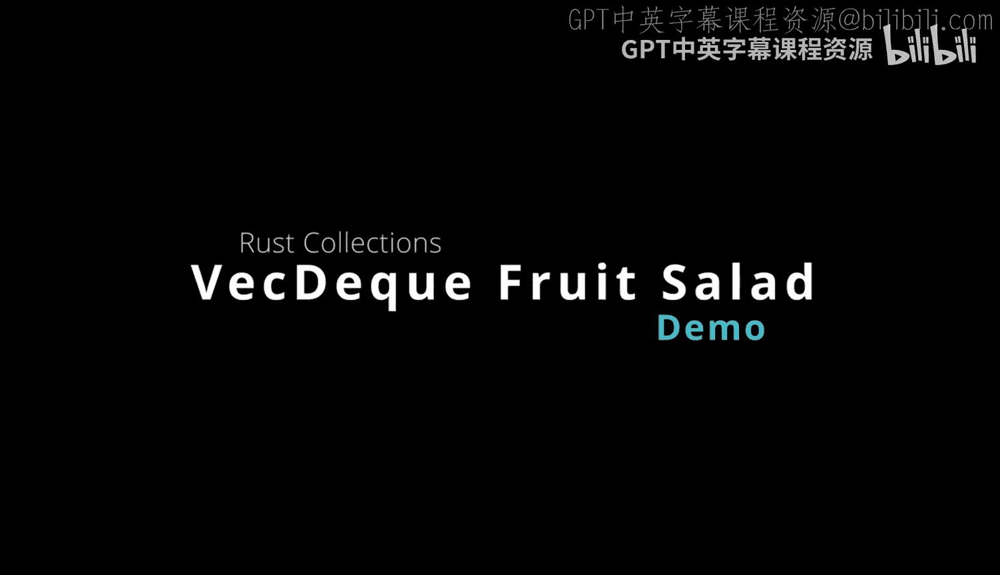
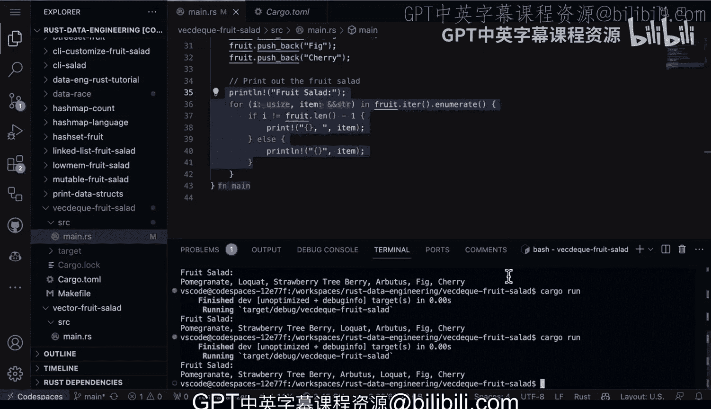

# 012：VecDeque水果沙拉演示 🍇



在本节中，我们将学习Rust标准库中的`VecDeque`（双端队列）数据结构。我们将通过一个制作“水果沙拉”的示例程序，来理解`VecDeque`的基本操作，包括从队列两端高效地添加元素，以及如何与普通向量（`Vec`）进行转换和配合使用。

---

## 概述

`VecDeque`是一个双端队列，类似于Python `collections`模块中的`deque`。它的一个显著优点是，在队列的**前端**和**后端**进行添加或删除操作时，都具有**O(1)**的时间复杂度。这意味着无论从哪一端操作，效率都非常高。这种特性可以为你的代码引入新的、非常有用的编程模式。

接下来，让我们详细解析示例代码。该代码的流程是：首先初始化一个`VecDeque`，将其转换为`Vec`以便进行随机打乱（shuffle），然后再转换回`VecDeque`。随后，它将石榴（pomegranate）添加到队列前端，将无花果（fig）和樱桃（cherry）添加到队列后端。最后，它打印出最终的水果沙拉列表。

---

## 代码解析与步骤

以下是实现上述逻辑的Rust代码核心步骤。

首先，我们需要引入必要的依赖。代码中使用了`rand`库来提供随机性，用于打乱水果的顺序。

```toml
# Cargo.toml 依赖项
[dependencies]
rand = "0.8"
```

在`main`函数中，我们开始构建水果沙拉。

**第一步：创建并初始化一个可变的`VecDeque`。**

我们创建一个`VecDeque<String>`，并向其**后端**依次添加三种水果。

```rust
use std::collections::VecDeque;

let mut fruit: VecDeque<String> = VecDeque::new();
fruit.push_back("Apple".to_string());
fruit.push_back("Banana".to_string());
fruit.push_back("Strawberry".to_string());
```
*   `push_back`方法将元素添加到队列的末尾。

**第二步：将`VecDeque`转换为`Vec`并进行打乱。**

为了随机打乱水果的顺序，我们需要先将`VecDeque`转换为普通的`Vec`，因为`Vec`有更丰富的切片操作方法。

```rust
use rand::seq::SliceRandom;
use rand::thread_rng;

// 将 VecDeque 转换为 Vec
let mut fruit_vec: Vec<String> = fruit.into_iter().collect();

// 使用随机数生成器打乱 Vec 中的元素顺序
let mut rng = thread_rng();
fruit_vec.shuffle(&mut rng);
```
*   `into_iter().collect()`是一个常见的模式，用于将一种集合类型转换为另一种。
*   `shuffle`方法来自`rand::seq::SliceRandom` trait，它随机重新排列切片中的元素。

**第三步：将打乱后的`Vec`转换回`VecDeque`。**

打乱完成后，我们再将`Vec`转换回`VecDeque`，以便后续进行双端操作。

```rust
// 将打乱后的 Vec 转换回 VecDeque
let mut fruit: VecDeque<String> = fruit_vec.into_iter().collect();
```

**第四步：向`VecDeque`的前端和后端添加新水果。**

现在，我们演示`VecDeque`的双端操作能力。将石榴添加到队列**前端**，将无花果和樱桃添加到队列**后端**。

```rust
fruit.push_front("Pomegranate".to_string()); // 添加到前端
fruit.push_back("Fig".to_string());         // 添加到后端
fruit.push_back("Cherry".to_string());      // 添加到后端
```
*   `push_front`方法将元素添加到队列的开头，这正是`VecDeque`相比普通`Vec`的优势所在（`Vec`在头部插入是O(n)操作）。

**第五步：打印最终的水果沙拉。**

最后，我们遍历并打印最终队列中的所有水果。

```rust
println!("Final Fruit Salad:");
for (i, item) in fruit.iter().enumerate() {
    println!("{}: {}", i + 1, item);
}
```
*   `iter().enumerate()`会同时产生元素的索引（`i`）和值（`item`）。

---

## 运行结果

运行程序（`cargo run`），每次输出可能类似如下（因为包含随机打乱）：

```
Final Fruit Salad:
1: Pomegranate
2: Banana
3: Strawberry
4: Apple
5: Fig
6: Cherry
```

再次运行，由于打乱顺序不同，输出也会变化：

```
Final Fruit Salad:
1: Pomegranate
2: Apple
3: Strawberry
4: Banana
5: Fig
6: Cherry
```

---

## 总结

本节课我们一起学习了Rust中的`VecDeque`双端队列。我们通过一个制作水果沙拉的生动例子，掌握了以下核心操作：
1.  使用`push_back`和`push_front`在队列两端高效添加元素。
2.  利用`into_iter().collect()`在`VecDeque`和`Vec`之间进行转换。
3.  结合`rand`库对集合中的元素进行随机打乱。



`VecDeque`在需要频繁在序列头部和尾部进行操作的场景下（如实现缓存、任务队列等）非常有用，它能提供比普通`Vec`更优的性能。你可以根据实际需求，在此基础上添加更复杂的逻辑或优化。