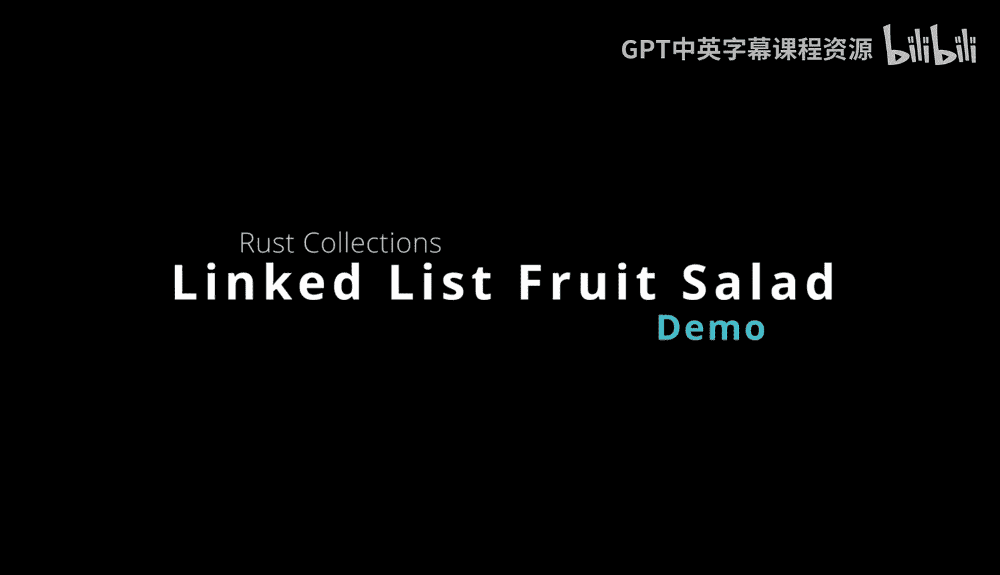
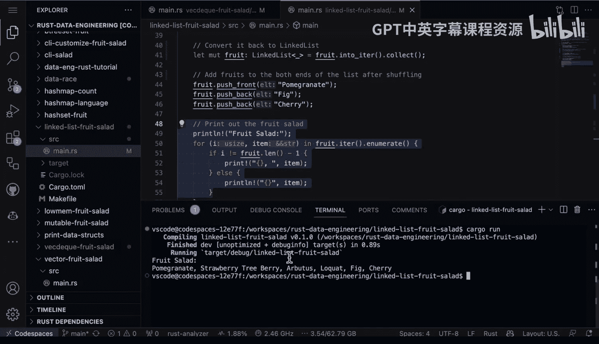

# Rust编程：2-3：链表水果沙拉演示 🥗



在本节课中，我们将学习Rust标准库中的`LinkedList`数据结构。我们将通过一个制作“水果沙拉”的示例，来了解链表的基本操作、其特性以及适用场景。

## 概述

链表是一种线性数据结构，由一系列节点组成，每个节点包含数据部分和指向下一个节点的指针。与`Vec`（动态数组）和`VecDeque`（双端队列）相比，链表在中间插入或删除元素时可能更高效，但它也带来了更高的内存开销和更差的缓存局部性。

## 链表特性分析

上一节我们介绍了链表的基本概念，本节中我们来看看它的核心特性。

链表的一个优点是，在**不关心随机访问元素**，而只关注从列表中间**插入或删除元素**时，它能提供关键的性能效率。

然而，在实际应用中，链表是一种使用频率相对较低的数据结构。与`Vec`或`VecDeque`相比，它具有**更高的内存开销**和**更差的缓存局部性**。

## 代码示例：水果沙拉

现在，让我们通过一个具体的代码示例，来看看如何在Rust中使用`LinkedList`。这个例子与之前`VecDeque`的例子非常相似。

以下是创建、修改和遍历链表的步骤：

1.  **创建并填充链表**：首先，我们创建一个`LinkedList`，并将一系列水果名称添加到链表的尾部。
    ```rust
    use std::collections::LinkedList;
    let mut fruit_list = LinkedList::new();
    fruit_list.push_back("apple");
    fruit_list.push_back("banana");
    fruit_list.push_back("cherry");
    ```

2.  **转换为Vec并打乱**：为了与之前的示例保持一致，这里做了一个不常见的操作：将链表转换回`Vec`以便打乱顺序。在实际开发中，可能不会这样做。
    ```rust
    let mut fruit_vec: Vec<_> = fruit_list.into_iter().collect();
    // 使用rand库打乱fruit_vec的顺序
    // ... shuffle操作 ...
    ```

3.  **移回链表并添加元素**：将打乱后的`Vec`重新转换为`LinkedList`。然后，可以向链表的头部和尾部添加新的水果。
    ```rust
    fruit_list = fruit_vec.into_iter().collect();
    fruit_list.push_front("dragonfruit"); // 添加到头部
    fruit_list.push_back("elderberry");   // 添加到尾部
    ```

4.  **遍历并打印**：最后，遍历链表并打印出所有水果，制作成我们的“水果沙拉”。
    ```rust
    for fruit in &fruit_list {
        println!("{}", fruit);
    }
    ```

运行`cargo run`后，我们将看到与使用`Vec`时非常相似的操作结果，一系列水果被打印出来。



## 总结


本节课中我们一起学习了`LinkedList`的使用。我们了解到，链表是一种具有特定属性的专用数据结构，在需要频繁从中间插入或删除元素的场景下可能有用。但在大多数情况下，使用`Vec`或`VecDeque`通常是更优的选择，因为它们能提供更好的内存布局和缓存性能。