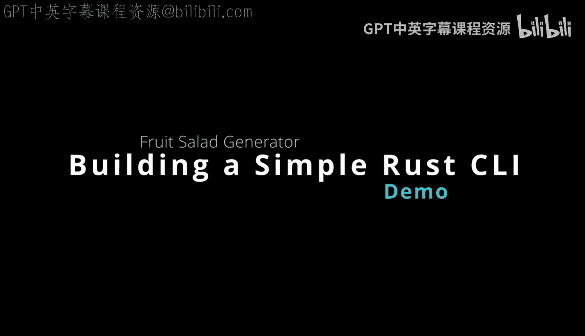
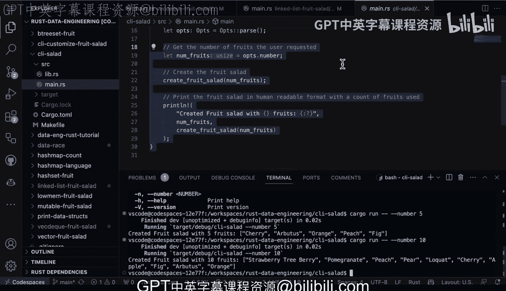

# Rust编程2-3（数据工程、DevOps）：14：水果沙拉命令行工具演示 🍇



在本节课中，我们将学习如何使用Rust构建一个简单的命令行工具。我们将通过一个名为“水果沙拉”的示例项目，演示如何组织代码、使用外部库解析命令行参数，并最终生成一个可执行的二进制程序。

## 项目结构概述

首先，我们来看一下这个Rust命令行工具的项目结构。它与Python的`argparse`模块非常相似。使用命令行界面可以让我们在构建应用时获得更大的灵活性。

项目默认包含`src`目录，其中有一个库文件`lib.rs`和一个主程序文件`main.rs`。在Rust中，如果你想将一些代码组织成库，只需在`src`目录下创建一个`lib.rs`文件即可。

## 库文件 (`lib.rs`) 解析

上一节我们介绍了项目结构，本节中我们来看看库文件`lib.rs`的具体实现。这个文件包含了我们工具的核心逻辑。

```rust
pub fn create_fruit_salad() -> Vec<String> {
    let mut fruits = vec![
        "apple".to_string(),
        "banana".to_string(),
        "cherry".to_string(),
        "date".to_string(),
        "elderberry".to_string(),
    ];
    fruits.shuffle(&mut rand::thread_rng());
    fruits
}
```

在这段代码中，我们公开(`pub`)了一个名为`create_fruit_salad`的函数。该函数创建一个包含多种水果名称的字符串向量(`Vec<String>`)。随后，它使用`shuffle`方法随机打乱向量中元素的顺序，使得每次调用都能获得一个独特的水果沙拉组合。

## 主程序 (`main.rs`) 与命令行解析

了解了核心逻辑后，我们现在转向主程序文件`main.rs`。这里我们将集成命令行参数解析功能。

在文件的顶部，我们引入了`clap`库，它类似于Python的`argparse`。同时，我们使用`use ci_salad::create_fruit_salad;`语句来引入我们刚刚在库中定义的函数。

这个命名空间`ci_salad`来自哪里？它来自于项目`Cargo.toml`文件中定义的包名。Rust会自动将包名中的连字符转换为下划线，因此`ci-salad`在代码中就变成了`ci_salad`。这是一种非常便捷的模式，能节省大量时间。

以下是`main.rs`中命令行设置的核心部分：

```rust
use clap::Parser;

#[derive(Parser)]
#[command(version, author, about)]
struct Args {
    #[arg(short, long, default_value_t = 5)]
    number: usize,
}

fn main() {
    let args = Args::parse();
    let num_fruits = args.number;
    // ... 调用 create_fruit_salad 并根据 num_fruits 处理逻辑
}
```

我们定义了一个`Args`结构体，并使用`clap`的宏为其派生`Parser`特性。我们为它添加了版本、作者和描述信息。结构体中有一个`number`字段，用户可以通过`-n`或`--number`来指定所需的水果数量，默认值为5。

## 工具使用演示

现在，让我们将所有这些部分结合起来，看看如何实际运行这个工具。

首先，我们需要在项目根目录下执行命令。一个关键点是，当使用`cargo run`并希望将参数传递给我们的命令行工具时，必须在工具参数前使用双连字符`--`。

以下是运行示例：

运行帮助命令查看用法：
```bash
cargo run -- --help
```

创建一个包含5种水果的沙拉：
```bash
cargo run -- --number 5
```

创建一个包含10种水果的沙拉：
```bash
cargo run -- --number 10
```

执行后，程序会根据用户请求的数量生成相应大小的随机水果沙拉列表。

## 优势总结

本节课中我们一起学习了如何使用Rust和`clap`库构建命令行工具。通过“水果沙拉”这个简单示例，我们掌握了：

1.  **代码组织**：如何将核心逻辑分离到`lib.rs`库文件中。
2.  **依赖管理**：如何在`Cargo.toml`中声明依赖（如`clap`）。
3.  **参数解析**：如何使用`clap`定义和解析命令行参数。
4.  **项目构建与运行**：如何使用`cargo run --`来运行并传递参数。



这种方式的巨大优势在于，一旦你习惯了用Rust编写脚本，就可以轻松地使用`clap`来扩展功能。更重要的是，你可以将项目编译成独立的二进制文件进行部署，轻松地将你的命令行工具分享给他人使用。🚀