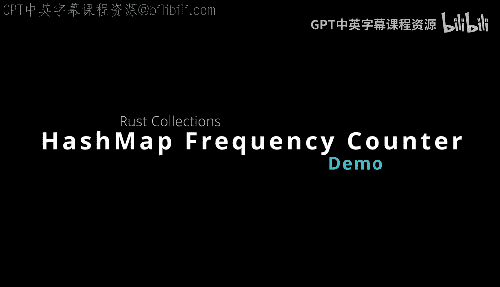
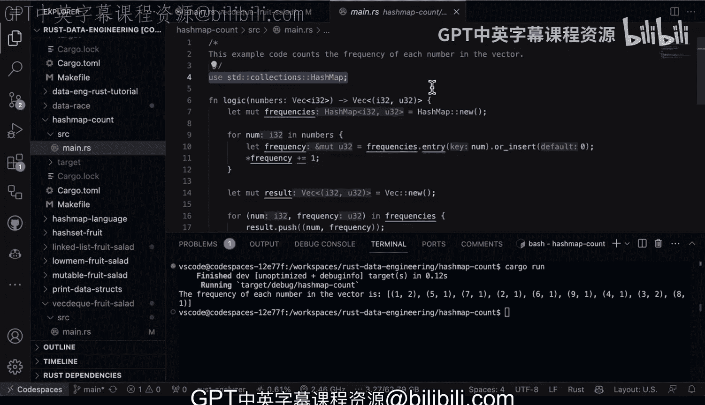

# 015：哈希映射频率计数器演示 🧮



在本节课中，我们将学习如何使用Rust中的哈希映射（HashMap）来构建一个频率计数器。这是一种非常实用的数据结构，常用于统计元素出现的次数。

哈希映射与Python中的字典非常相似，它对于插入、删除和访问操作都具有O(1)的时间复杂度，因此性能优异。它特别适合需要快速查找的任务，例如统计项目中各项的出现频率。

## 代码结构与逻辑

接下来，我们通过一个具体的代码示例来演示其用法。在`main`函数中，我们定义了一个数字向量，并调用了一个名为`logic`的函数来处理它。

以下是`logic`函数的核心逻辑：

```rust
let mut frequencies = HashMap::new();
for &num in &numbers {
    let count = frequencies.entry(num).or_insert(0);
    *count += 1;
}
```

这段代码遍历输入的数字向量，并使用哈希映射的`entry`API来计数。`or_insert(0)`方法确保如果键不存在，则将其值初始化为0，然后我们对计数进行递增。

为了便于输出结果，函数最后将哈希映射转换成了一个元组向量并返回。

## 主函数与数据

在主函数中，我们创建了一个包含一些重复项的数字列表，用于验证计数器的正确性。

```rust
let numbers = vec![1, 2, 3, 4, 5, 6, 7, 8, 9, 1, 3];
```

然后，我们调用`logic`函数并打印出每个数字的频率。清晰的输出信息有助于理解程序的功能。

## 运行结果与分析

运行程序（`cargo run`）后，控制台会输出类似以下的结果：

```
The frequency of each number in the vector is:
1 occurs 2 times
2 occurs 1 time
3 occurs 2 times
...
```

从结果中可以看到，数字1和3各出现了两次，而其他数字均出现一次，这与我们的输入数据完全吻合，证明了频率计数器的正确性。

## 总结与核心要点

本节课中，我们一起学习了Rust哈希映射在构建频率计数器中的应用。

*   **核心数据结构**：哈希映射（`HashMap`）是Rust中用于快速键值查找的通用数据结构，其时间复杂度为**O(1)**。
*   **常用API**：`entry(key).or_insert(default_value)`是进行计数或初始化操作的惯用模式。
*   **代码组织**：将核心逻辑封装在独立的函数中（如本例的`logic`函数），可以使`main`函数保持清晰易读。
*   **实用价值**：结合向量（`Vec`）和哈希映射，你就能在Rust中高效处理各种各样的数据任务，这与Python中使用列表和字典的思路非常相似。



哈希映射因其出色的性能和灵活性，是Rust编程中需要重点掌握的数据结构之一。