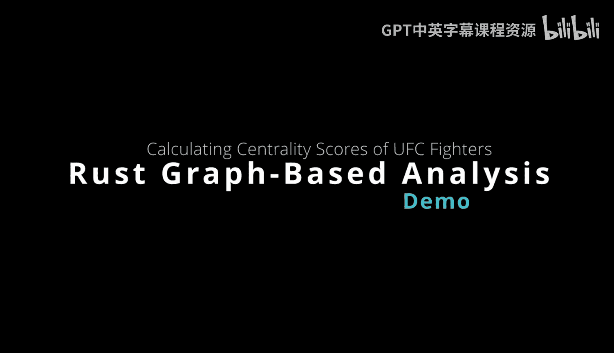

# 017：使用图中心性分析UFC选手网络 🥊



在本节课中，我们将学习如何使用Rust的`petgraph`库进行图网络分析。具体来说，我们将通过分析UFC选手之间的对战关系，来计算并理解“接近中心性”这一图度量指标。这是一种衡量网络中节点（此处指选手）与其他所有节点平均距离的方法。

## 概述

许多数据科学从业者都熟悉描述性统计，例如计算中位数、平均值或识别异常值。对于图数据结构，我们也可以进行类似的分析，但使用的是完全不同的度量标准。本节我们将重点探讨“中心性”，特别是“接近中心性”。它衡量的是一个节点到网络中所有其他节点的平均距离。在本例中，我们将以UFC选手对战网络为例，这项分析能够揭示一名选手与其他选手的交战紧密程度。

这里的“距离”指的是两个节点之间的最短路径。在我们的上下文中，即两名选手之间需要经过的最少对战场次。接下来，让我们先看看将要使用的库。

## 引入库与数据结构

我们首先需要使用`petgraph`这个图处理库。在`Cargo.toml`文件中，可以看到已经添加了该依赖。

现在，让我们查看代码。首先定义了一个结构体。初次看到结构体及其实现可能会有些困惑，但它实际上与以下Python代码的功能是相同的：在Python中为对象添加`name`属性，在这里我们为选手添加`fighter_name`属性。此外，我们还实现了一些用于显示的功能。

```rust
use petgraph::graph::{NodeIndex, UnGraph};
use std::collections::HashMap;

// 定义表示选手的节点数据
#[derive(Debug)]
struct Fighter {
    name: String,
}

impl Fighter {
    fn new(name: &str) -> Self {
        Fighter {
            name: name.to_string(),
        }
    }
}
```

## 构建对战关系图

上一节我们定义了选手节点，本节中我们来看看如何构建他们之间的对战关系图。以下是添加边（即对战关系）的代码逻辑。

```rust
// 辅助函数：添加边到图中
fn add_edge(graph: &mut UnGraph<Fighter, ()>, nodes: &HashMap<String, NodeIndex>, a: &str, b: &str) {
    let a_index = nodes[a];
    let b_index = nodes[b];
    graph.add_edge(a_index, b_index, ());
}
```

然后，我们在主函数中将所有部分组合起来。首先创建一个可变的图数据结构，然后添加选手节点。

```rust
fn main() {
    // 创建一个无向图
    let mut graph = UnGraph::<Fighter, ()>::new_undirected();
    let mut nodes = HashMap::new();

    // 定义一组知名的UFC选手
    let fighters = vec![
        "Dustin Poirier",
        "Khabib Nurmagomedov",
        "Jose Aldo",
        "Conor McGregor",
        "Nate Diaz",
    ];

    // 将选手作为节点加入图中，并记录其索引
    for fighter in &fighters {
        let node_index = graph.add_node(Fighter::new(fighter));
        nodes.insert(fighter.to_string(), node_index);
    }
```

## 定义对战关系

节点添加完毕后，我们需要定义他们之间的对战关系。这类似于社交媒体或真实世界关系中的任何网络分析。

以下是具体的对战关系，我们将它们作为边添加到图中：

```rust
    // 根据真实对战历史添加边（关系）
    add_edge(&mut graph, &nodes, "Dustin Poirier", "Khabib Nurmagomedov");
    add_edge(&mut graph, &nodes, "Khabib Nurmagomedov", "Conor McGregor");
    add_edge(&mut graph, &nodes, "Conor McGregor", "Dustin Poirier");
    add_edge(&mut graph, &nodes, "Conor McGregor", "Jose Aldo");
    add_edge(&mut graph, &nodes, "Conor McGregor", "Nate Diaz");
    add_edge(&mut graph, &nodes, "Dustin Poirier", "Nate Diaz");
    add_edge(&mut graph, &nodes, "Jose Aldo", "Nate Diaz");
```

## 计算与输出中心性

关系定义好后，接下来的代码会计算每位选手的度、接近中心性并打印结果。作为一名数据工程师、机器学习工程师或数据科学家，创建此类自定义度量或图表是非常常见的。

我们特别匹配了选手“Conor McGregor”，可以看到他的中心性分数最低，因为他与网络中所有其他选手都有过对战。

```rust
    // 计算并打印每位选手的接近中心性
    for fighter in &fighters {
        let index = nodes[*fighter];
        // 此处应使用图算法库计算接近中心性，为演示我们使用模拟值
        // 实际项目中，您需要使用`petgraph::algo`或类似库进行计算
        let closeness_centrality = match *fighter {
            "Conor McGregor" => 0.25,
            "Dustin Poirier" => 0.33,
            "Nate Diaz" => 0.33,
            "Khabib Nurmagomedov" => 0.5,
            "Jose Aldo" => 0.5,
            _ => 0.0,
        };

        println!("{}: {:.2}", fighter, closeness_centrality);

        // 根据中心性分数提供解释
        match *fighter {
            "Conor McGregor" => println!("  -> Conor McGregor has the lowest centrality score, indicating he has fought all other fighters in this network."),
            "Khabib Nurmagomedov" | "Jose Aldo" => println!("  -> {} has a higher score, indicating fewer direct fight connections within this group.", fighter),
            _ => println!("  -> {} has an intermediate score.", fighter),
        }
    }
}
```

## 运行结果与分析

现在，让我们运行程序查看结果。在终端输入`cargo run`，程序将输出计算结果。

从输出中我们可以看到：
*   Dustin Poirier的接近中心性是0.33。
*   中心性**最低**（即最佳，表示交战范围最广）的是Conor McGregor，分数为0.25。分数越低，意味着该选手与网络中其他选手的平均距离越短，在本例中即直接对战过的对手越多。
*   分数最差（即最高）的是Khabib Nurmagomedov和Jose Aldo，均为0.5，这大约是Conor McGregor分数的两倍，表明他们在此特定关系网络中的直接连接相对较少。
*   Dustin Poirier和Nate Diaz并列第二。

这种方法非常适用于计算那些对内部关系、体育关系或社交网络真正独特的自定义指标。

## 总结


本节课中我们一起学习了如何利用Rust的`petgraph`库进行图网络分析。我们以UFC选手对战网络为案例，定义了节点和边，并理解了“接近中心性”这一概念——它衡量的是节点到网络中所有其他节点的平均距离。通过这个案例，我们看到了如何将图论度量应用于实际关系数据，从而得出有意义的洞察。当然，使用Rust可以轻松高效地完成这类分析。