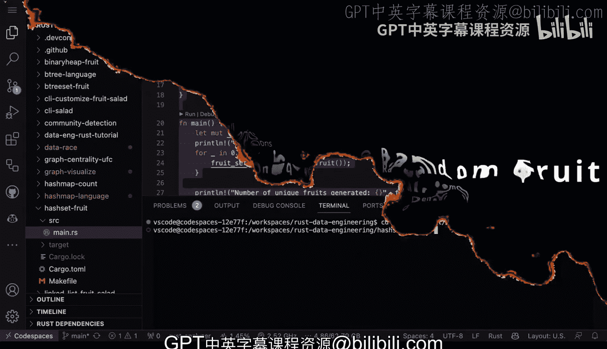
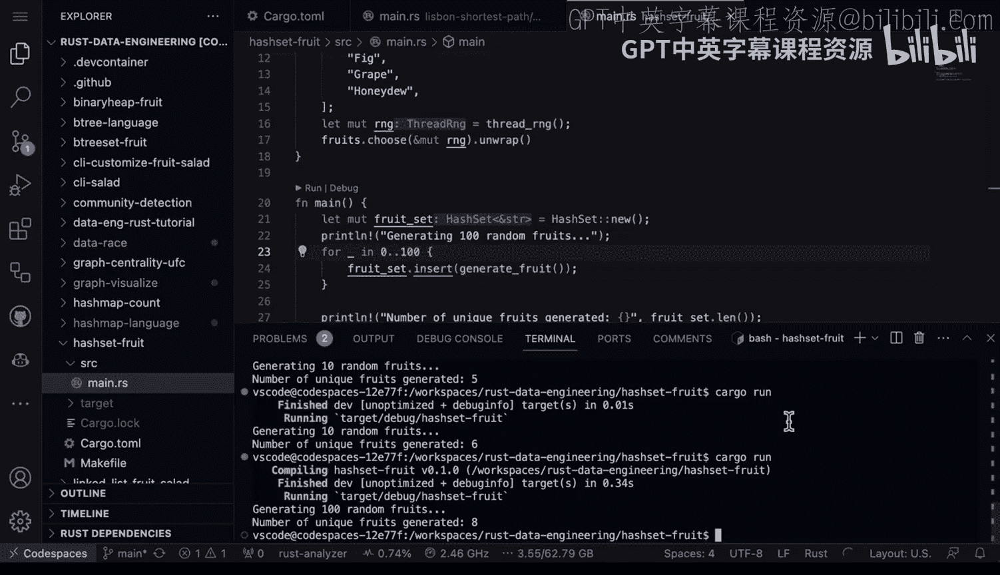

# 018：使用HashSet存储唯一水果


在本节课中，我们将学习如何使用Rust标准库中的`HashSet`来存储唯一元素。我们将通过一个生成随机水果列表并计算其中唯一水果数量的程序来演示其用法。

---

## 概述

我们将创建一个Rust程序，该程序会生成一个包含100个随机水果的列表。由于水果是从一个固定的列表中随机选择的，因此列表中很可能包含重复项。我们的目标是利用`HashSet`的特性，自动过滤掉重复项，从而计算出最终生成了多少种不同的水果。

上一节我们介绍了Rust的基本数据结构，本节中我们来看看如何使用`HashSet`来处理唯一性数据。

## 引入外部依赖

程序使用了`rand`外部crate来生成随机数。具体来说，`SliceRandom`和`thread_rng`这两个工具帮助我们从一个水果列表中随机选择元素。

以下是引入依赖和定义水果列表的代码：

```rust
use rand::seq::SliceRandom;
use rand::thread_rng;
use std::collections::HashSet;

fn main() {
    let fruits = vec![
        "apple", "banana", "orange", "grape", "kiwi",
        "mango", "pineapple", "strawberry", "blueberry", "peach",
    ];
    // ... 后续代码
}
```



## 理解HashSet

`HashSet`是Rust标准库`collections`模块中的一个集合类型。它的一个关键特性是**只存储唯一的元素**。当我们向`HashSet`中插入一个已经存在的元素时，插入操作不会产生任何效果。这使得它非常适合用于需要去重或检查唯一性的场景。

在程序中，我们声明一个`HashSet`来存储出现过的水果：

```rust
let mut fruit_set = HashSet::new();
```

## 生成随机水果列表

接下来，我们需要生成指定数量的随机水果。以下是实现这一功能的核心循环：

```rust
for _ in 0..100 {
    let fruit = fruits.choose(&mut rng).unwrap();
    fruit_set.insert(fruit);
}
```

这段代码循环100次。在每次循环中：
1.  使用`choose`方法从`fruits`列表中随机选取一个水果。
2.  使用`insert`方法将这个水果放入`fruit_set`中。如果水果已存在，`HashSet`会自动忽略。

## 运行程序并分析结果

现在，让我们运行程序并查看结果。在终端中输入`cargo run`。

程序输出可能类似于：
```
生成了100个随机水果。
生成的唯一水果数量是：8。
```

**关键点**：即使我们生成了100个水果，唯一水果的数量也可能远少于100。这是因为随机选择过程允许同一水果被多次选中，而`HashSet`确保了每个种类只被计数一次。

为了更直观地理解随机性，我们可以将生成数量从100改为10，并多次运行程序：

```rust
for _ in 0..10 { // 将循环次数改为10
    // ... 生成水果
}
```

多次运行可能会得到不同的结果，例如6、4或更少。这证明了在少量尝试中，由于随机性，很难覆盖列表中的所有水果。即使生成了10次，也可能只得到4种不同的水果。

## 实际应用场景

掌握`HashSet`和随机数生成在数据工程等领域非常实用。例如，你可以用类似的方法：
*   从日志文件中找出唯一的用户ID。
*   在数据清洗过程中去除重复的记录。
*   为仪表盘或分析工具生成去重后的数据视图。

Rust作为一门编译型语言，其强大的类型安全和性能特性，使得处理这类任务既安全又高效。

---

## 总结



本节课中我们一起学习了如何使用Rust的`HashSet`来存储唯一值。我们通过一个生成随机水果的示例程序，演示了如何结合`rand` crate生成随机数据，并利用`HashSet`自动去重的特性来统计唯一项的数量。你学会了`HashSet`的基本操作，并理解了随机性对结果的影响。这些是构建更复杂数据处理工具的基础技能。