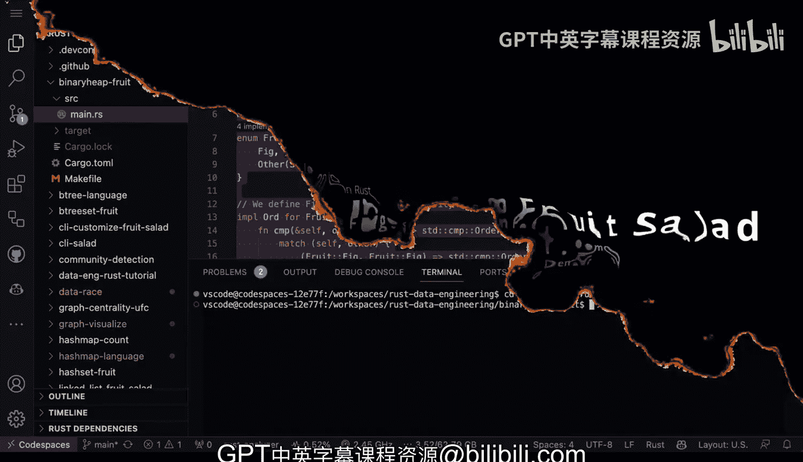
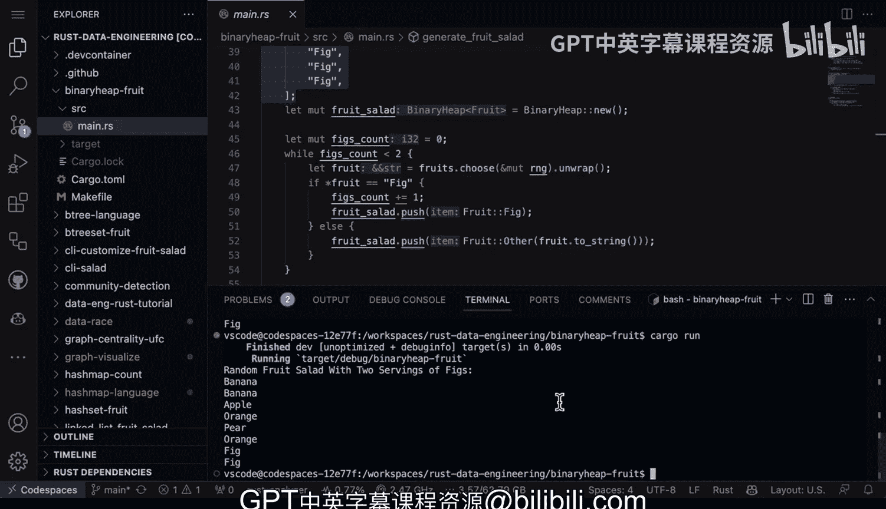

# 020：使用二叉堆创建无花果优先水果沙拉 🥗


在本节课中，我们将学习如何使用Rust标准库中的`BinaryHeap`数据结构来创建一个“水果沙拉”程序。这个程序的特别之处在于，它会为水果“无花果”赋予最高优先级，确保在最终的水果沙拉中，无花果总是优先出现。我们将通过实现`Ord`和`PartialOrd`特质来定义优先级，并使用随机性来模拟水果的选择过程。

---

## 概述与核心概念

我们将创建一个程序，它使用**二叉堆**作为**优先队列**。优先队列是一种数据结构，允许我们始终高效地访问集合中“优先级最高”或“优先级最低”的元素。在Rust中，`std::collections::BinaryHeap`默认实现了一个最大堆，这意味着堆顶的元素总是最大的（根据我们定义的排序规则）。

为了实现无花果的优先权，我们需要定义一个枚举（`enum`）来表示水果，并为这个枚举实现`Ord`和`PartialOrd`特质，以指定无花果的优先级高于其他水果。

---

## 定义水果枚举与优先级



首先，我们定义一个名为`Fruit`的枚举，它有两种变体：`Fig`（无花果）和`Other`（其他水果）。

```rust
enum Fruit {
    Fig,
    Other(String),
}
```

接下来，我们需要为`Fruit`实现排序特质。我们希望`Fig`变体被视为“最大”的，这样它就会在二叉堆的顶部。

```rust
use std::cmp::Ordering;

impl Ord for Fruit {
    fn cmp(&self, other: &Self) -> Ordering {
        match (self, other) {
            // Fig 的优先级最高
            (Fruit::Fig, Fruit::Fig) => Ordering::Equal,
            (Fruit::Fig, Fruit::Other(_)) => Ordering::Greater,
            (Fruit::Other(_), Fruit::Fig) => Ordering::Less,
            // 其他水果之间比较，这里简单按字符串比较，不影响Fig的优先级
            (Fruit::Other(a), Fruit::Other(b)) => a.cmp(b),
        }
    }
}

// 必须同时实现 PartialOrd, PartialEq, Eq
impl PartialOrd for Fruit {
    fn partial_cmp(&self, other: &Self) -> Option<Ordering> {
        Some(self.cmp(other))
    }
}

impl PartialEq for Fruit {
    fn eq(&self, other: &Self) -> bool {
        self.cmp(other) == Ordering::Equal
    }
}

impl Eq for Fruit {}
```

通过以上实现，我们确保了在任何比较中，`Fruit::Fig`都被认为大于`Fruit::Other`，从而在二叉堆中获得最高优先级。

---

## 构建水果沙拉

现在，让我们进入程序的核心部分：生成水果沙拉。我们将遵循以下步骤：

1.  创建一个包含多种水果的列表，并特意添加多个无花果。
2.  初始化一个空的`BinaryHeap`。
3.  设置一个目标：至少获得两份无花果。
4.  循环从水果列表中随机选择水果，并推入堆中，直到我们收集到足够数量的无花果。
5.  将堆中剩余的水果也加入沙拉。

以下是实现这个逻辑的代码框架：

```rust
use std::collections::BinaryHeap;
use rand::seq::SliceRandom; // 需要添加 rand 依赖
use rand::thread_rng;

fn main() {
    // 1. 定义水果列表
    let mut fruits = vec![
        Fruit::Other("apple".to_string()),
        Fruit::Other("orange".to_string()),
        Fruit::Other("pear".to_string()),
        Fruit::Other("peach".to_string()),
        Fruit::Other("banana".to_string()),
        Fruit::Fig, Fruit::Fig, Fruit::Fig, Fruit::Fig, // 添加多个无花果
    ];

    let mut rng = thread_rng();
    let mut salad = BinaryHeap::new();
    let mut fig_count = 0;
    let target_figs = 2;

    // 2. 优先收集无花果
    while fig_count < target_figs {
        // 随机打乱并选择一种水果
        fruits.shuffle(&mut rng);
        if let Some(fruit) = fruits.pop() {
            match fruit {
                Fruit::Fig => fig_count += 1,
                _ => {}
            }
            salad.push(fruit);
        }
    }

    // 3. 将剩余水果加入沙拉
    for fruit in fruits {
        salad.push(fruit);
    }

    // 4. 输出最终沙拉（从堆中依次弹出，即优先级从高到低）
    println!("随机水果沙拉（含{}份无花果）：", target_figs);
    while let Some(fruit) = salad.pop() {
        match fruit {
            Fruit::Fig => println!("无花果"),
            Fruit::Other(name) => println!("{}", name),
        }
    }
}
```

---

## 程序运行与结果

运行此程序（使用`cargo run`），每次都会生成一个随机的水果沙拉，但**前两个（或指定数量的）最高优先级的元素保证是无花果**。输出可能如下所示：

```
随机水果沙拉（含2份无花果）：
无花果
无花果
peach
orange
apple
banana
pear
```

即使再次运行，无花果也总是最先出现，这证明了二叉堆根据我们定义的`Ord`实现正确地对元素进行了排序。

---

## 总结

本节课中，我们一起学习了如何使用Rust的`BinaryHeap`创建一个优先队列。我们通过以下步骤实现了“无花果优先水果沙拉”程序：

1.  **定义数据结构**：创建了`Fruit`枚举来区分无花果和其他水果。
2.  **实现优先级**：通过为`Fruit`实现`Ord`和`PartialOrd`特质，明确了无花果具有最高优先级。
3.  **利用二叉堆**：使用`BinaryHeap`作为优先队列，确保在插入和弹出元素时，优先级最高的（无花果）始终在最前面。
4.  **控制流程**：通过循环逻辑，保证了最终结果中至少包含指定数量的高优先级项。



**二叉堆**是数据工程和DevOps中非常有用的工具，特别适用于需要持续处理最大或最小元素的场景，例如任务调度、日志级别处理或任何需要优先级管理的系统。你可以尝试修改优先级规则或添加更多水果类型来进一步探索这个数据结构。