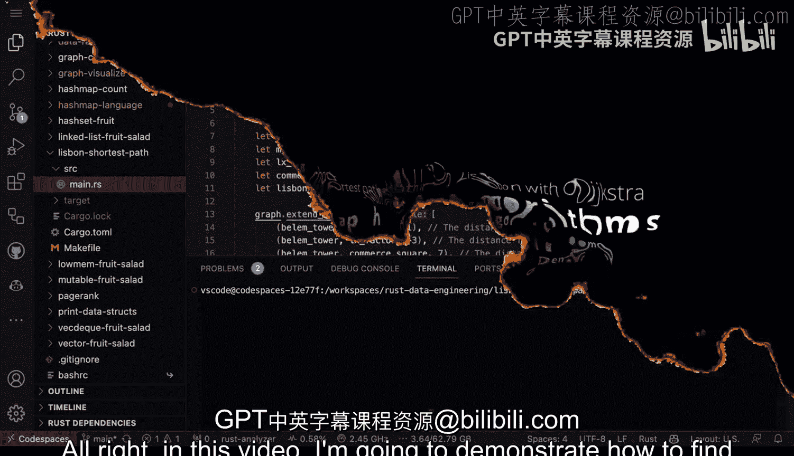
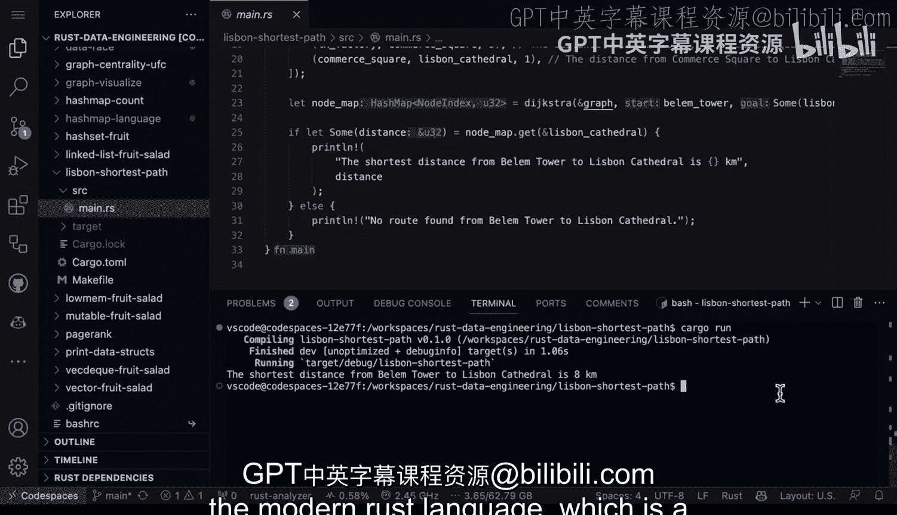

# 022：使用Dijkstra算法寻找最短路径 🗺️


在本节课中，我们将学习如何使用Rust语言和`petgraph`库来实现经典的Dijkstra算法，以解决一个实际问题：寻找葡萄牙里斯本两个地标之间的最短路径。

---

## 概述

我们将通过一个具体的例子来演示Dijkstra算法。这个算法是一种经典的图遍历技术，用于寻找从单个源节点到图中所有其他节点的最短路径。这意味着，如果我们有许多可以到达的不同地点，该算法能找出需要遍历的最短节点序列及其实际距离。

## 构建图结构

首先，我们需要使用`petgraph`库来构建一个图。`petgraph`是一个优秀的Rust图处理库。我已经通过Cargo将其安装到项目中。

以下代码展示了如何初始化一个无向图：

```rust
use petgraph::graph::UnGraph;
```



得益于Rust出色的类型系统，我们无需担心可能出现的许多错误。类型系统为我们清晰地规划了图中将包含哪些元素。

## 添加节点与边

接下来，我们向图中添加节点和带权重的边。节点代表里斯本的各个地标。

以下是添加节点和边的示例代码：

```rust
let mut graph = UnGraph::<&str, i32>::new_undirected();
let belem_tower = graph.add_node("Belem Tower");
let monastery = graph.add_node("Monastery");
let lisbon_cathedral = graph.add_node("Lisbon Cathedral");

graph.add_edge(belem_tower, monastery, 1);
graph.add_edge(belem_tower, lisbon_cathedral, 3);
// ... 可以继续添加其他边
```

我们首先创建节点，例如“贝伦塔”和“修道院”。然后，我们使用`add_edge`方法添加边，并指定它们之间的距离（权重），例如从贝伦塔到修道院的距离是1。

## 应用Dijkstra算法

`petgraph`库的一个便利之处在于它内置了Dijkstra算法的实现。我们无需自己编写这个复杂的算法。

我们可以直接调用库函数来计算两个节点之间的最短路径和距离。代码如下：

```rust
use petgraph::algo::dijkstra;
let node_map = dijkstra(&graph, belem_tower, Some(lisbon_cathedral), |e| *e.weight());
```

这段代码计算了从“贝伦塔”节点到“里斯本大教堂”节点的最短路径。

## 运行与结果

现在，让我们运行程序查看结果。在终端中输入 `cargo run` 执行代码。

程序运行后，输出显示从贝伦塔到里斯本大教堂的最短距离是 **8公里**。

## 实际应用与优势

通过这个例子，我们可以看到使用知名算法解决实际问题的强大之处。无论是数据工程师、机器学习工程师，还是从事物流相关工作的人，都可以构建类似的解决方案。

他们可以信赖Rust带来的卓越性能。部署这样的程序也非常简单，只需将编译后的二进制文件推送到目标位置即可运行。该程序内存占用极低，并且算法本身经过优化。

在Rust中构建并解决这类经典问题有很多优点：我们可以获得接近C语言级别的高性能，同时得益于Rust这门现代编译语言内置的所有安全特性，程序又是内存安全的。

---

## 总结



本节课我们一起学习了如何在Rust中使用`petgraph`库实现Dijkstra算法。我们构建了一个代表里斯本地标的图，添加了节点和带权重的边，并最终计算出了两个地标之间的最短路径距离。这个过程展示了Rust在解决经典算法问题时的性能、安全性和部署便利性。