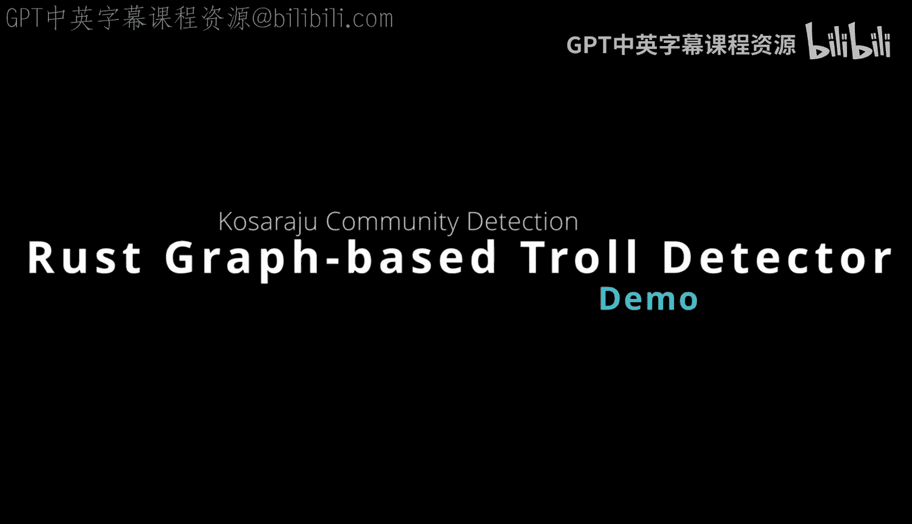
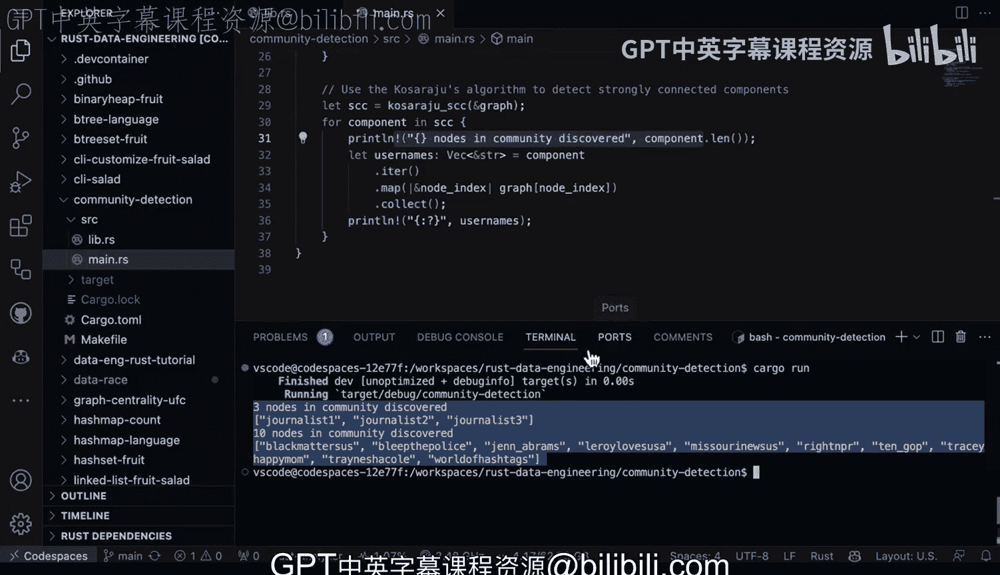

# Rust社区检测：2-3：使用Kosaraju算法进行强连通分量检测



在本节课中，我们将学习如何使用Rust语言和Kosaraju算法，从社交网络数据（例如Twitter用户的提及关系）中检测社区或强连通分量。我们将通过一个具体的例子，分析如何识别在推文中互动频繁的用户群体。

## 概述

社区检测是图论中的一个重要应用，常用于社交网络分析。本节课我们将利用Rust的`petgraph`库和Kosaraju算法，分析Twitter用户之间的提及关系，从而识别出紧密互动的用户社区。我们将从数据准备开始，逐步构建图结构，应用算法，并最终解释结果。

## 数据准备与图构建

首先，我们需要准备数据并构建图模型。数据包含Twitter用户名及其提及的其他用户，我们将这些关系建模为有向图的边。


以下是构建图结构的关键步骤：

1.  **导入库与数据**：我们使用`petgraph`库来处理图结构和算法，并从一个文件中读取用户名和提及关系数据。
2.  **创建图与索引**：我们创建一个有向图，并使用哈希映射来存储用户名到图中节点索引的对应关系。
3.  **添加节点与边**：遍历数据，为每个出现的用户添加为图中的一个节点。然后，根据“用户A提及了用户B”的关系，在对应的节点之间添加一条有向边。

```rust
// 伪代码示例：添加节点和边
let mut graph = DiGraph::<&str, ()>::new();
let mut node_indices = HashMap::new();

for (user, mention) in data_pairs {
    let user_node = *node_indices.entry(user).or_insert_with(|| graph.add_node(user));
    let mention_node = *node_indices.entry(mention).or_insert_with(|| graph.add_node(mention));
    graph.add_edge(user_node, mention_node, ());
}
```

上一节我们介绍了如何将原始数据构建为有向图。接下来，我们将在这个图上应用核心算法来发现社区。

## 应用Kosaraju算法

图构建完成后，核心任务是检测其中的强连通分量。一个强连通分量是指图中的一个子图，其中任意两个节点都可以通过有向路径相互到达。在Twitter语境下，这通常代表一个内部互动非常紧密的用户群体。

我们将使用Kosaraju算法来完成这一检测。该算法效率很高，其时间复杂度为 **O(V + E)**，其中V是顶点数，E是边数。

以下是算法应用过程：

1.  **调用算法**：我们直接使用`petgraph`库中提供的`kosaraju_scc`函数。
2.  **获取结果**：该函数返回一个向量，向量中的每个元素也是一个向量，包含属于同一个强连通分量的所有节点的索引。
3.  **映射回用户名**：通过之前建立的哈希映射，我们可以将节点索引转换回实际的Twitter用户名，使结果更易读。

```rust
// 伪代码示例：运行Kosaraju算法并输出结果
let scc = kosaraju_scc(&graph);
for component in scc {
    let usernames: Vec<_> = component.iter().map(|&node_index| graph[node_index]).collect();
    println!("发现社区: {:?}", usernames);
}
```

## 运行结果与解读

运行程序后，我们将得到检测出的社区列表。每个社区包含一组用户名，这些用户之间存在双向或循环的提及关系。

以下是程序输出的一个示例解读：

*   它可能识别出一个由“journalist1”、“journalist2”、“journalist3”组成的社区，这表明这几位记者经常相互引用或转发彼此的内容。
*   同时，它也能从数据中分离出另一组被标记为“ legitimate troll accounts”的用户，这些是曾在真实事件中被识别出的特定账户群体。

这个结果验证了算法能够有效区分不同的互动群体。即使我们混入了一些模拟数据（“fake community”），算法也能正确地将它们区分开来。

## 总结



本节课中我们一起学习了如何使用Rust实现一个高效的社区检测工具。我们首先将Twitter的提及关系数据建模为有向图，然后利用Kosaraju算法检测图中的强连通分量，从而识别出内部互动密集的用户社区。这个方法不仅性能出色，时间复杂度为 **O(V + E)**，而且完全由Rust构建，可以编译为独立的二进制工具，易于集成到生产环境的数据管道或社交分析平台中。通过这个案例，我们看到了Rust在处理图论和数据分析任务时的强大能力。