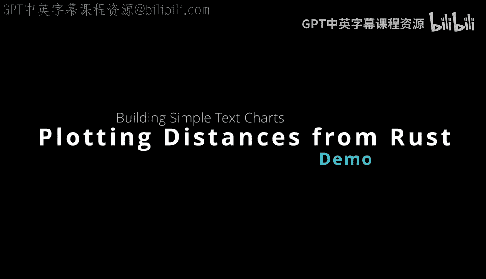
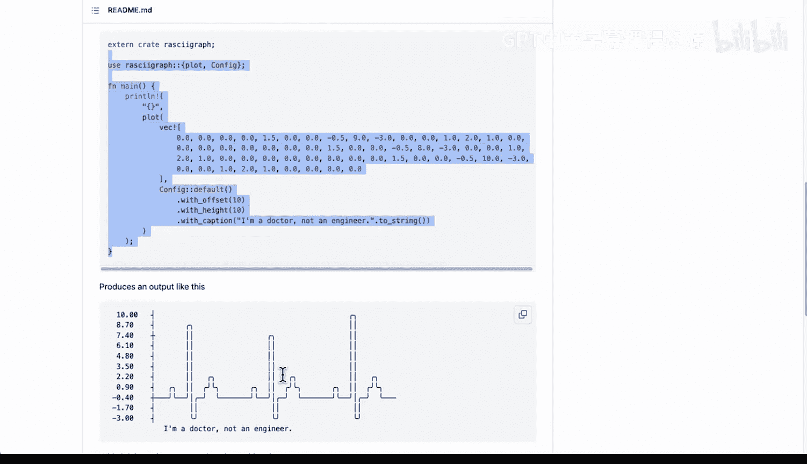
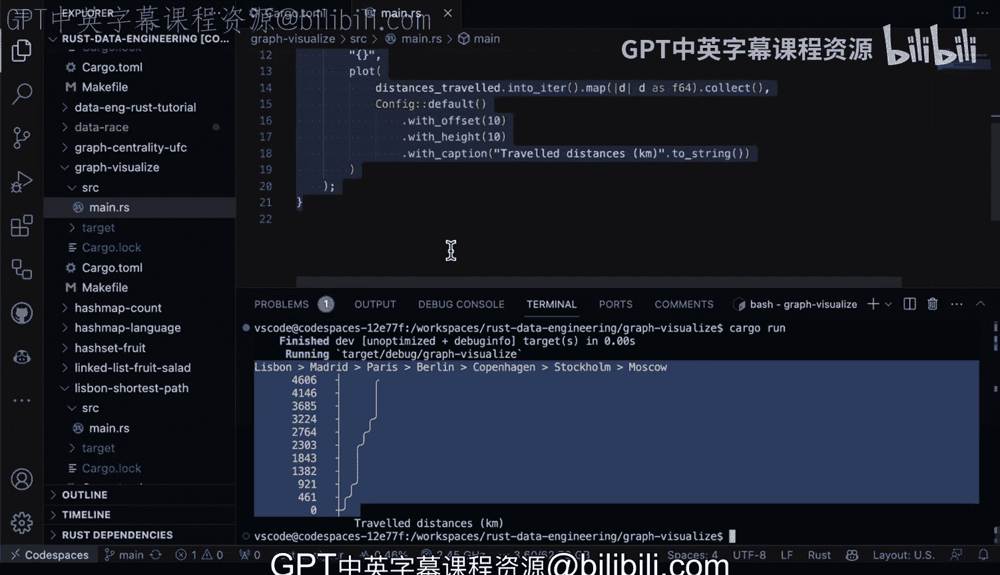

# 024：使用Rust绘制简易ASCII图表 📊



在本节课中，我们将学习如何使用Rust语言中的`raski`图形库来可视化数据。具体来说，我们将通过一个简单的例子，展示如何将城市间的距离数据绘制成清晰易读的ASCII图表。

## 概述

我们将创建一个Rust程序，用于展示从里斯本到欧洲其他几个城市的距离。通过使用`raski`库，我们可以用极少的代码生成一个直观的ASCII图表，并在终端中直接输出。

## 配置与数据准备

首先，我们需要在项目的`Cargo.toml`文件中添加`raski`库作为依赖项。接着，在代码中配置图表并准备数据。

以下是配置图表和定义数据的步骤：



1.  **导入库并配置图表**：使用`raski`库创建一个图表配置。
2.  **定义城市列表**：我们选取里斯本、马德里、巴黎、柏林、哥本哈根、斯德哥尔摩和莫斯科作为示例城市。
3.  **创建距离向量**：构建一个向量（`Vec`），其中包含从里斯本到各个城市的距离（单位：公里）。例如，里斯本到里斯本的距离是0公里，里斯本到马德里的距离是502公里。

以下是数据定义的代码示例：
```rust
let cities = vec!["Lisbon", "Madrid", "Paris", "Berlin", "Copenhagen", "Stockholm", "Moscow"];
let distances = vec![0, 502, 1053, 2187, 2806, 3116, 4596];
```

## 生成与输出图表

上一节我们准备好了数据，本节中我们来看看如何使用`raski`库将这些数据绘制成图表并输出。

这个过程非常简单直接。我们只需将定义好的距离向量传递给库的绘图函数，并应用我们的配置。

以下是生成图表的关键步骤：

*   调用库函数，传入距离数据向量。
*   函数会根据数据自动生成一个ASCII风格的条形图。
*   图表会直接打印到终端控制台。

运行程序（`cargo run`）后，终端会显示图表。图表顶部有一个标题，说明图表展示的是“从里斯本出发的旅行距离”。随着城市序列的推进，代表距离的条形图会逐渐变长，直观地反映了距离的增加。图表底部还清晰地标注了单位“公里”。

## 总结



本节课中我们一起学习了如何使用Rust和`raski`图形库快速创建ASCII图表。我们通过一个具体的例子，演示了如何将结构化的数据（城市距离）转换为可视化的终端图表。这种方法代码量小，易于集成到基于命令行的工具中，能有效地向工具使用者传达信息。对于需要在Rust开发的数据工程或DevOps工具中嵌入简单图表和图形的场景，这是一个非常实用且高效的解决方案。