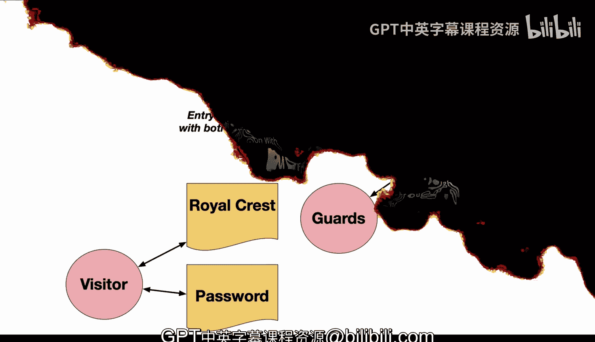
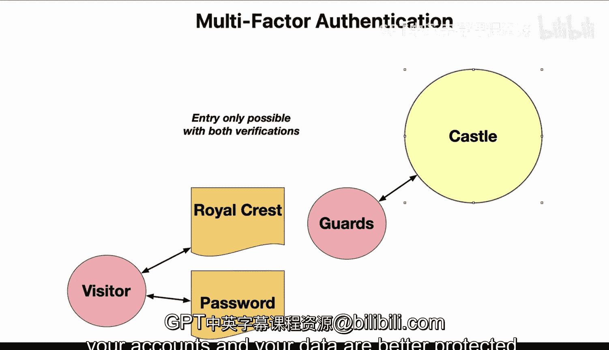

# Rust编程2-3（数据工程、DevOps）：25：多因素身份验证 🔐

在本节课中，我们将要学习多因素身份验证的基本概念及其重要性。我们将通过一个生动的城堡比喻来理解其工作原理，并探讨它在现代计算机安全中的应用。

## 城堡比喻：理解多因素身份验证 🏰

上一节我们介绍了课程主题，本节中我们来看看如何通过一个城堡的比喻来理解多因素身份验证。

让我们在城堡的背景下讨论多因素身份验证。这是一个很好的方式，可以审视一些在云环境中可能实现的基本安全凭证和安全机制，这些机制实际上已经存在了数千年。

让我们看看这座城堡。如果你要获得进入一个安全城堡的权限，你必须知道不止一件事。你需要知道口令，守卫还会检查你拥有的东西，比如皇家徽章。这被称为双因素身份验证，它是一种更强的安全级别。

## 双因素认证的优势 🛡️

上一节我们通过城堡比喻引入了多因素认证的概念，本节中我们来看看它为何能提供更强的安全性。

你不仅仅依赖于像密码这样的单一因素，因为单一因素有风险。密码可能被猜到、被窃取或被破解，任何得知密码的人都可能冒充你。而使用双因素认证，冒名顶替者需要两样东西：你知道的某样东西和你拥有的某样东西。即使他们窃取了你的口令，他们也无法进入城堡，因为他们没有你的皇家徽章。

同样的原则适用于安全的计算机和在线账户。你可以使用你知道的密码，加上你实际拥有的安全密钥，甚至可以将PIN码与你的指纹结合起来。

## 现代应用与最佳实践 💻

上一节我们探讨了双因素认证的原理，本节中我们来看看它在现代环境中的应用和重要性。

双因素认证已成为安全领域的最佳实践之一。银行用它来防止未经授权的转账，公司启用它以保护员工账户。这个额外的步骤需要付出多一点努力，但能极大地提高防御渗透的能力。

因此，当你考虑设置一个新账户时，请寻找开启双因素认证的选项。这是增强防御入侵者能力的一个简单方法。同样重要的是要注意，添加第二层认证就像在城堡周围挖了一条护城河。你将能睡得更安稳，因为你知道你的账户和数据得到了更好的保护。

## 总结 📝

本节课中我们一起学习了多因素身份验证。我们通过城堡的比喻理解了其核心思想：结合“你知道的”（如密码）和“你拥有的”（如安全密钥或徽章）两种因素来提供更强的安全保障。我们看到了它在从古代城堡到现代银行和公司账户保护中的一贯应用，并认识到开启双因素认证是保护个人数据和账户安全的一项简单而有效的最佳实践。