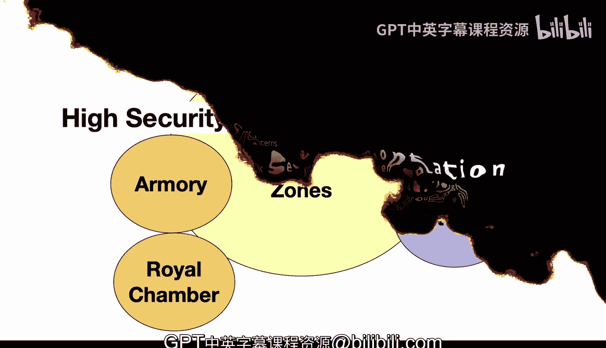
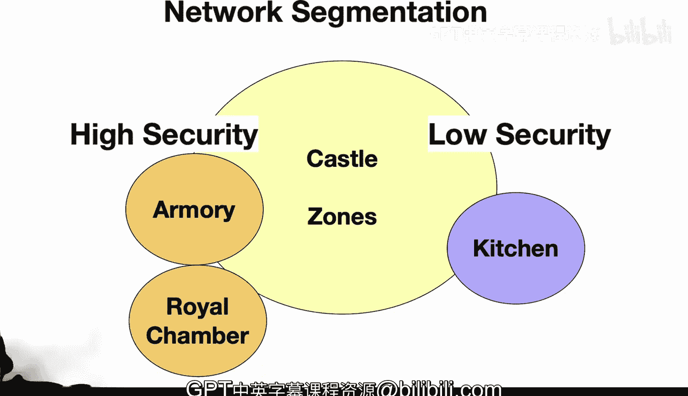

# Rust编程2-3（数据工程、DevOps）：26：网络分段 🏰

在本节课中，我们将要学习网络分段的概念。网络分段是一种将计算机网络划分为多个子网络的安全实践，其核心思想类似于古代城堡的分区防御。通过将网络划分为不同的安全区域，我们可以限制潜在攻击者的活动范围，从而保护关键数据和资产。

---

上一节我们介绍了网络安全的重要性，本节中我们来看看网络分段的具体实现和原理。

想象一座城堡。城堡会将其领地划分为不同的区域，例如军械库、王室寝宫等。这些区域因其重要性而受到严密守卫。相比之下，厨房则不需要同等级别的保护。城堡的大门控制着人员的流动。这种分段方式增强了安全性，降低了风险。即使入侵者进入了厨房，也无法轻易进入更敏感的区域，从而将损害控制在局部。

计算机网络与此非常相似。你可以将网络划分为由防火墙隔离的多个网段。面向公众的Web服务器被放置在一个称为“非军事区”（DMZ）的外部区域。内部区域则存放敏感数据，例如客户记录。分段控制着这些区域之间的访问。这会限制攻击者横向移动并造成更广泛损害的能力。用户和设备只与它们需要交互的系统进行通信。

总而言之，网络分段是一种强大的安全实践，但需要一些规划。分组将根据功能、敏感性、访问需求来设计。更可信的区域会获得更多的访问权限。例如，数据库服务器可能需要一个受限制的网段。应用程序服务器需要查询该数据库，但只被授予特定的访问权限，其他系统则被阻止访问。

你可以将每个区域想象成城堡的庭院。吊桥的升起或放下控制着区域之间的流动。分段将保护关键数据和资产。

以下是实现网络分段的一些关键技术和组件：

*   **防火墙和VLAN**：将网络划分为安全区域。
*   **访问限制**：限制区域间的访问，以缩小入侵的影响半径。
*   **入侵检测系统**：监控网络中的异常行为。
*   **子网划分和VLAN**：用于网络分区。
*   **访问控制列表**：用于接口权限管理。
*   **数据包检查**：在防火墙中进行深度数据包检查。
*   **启发式分析**：用于识别未知威胁。

因此，保护网络的概念与旧时的城堡防御策略非常相似。

---

本节课中我们一起学习了网络分段。我们了解到，通过将网络像城堡一样划分为不同安全级别的区域，并使用防火墙、VLAN、访问控制列表等技术来控制区域间的通信，可以有效地遏制安全威胁的扩散，提升整体网络的安全性。这是一种基础且关键的网络防御策略。