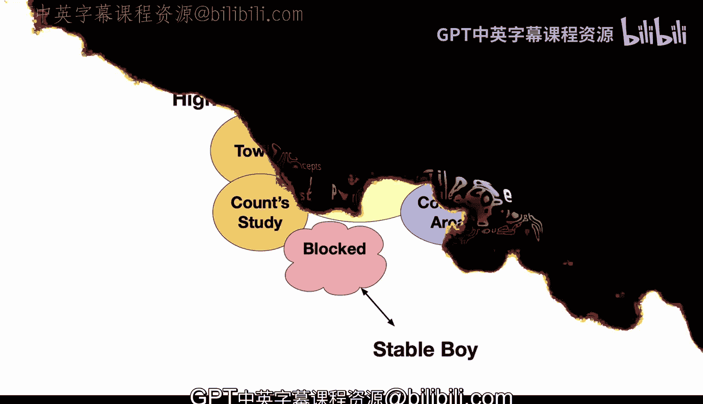
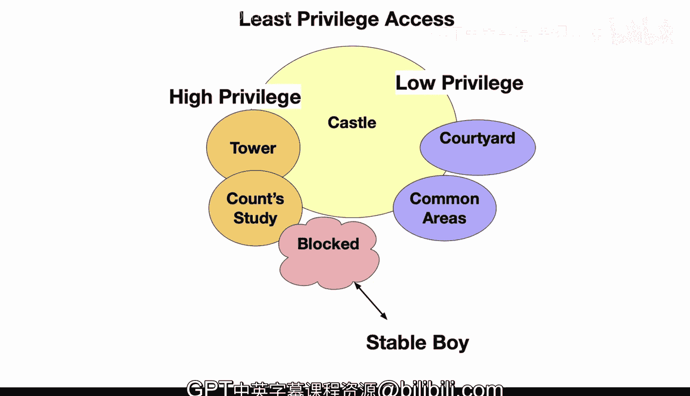

# Rust编程2-3（数据工程、DevOps）：27：最小权限访问 🔐

在本节课中，我们将要学习计算机安全中的一个核心原则——最小权限访问。我们将通过一个城堡的比喻来理解这一概念，并探讨其在计算机系统和Rust编程中的实际应用。

## 城堡中的安全模型 🏰

上一节我们介绍了安全的基本概念，本节中我们来看看最小权限原则在现实世界中的类比。

让我们将最小权限访问视为计算机世界中的一个“城堡”内部的安全情境。显然，我们知道需要限制授予用户的权限数量，直到他们确实需要这些权限。这与城堡中的概念完全相同。

在城堡内部，访问权限是受到策略性限制的。例如，伯爵可以进入城堡的任何区域，但一个仆人只能去其职责所需的地方。这种最小权限模型增强了安全级别。

## 计算机系统中的权限控制 💻

理解了城堡的比喻后，我们来看看它在计算机系统中的对应关系。

类似地，在计算机系统中，用户和程序只应获得必要的权限。如果授予了过多的访问权限，就会增加被滥用的风险。例如，如果一个城堡守卫不需要进入金库，或者一个厨房厨师不需要进入兵营，他们的工作就被限制在那些被授权的区域内。

在计算领域，授权是通过访问策略来控制的。这意味着一个数据库应用程序将获得对特定表的读写权限，但它不应该能够删除服务器上的文件。

以下是有效的安全授权原则：
*   只授予完成任务所需的最小访问量。
*   如果职责增加，可以添加额外的权限。
*   但起始时有一个严格的基线。

## 实施最小权限的挑战与益处 ⚖️

了解了原则之后，我们来看看实施过程中的常见问题及其重要性。

不幸的是，许多组织开始时采用了过于宽松的访问模型。随后发生的情况是，你试图在后期锁定安全，但会遇到问题。这就像在限制某些区域之前，让所有人都进入城堡。

最好从一开始就采用最小权限的思维方式。虽然这确实需要前期多做一点工作，但它能极大地减少因错误、程序缺陷或恶意行为者造成损害的可能性。这种权限限制将锁定——在这个特定的例子中是城堡，而在你的情况下，是你的数字城堡或计算机系统。

## 总结 📝

本节课中我们一起学习了最小权限访问原则。我们通过城堡的比喻理解了限制权限的重要性，探讨了在计算机系统中如何通过访问策略控制授权，并比较了从开始就实施最小权限与后期补救的利弊。记住，始终从最小必要权限开始，是构建安全系统的坚实基础。