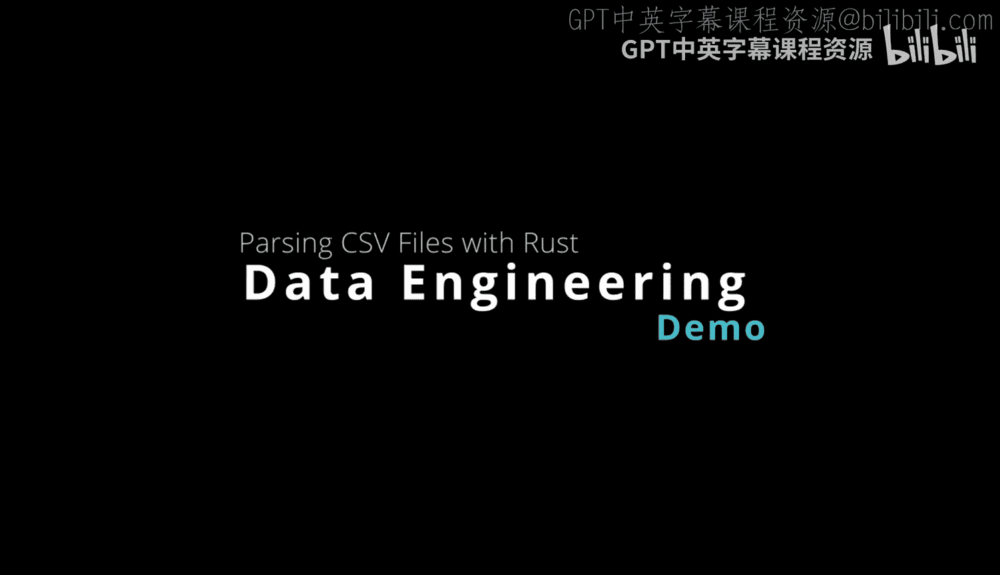
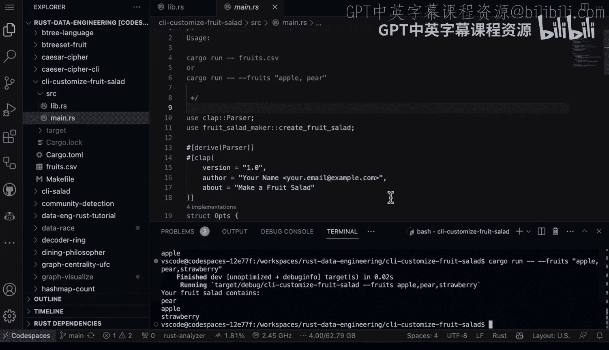

# 030：使用CLI定制水果沙拉 🍎🍌🍓



在本节课中，我们将学习如何通过一个简单的Rust程序来定制水果沙拉。这个程序演示了如何使用命令行界面（CLI）来读取输入，并利用随机化功能对数据进行处理。我们将重点关注代码的结构、安全性以及它在数据工程中的实际应用。

## 概述

我们将分析一个Rust库函数，它接收一个字符串向量，并返回一个随机排序的新向量。然后，我们将看到如何在主程序中使用这个函数，结合命令行参数解析，来处理来自CSV文件或直接输入的字符串数据。

## 库函数解析

首先，我们来看一下位于 `lib.rs` 文件中的一个函数示例。这个函数通过引入一些随机化来定制Rust中的某些内容。

```rust
pub fn randomize_fruits(mut fruits: Vec<String>) -> Vec<String> {
    // ... 随机化逻辑 ...
}
```

以下是关于这段Rust代码的一些独特之处：
*   **`pub` 关键字**：这表明该函数可以在另一个模块中使用，是公开可用的。这是一个很好的安全默认设置，允许我们将它导入到 `main` 函数中。
*   **函数定义**：使用 `fn` 关键字定义函数。输入包括一个可变的字符串向量 `fruits`，返回类型也是一个字符串向量。
*   **显式类型与可变性**：这种Rust编程风格的强大之处在于，我们能够明确地声明哪些内容在代码的其他部分暴露，以及输入和输出的具体类型。更重要的是，我们还显式地指明了向量的可变性。

## 主程序应用

上一节我们介绍了核心的随机化函数，本节中我们来看看如何在主程序中使用它来操作CSV文件。

执行此代码的方式是运行 `cargo run -- fruits.csv`，或者也可以显式地输入参数。

在数据工程中，这是一个非常常见的问题：你有一些输入数据，并希望对其进行一些更改。这类操作可能每年运行数十万次。因此，如果能够添加尽可能多的安全和可靠性默认设置，你将获得更好的体验。

以下是主程序的关键部分：
*   **命令行解析**：我们使用 `clap` 库来解析命令行参数。
*   **结构体定义**：`struct Opts` 定义了输入选项。我们希望能够输入水果列表，可以是一个CSV文件，也可以是一串逗号分隔的值。
*   **数据转换函数**：一个函数负责将CSV文件内容转换为字符串向量。在数据工程中，将一种数据形式操作转换为另一种是非常常见的任务。这段代码的强大之处再次体现在它明确声明了输入（字符串）和输出（字符串向量）。
*   **数据显示**：最后，为了显示水果沙拉，我们将结果传递给另一个函数进行处理。

在 `main` 函数的最后，我们整合了选项解析，并根据输入决定是从CSV文件读取水果列表，还是直接使用命令行输入。`match` 语句在这里处理了这两种场景。最终，程序会显示定制好的水果沙拉。

## 运行与测试

现在，让我们看看如何实际运行这个程序。通常，即使手边没有现成的文档，我们也能以直观的方式弄清楚Rust项目的情况。

首先，我通常在CLI中键入 `cargo run`。如果它能运行，那是个好迹象。

编译后运行，程序会输出“你的水果沙拉包含：”，但最初因为没有输入任何内容，所以是空的。注意到帮助信息提示了 `--fruits` 参数。

既然我知道它支持某种命令行解析输入，我可以输入 `cargo run -- --help`。这告诉Cargo工具将我的输入参数传递给要执行的程序。使用 `clap` 这类解析器库的一个好处是，你可以直接看到使用说明，而不必自己处理所有细节。

查看帮助，我们可以看到“定制水果沙拉”程序有选项，可以指定CSV文件。让我们尝试一下。

传入CSV文件名，程序会读取该文件中的输入，并对其进行随机化。如果再次运行，会得到一个略有不同的水果组合。

我们还可以做更多事情。回到帮助菜单，我们可以看到有查看版本的选项（`--version` 或 `-V`）。执行后会显示版本号（例如1.0）。

此外，我们也可以直接将水果作为一串逗号分隔的值输入。例如：
```bash
cargo run -- --fruits apple,pear,strawberry
```
程序同样能够将其随机化并输出。

## 总结



本节课中我们一起学习了一个简单的示例，但讨论它很重要，因为它提供了一个绝佳的范式，尤其适用于构建数据工程工具。当你希望构建一些极其安全、健壮，并且能够稳定运行十年甚至二十年的工具时，Rust语言的设计使其很容易“做正确的事”，这意味着你的代码在未来将极其可靠，并且对其他运行它的人来说直观易懂。这个例子展示了如何通过明确的类型系统、所有权模型和模块化设计来达成这些目标。