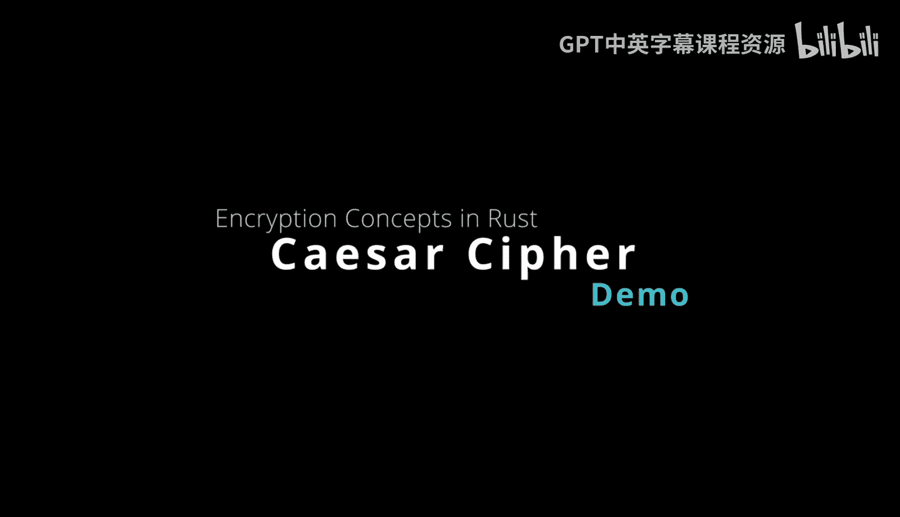
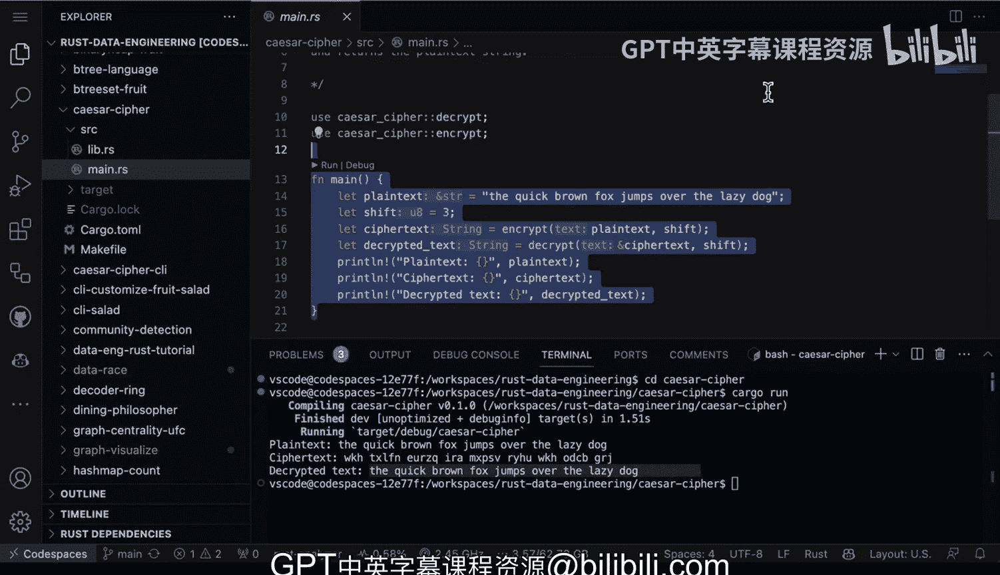

# Rust编程入门：2-3：凯撒密码解密技术揭秘 🔐



在本节课中，我们将一起探索密码学的神秘世界，具体学习如何使用Rust编程语言实现经典的凯撒密码。我们将从加密和解密的基本概念入手，通过一个简单的Rust程序来演示整个过程。课程内容将涵盖代码结构、核心逻辑，并最终运行程序以验证结果。

## 加密函数解析

上一节我们介绍了凯撒密码的基本概念，本节中我们来看看实现加密功能的核心代码。加密函数是执行字母替换这一神秘艺术的关键，它会根据指定的偏移量移动每个字母，从而隐藏原始内容。

以下是`lib.rs`文件中加密函数`encrypt`的代码片段：

```rust
pub fn encrypt(text: &str, shift: u8) -> String {
    text.chars()
        .map(|c| {
            if c.is_ascii_alphabetic() {
                let base = if c.is_ascii_lowercase() { b'a' } else { b'A' };
                (((c as u8 - base + shift) % 26) + base) as char
            } else {
                c
            }
        })
        .collect()
}
```

该函数接收两个参数：待加密的文本`text`和偏移量`shift`。偏移量决定了字母替换的规则。例如，如果起始字母是`A`，偏移量为`2`，则加密后的字母为`C`；偏移量为`3`，则结果为`D`。函数内部会遍历文本中的每个字符，将其转换为小写，并根据偏移量进行移位计算。

## 解密函数原理

理解了加密过程后，解密就变得相对简单。解密本质上就是加密的逆过程，只需将字母向相反方向移动相同的偏移量即可。

以下是解密函数`decrypt`的代码：

```rust
pub fn decrypt(text: &str, shift: u8) -> String {
    encrypt(text, 26 - (shift % 26))
}
```

可以看到，解密函数巧妙地复用了加密函数。通过传入`26 - (shift % 26)`作为新的偏移量，即可实现反向移位，从而恢复出原始文本。这里的`26`代表英文字母的总数。

## 程序运行与验证

现在，让我们看看如何在主函数中调用这些功能，并观察凯撒密码的实际效果。

以下是`main.rs`文件中的主要内容：

```rust
use caesar_cipher::{encrypt, decrypt};

fn main() {
    let plain_text = "the quick brown fox jumps over the lazy dog";
    let shift = 3;

    let encrypted = encrypt(plain_text, shift);
    println!("加密后的文本: {}", encrypted);

    let decrypted = decrypt(&encrypted, shift);
    println!("解密后的文本: {}", decrypted);
}
```

程序中硬编码了明文`"the quick brown fox jumps over the lazy dog"`和偏移量`3`。运行程序后，我们会先得到加密后的乱码文本。例如，字母`T`偏移`3`位后会变成`W`。如果我们知道偏移量是`3`，理论上可以手动推算出原始信息。最后，程序调用解密函数，可以成功恢复出原始的明文。

## 总结



本节课中我们一起学习了凯撒密码在Rust中的实现。我们分析了加密和解密两个核心函数的代码逻辑，了解了偏移量如何决定字母的替换规则。通过运行示例程序，我们验证了加密文本可以通过已知的偏移量被成功解密。这个项目是一个很好的概念验证，展示了使用Rust构建密码学相关工具的简洁性与直观性，非常适合初学者进行实践和探索。