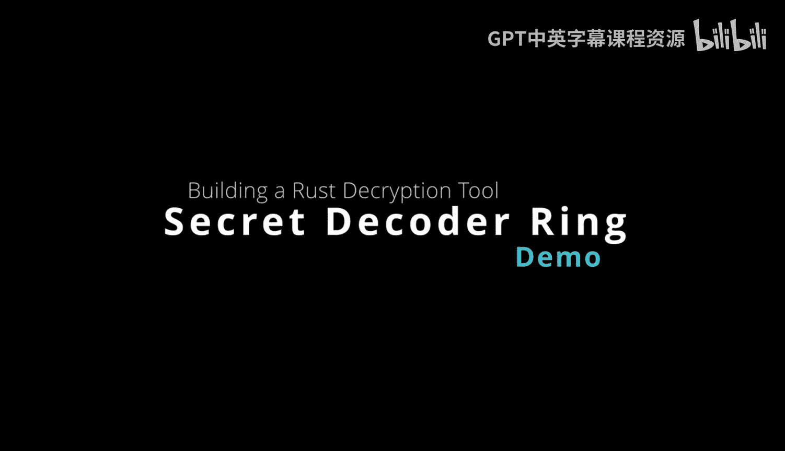
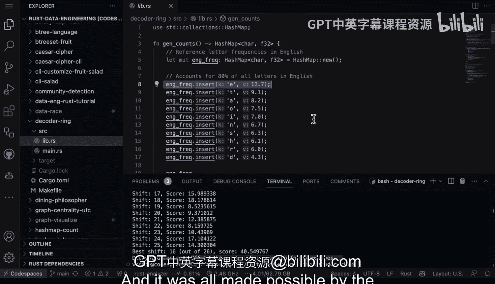

# 035：解码环制作实践指南 🔐



在本节课中，我们将要学习如何利用Rust语言构建一个实用的工具，用于分析和破解凯撒密码。我们将从理解凯撒密码的基本原理开始，逐步深入到如何通过统计分析来猜测加密时使用的偏移量，并最终实现一个完整的命令行工具。

## 凯撒密码简介

上一节我们介绍了课程的整体目标，本节中我们来看看凯撒密码是什么。

凯撒密码是最简单的加密技术之一。它的原理是将字母表中的每个字母按照一个固定的数字进行偏移，从而对信息进行编码。

例如，当偏移量为3时，字母`A`会被加密为`D`，`B`会被加密为`E`，以此类推。

## 工具设计与功能概述

了解了凯撒密码的原理后，本节中我们来看看如何构建一个工具来应对它。

我构建的这个工具不仅能创建密码和加密信息，还能使用统计分析来检测密码最可能使用的偏移量。其核心思路是：如果你能找出最可能的偏移量，并设计一种评估概率的指标，你就能推断出原始信息。这种方法在处理大数据问题时尤其有用，例如，在尝试所有可能的暴力破解方法之前，可以先对数据进行采样分析，就像本示例所做的那样。

## 核心实现：统计分析

上一节我们介绍了工具的整体功能，本节中我们来看看其核心的统计分析是如何实现的。

工具的核心在于利用字母频率分析来猜测偏移量。在英语中，大约80%的字母遵循特定的频率分布。

以下是英语字母的初始频率哈希映射示例：

```rust
let mut frequencies: HashMap<char, f64> = HashMap::new();
frequencies.insert('e', 12.7);
frequencies.insert('t', 9.1);
frequencies.insert('a', 8.2);
// ... 其他字母
```

工具会统计密文中每个字母的出现频率，然后与标准英语字母频率进行比较。通过计算所有可能偏移量（0到25）下的匹配分数，分数最高的偏移量就是最可能的答案。

以下是猜测偏移量的核心逻辑：

```rust
fn guess_shift(ciphertext: &str, frequencies: &HashMap<char, f64>) -> i32 {
    let mut best_shift = 0;
    let mut highest_score = 0.0;
    for shift in 0..26 {
        let score = calculate_score(ciphertext, shift, frequencies);
        if score > highest_score {
            highest_score = score;
            best_shift = shift;
        }
    }
    best_shift
}
```

## 工具使用演示

理解了核心原理后，本节中我们来看看这个工具具体如何使用。

这是一个命令行工具。启动后，通过`--help`参数可以查看使用说明。工具的主要功能是解密和进行频率分析。

以下是主要的使用命令：

*   **解密并猜测偏移量**：`cargo run -- --message "加密文本" --guess`
*   **仅进行频率分析**：`cargo run -- --message "加密文本" --stats`

例如，当我们输入一段密文并启用`--guess`模式时，工具会遍历所有26种可能的偏移，计算每种情况下的频率匹配分数，并输出得分最高的偏移量及其对应的解密结果。

## 实例分析

让我们通过一个具体例子来巩固理解。假设我们有一段密文。

运行工具并传入密文和`--guess`参数后，工具会输出类似以下的分析过程：

```
分析分数：
偏移 0: 分数 5
偏移 1: 分数 8
...
偏移 11: 分数 22
偏移 16: 分数 40 <-- 最高分
...
最高分数为40，最可能偏移量：16
解密后的消息：off to the bunker every person for themselves
```

从输出可以看出，偏移量16获得了最高的分数（40），因此被判定为最可能使用的加密偏移。使用该偏移量解密后，我们得到了原始信息。

## 凯撒密码的弱点与总结

本节课中我们一起学习了如何构建一个凯撒密码分析工具。

这个练习很好地演示了如何将密码学概念转化为实际的命令行工具。同时，它也揭示了凯撒密码的一个根本弱点：它对频率分析攻击是脆弱的。因为字母`E`在英语中出现的频率约为12.7%，通过分析密文中字母的分布，攻击者可以做出有根据的猜测并计算出匹配分数，这正是利用统计学解码信息的方法。



整个项目的实现，得益于Rust语言的优雅与强大功能。