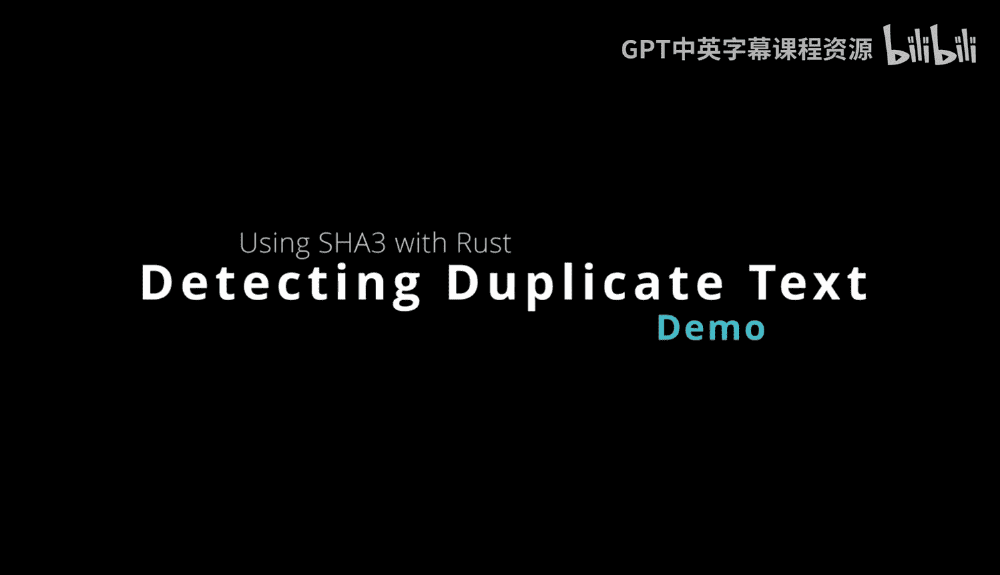
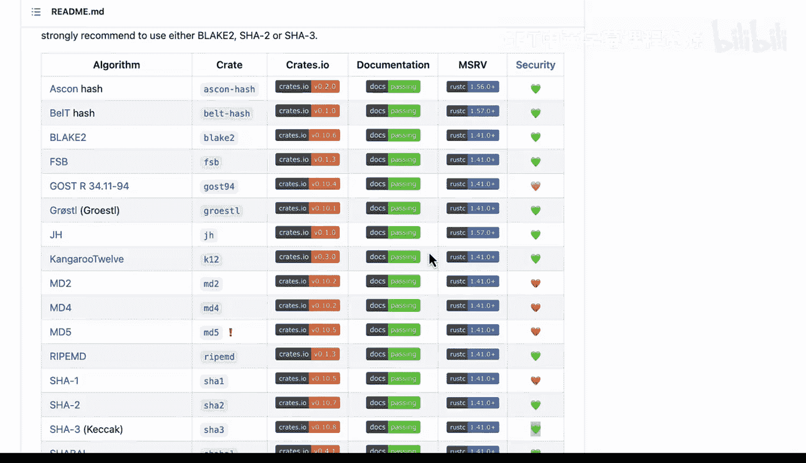
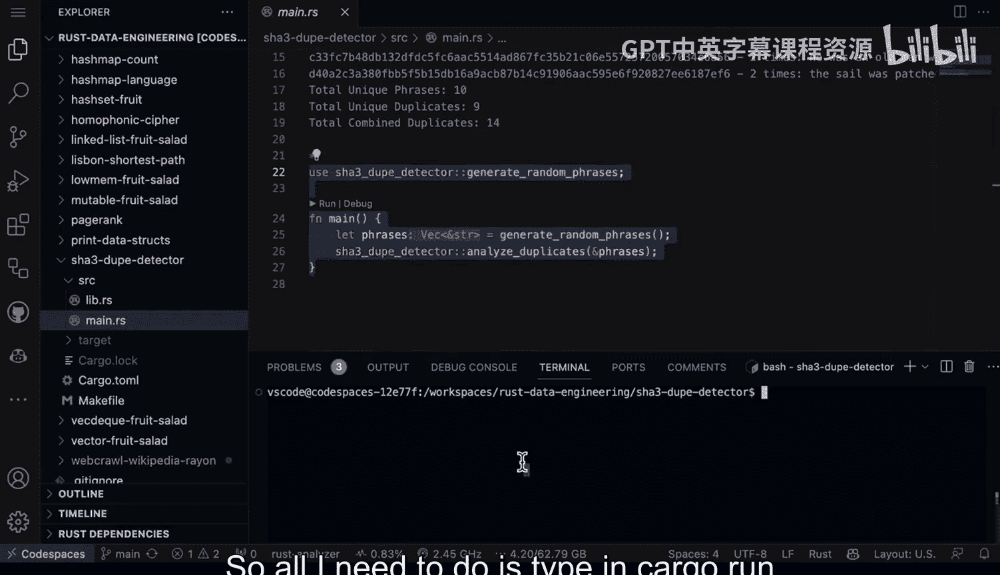

# Rust编程2-3（数据工程、DevOps）：36：使用SHA-3检测重复数据



在本节课中，我们将要学习如何在Rust中使用SHA-3哈希算法来检测文本数据中的重复项。我们将通过一个具体的例子，模拟从海明威的《老人与海》中提取短语，并生成随机重复的文本，最后使用SHA-3来识别和统计这些重复项。

## 概述：选择加密库

上一节我们介绍了Rust中加密库的选择。这里有一个关于Rust加密库从M2到M4再到M5的示例。这些都是你可以使用的不同库。这个特定的资源库很有用，因为它告诉了你安全级别。

请注意，它建议：对于新应用程序，或者在不考虑与其他标准兼容性的情况下，我们推荐使用Blake2、Sha2或Sha3。

在这个特定示例中，我们使用了Sha3。我们称其为较新的标准。我们可以看出，它在加密使用上非常安全。



## 添加项目依赖

既然知道了可以使用那个库，我将转到我的`Cargo.toml`文件。如果你想使用特定的依赖项，只需将其放入你的`Cargo.toml`文件中。当你运行`cargo run`时，它会自动拉取该依赖项。因此，拉取依赖项非常直接。

以下是依赖项的配置：
```toml
[dependencies]
sha3 = "0.10"
rand = "0.8"
```

## 构建模拟数据生成器

现在，关于我们要构建的内容，请注意我使用了其他库，如`rand`等。我在这里使用Sha3的目的是，我想从海明威的《老人与海》这本书中获取一系列短语。

我在这里设计了一个静态短语列表，并添加了10个字符串。我可以指定这是第一个短语，第二个短语，等等。

将这些短语组合在一起后，我想要做的是生成一堆随机短语。这在某种程度上是一种模拟，用于生成可能包含重复项的文本，这正是这里的核心思想。

以下是生成随机短语的函数：
```rust
fn generate_random_phrases(count: usize) -> Vec<String> {
    let static_phrases = vec![
        "He was an old man who fished alone.",
        "Everything about him was old.",
        "The sail was patched with flour sacks.",
        "His hope and his confidence had never gone.",
        "But now they were freshening.",
        "The clouds over the land now rose like mountains.",
        "The boat moved ahead slowly.",
        "He looked at the sky and saw the white cumulus built like friendly piles of ice.",
        "Then he looked ahead and saw the birds working.",
        "He was sorry for the birds."
    ];
    let mut rng = rand::thread_rng();
    (0..count).map(|_| {
        let idx = rng.gen_range(0..static_phrases.len());
        static_phrases[idx].to_string()
    }).collect()
}
```
这个函数接受一个数量参数，返回一个充满字符串的向量。我们使用静态短语列表，然后生成一堆消息到一个字符串向量中。

## 使用SHA-3创建唯一哈希

下一个函数是我们引入SHA-3能力的地方。我们将在这里创建一个唯一的哈希。

我们将使用这个哈希映射，并说明短语的总数。然后，对于短语列表中的每个短语，我们将为其创建一个唯一的哈希。这使我们能够快速识别重复项。

以下是使用SHA-3检测重复项的核心函数：
```rust
use sha3::{Digest, Sha3_256};
use std::collections::HashMap;

fn detect_duplicates(phrases: Vec<String>) {
    let mut phrase_counts: HashMap<String, usize> = HashMap::new();
    let mut hash_map: HashMap<String, String> = HashMap::new();

    for phrase in phrases {
        let mut hasher = Sha3_256::new();
        hasher.update(phrase.as_bytes());
        let hash_result = hasher.finalize();
        let hash_hex = format!("{:x}", hash_result);

        // 使用哈希值作为键来统计重复
        let count = phrase_counts.entry(hash_hex.clone()).or_insert(0);
        *count += 1;
        // 存储原始短语（可选，用于调试或输出）
        hash_map.entry(hash_hex).or_insert(phrase);
    }

    // 输出统计信息
    let total_phrases: usize = phrase_counts.values().sum();
    let unique_phrases = phrase_counts.len();
    let total_duplicates = total_phrases - unique_phrases;

    println!("总生成短语数: {}", total_phrases);
    println!("唯一短语数: {}", unique_phrases);
    println!("重复短语总数: {}", total_duplicates);
    println!("\n详细统计（哈希值 -> 出现次数）:");
    for (hash, count) in &phrase_counts {
        if *count > 1 {
            println!("哈希 {}: 出现 {} 次", &hash[0..8], count); // 只显示哈希前8位以便阅读
        }
    }
}
```
然后，我们将列出一个唯一短语数量的列表，并放入一些更具描述性的统计数据，如总唯一重复项、总合并重复项，最后基本上在最后全部打印出来。

## 运行与结果分析

现在，如果我们转到`main`函数，看看会发生什么。这段代码将从短语列表中生成随机的重复短语。

在这个例子中，我们将看到生成了24个短语。它将给出唯一的缓存，并说明它能够检测到该短语的次数，以及有多少个唯一短语。



例如，在这个案例中，10个短语里只有9个是唯一的。重复项总共有14个合并的重复项。也就是说，在24个中有多少个重复短语。

如果我们仔细查看，我们可以实际检查这一点，并看到它全部协同工作。我只需要输入`cargo run`，我们就能看到这里发生了什么。

如果我们运行这段代码，我们将看到它生成了24个短语。我们可以看到这个短语出现了三次，下一个短语出现了三次，等等。因此，它能够看到总共有10个唯一短语，并且发现的重复项总共有8种不同类型。然后，如果你把这些加起来，总共有14个重复项。

所以，这里有24个短语，我们可以看到关于它的描述性统计数据。因此，这是一个很好的技术，取决于你正在解决什么样的问题。也许你正在尝试策划一个数据集，或者查看文件系统并删除某些文件。

幸运的是，使用Rust可以非常容易地构建一个强大的命令行工具，可以检测文本和二进制文件中的重复项，这一切都是通过现有的库完成的。你也可以放心，分发这个工具会很容易，因为你可以进行基于二进制的部署。

## 总结


本节课中我们一起学习了如何在Rust项目中使用SHA-3哈希算法。我们首先了解了如何选择合适的加密库，然后在`Cargo.toml`中添加依赖。接着，我们构建了一个模拟数据生成器来创建可能包含重复项的文本。核心部分是利用SHA-3为每个短语生成唯一哈希值，并通过哈希映射快速识别和统计重复项。最后，我们运行程序并分析了输出结果，展示了该技术在数据去重和数据集整理中的实际应用。这种方法高效、安全，并且得益于Rust的生态系统，易于实现和分发。