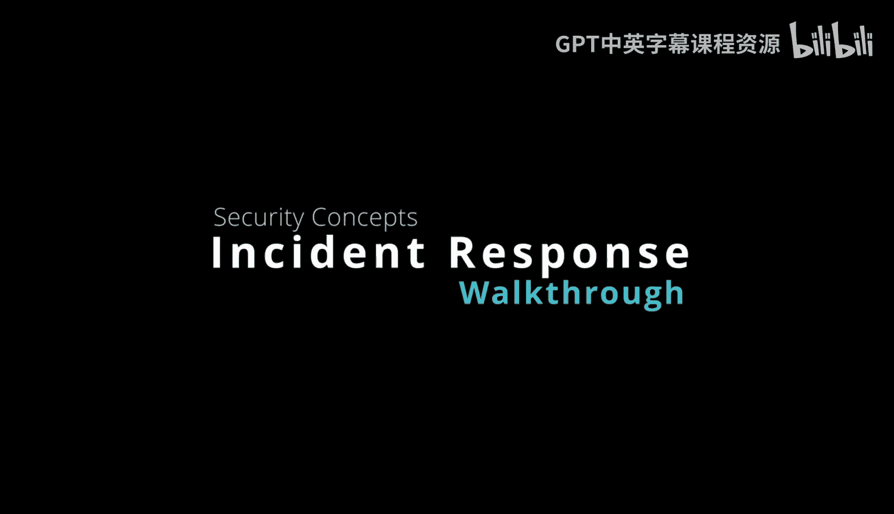
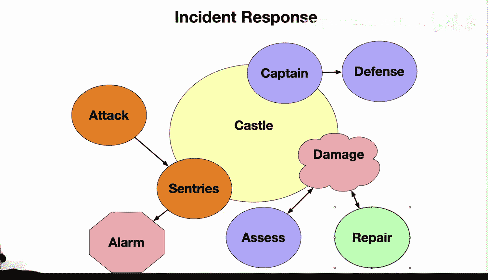

# 网络安全：2-3：事件响应流程详解 🏰

在本节课中，我们将通过一个中世纪城堡的比喻，来学习现代网络安全中的事件响应流程。我们将了解一次攻击如何触发一系列防御动作，以及如何通过计划、响应和分析来保护系统安全。

上一节我们介绍了网络安全的基础概念，本节中我们来看看当攻击真正发生时，一个有效的响应计划是如何运作的。

## 城堡事件响应流程 🛡️

下图展示了一个中世纪城堡的事件响应流程图。我们将分析一次针对城堡的攻击会实际触发哪些步骤。

拥有一个有效的事件响应计划对于保卫城堡至关重要。以下是响应流程中的关键步骤。

以下是事件响应流程的六个核心阶段：

1.  **警报**：哨兵发现入侵迹象，立即拉响警报。
2.  **协调**：指挥官根据警报，协调并制定防御策略。
3.  **评估**：评估造成的损害和攻击者的入口点。例如，城墙是否被攻破，护城河是否需要修复。
4.  **遏制**：部署应对措施，以最小化攻击的影响。
5.  **取证**：事件得到控制后，进行深入取证分析，查明攻击者是如何渗透外围防御的。
6.  **改进**：从事件中吸取教训，改进未来的安全防护和响应能力。

通过训练让守卫做好准备，以便未来能快速识别并应对类似事件。充分的准备对于保卫城堡至关重要。

## 现代网络安全的事件响应 🔐

现代网络安全方法论依赖于类似的事件响应程序。其核心逻辑可以概括为：**检测 -> 响应 -> 分析 -> 改进**。

以下是现代网络安全事件响应的关键组成部分：

*   **自动检测**：入侵检测系统（IDS）等控制措施会自动向IT团队发出关于可疑活动的警报。
*   **计划文档**：响应计划会详细记录分析、遏制安全事件以及从事件中恢复的程序。
*   **团队协作**：根据事件的严重程度，可能还需要与法律和公关团队进行协调。
*   **损害最小化**：强大的事件响应能力可以最大限度地减少攻击造成的损害。
*   **趋势分析**：通过分析攻击趋势，可以发现系统漏洞，从而改进防御措施。
*   **合规报告**：为了验证是否符合法规要求，良好的事件报告也至关重要。

总而言之，通过训练和测试进行准备，能够构建有效的“响应肌肉记忆”。这使你能够凭借本能快速反应。你必须确保你的“城堡”能够随时检测并化解任何潜在的入侵。

本节课中，我们一起学习了从古典比喻到现代实践的事件响应完整流程。一个结构化的响应计划是有效网络防御的基石，它不仅能控制损失，更能通过持续改进来提升整体的安全水位。

