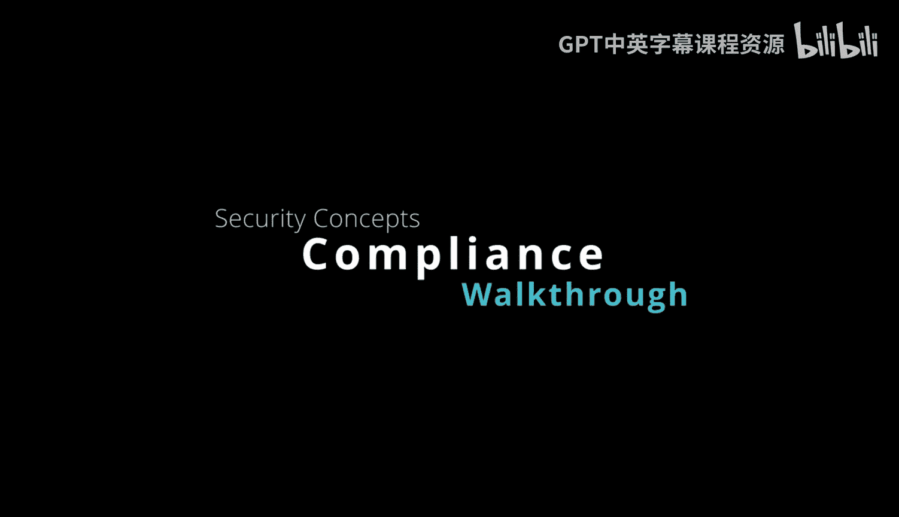
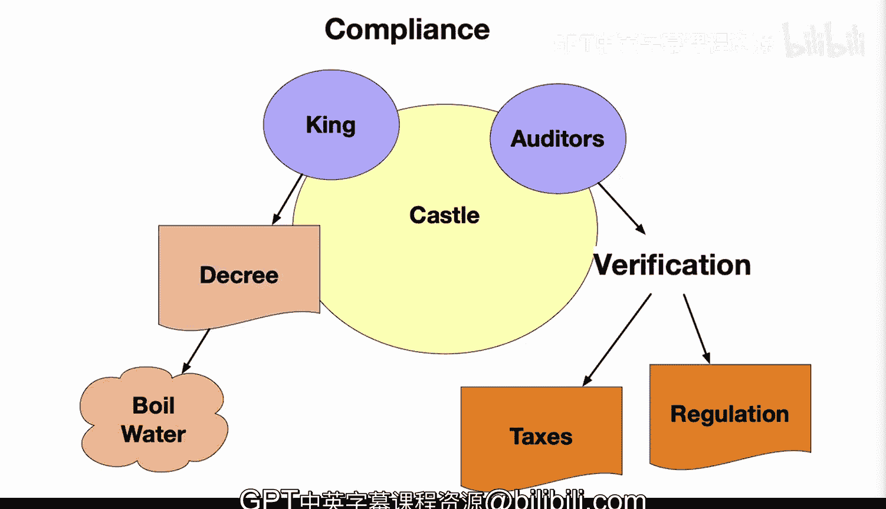

# 038：合规性管理 🏰

在本节课中，我们将通过一个中世纪的城堡比喻，来学习计算机系统中的合规性管理概念。我们将了解合规性的重要性、如何实施控制措施，以及如何通过审计和自动化来确保系统符合法规要求。

## 城堡中的合规性

让我们通过一个中世纪城堡的视角来看待合规性。如果你想遵守国王颁布的法令，城堡本身必须拥有执行这些法令的方法。

## 合规性的执行与验证

法令可能规定所有水在使用前都必须煮沸，这可以保护城堡内每个人的安全。因此，你需要审计员。这些审计员将为法规以及其他事项（例如税收）提供一定程度的验证。毕竟，必须有人为审计员支付报酬，而这通常通过税收来完成，所以你也需要验证这些税收技术。相关文件将证明合规工作的成效。

以下是合规性执行的具体步骤示例：

*   **记录与通知**：例如，在主井内，每次取水后都必须进行取水通知。煮沸后，可能需要进行另一次通知。
*   **清单管理**：某处会有一份检查清单。
*   **人员培训**：守卫们会接受相关法规的培训。
*   **问题整改**：在检查员到来之前，会识别并补救不足之处。

## 计算机系统中的合规性

上一节我们看到了城堡如何执行合规，在计算机系统中，情况非常相似。你必须遵守诸如HIPAA或PC DSS之类的规则。不合规将导致罚款，甚至失去公众信任。

框架会概述所需的控制措施和政策，并实施方法来证明对法规的遵守。

以下是确保计算机系统合规性的关键方法：

*   **审计与证据**：审计是一种非常有效的控制手段。像系统日志这样的证据可以向当局证明合规性，并使你能够跟上不断发展的法规。
*   **自动化策略执行**：自动执行策略是减少错误的好方法，检查清单是其中较好的方式之一。这能确保即使人员发生变动，工作的连续性也能得到保障。
*   **漏洞评估**：漏洞评估也将识别出差距。

## 合规性的价值

总而言之，合规性将提供问责制和法律保证，并实施所需的控制措施，以便客户和监管机构都能信任该系统。这将为业务运营创造顺畅的环境。

本节课中，我们一起学习了合规性管理的核心概念。我们通过城堡的比喻理解了合规的必要性，探讨了在计算机系统中通过审计、自动化执行和漏洞评估来确保合规的具体方法，并最终认识到合规性对于建立信任、保证业务平稳运行的重要价值。