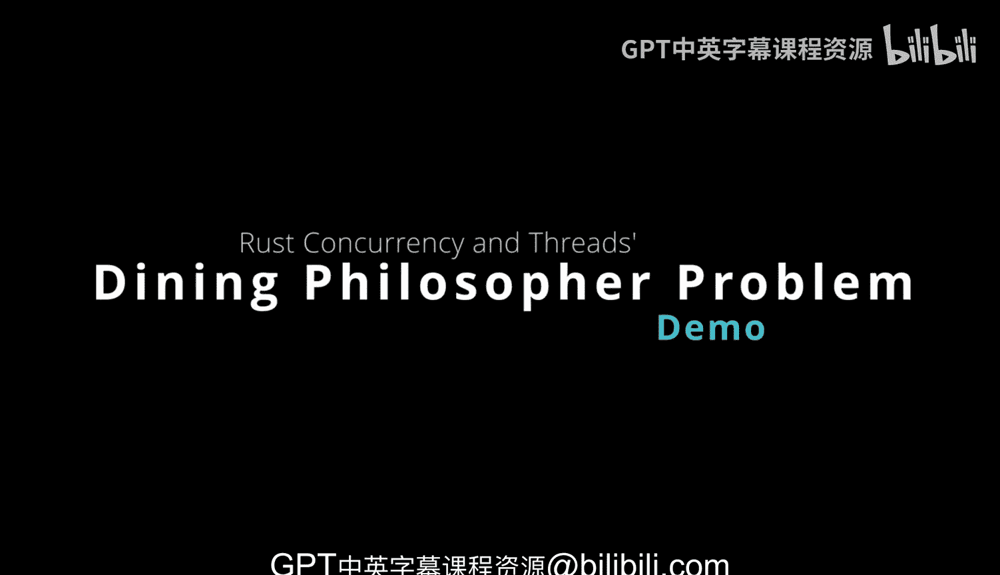
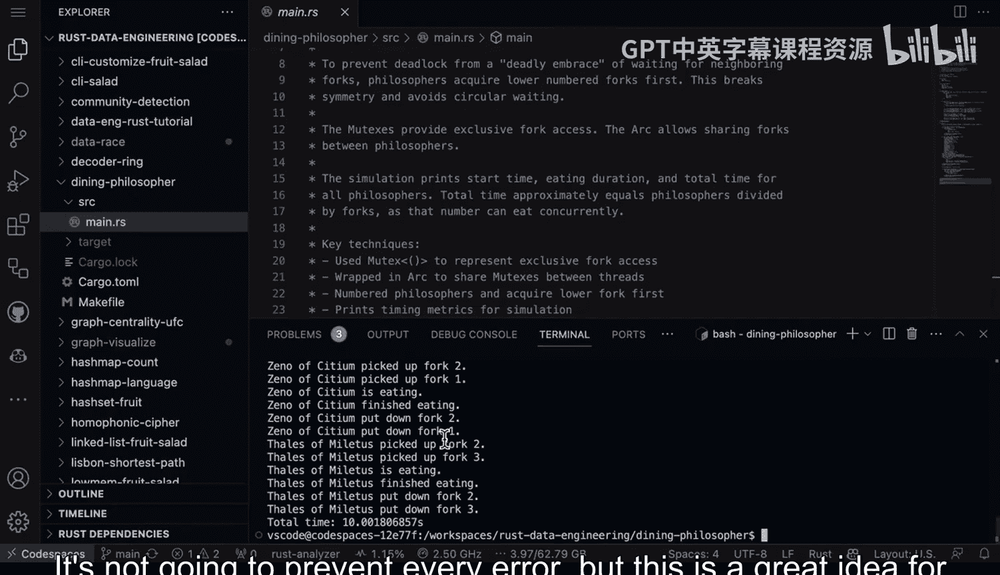

# 040：哲学家就餐问题 🍽️



在本节课中，我们将学习一个经典的并发编程问题——哲学家就餐问题。我们将探讨如何使用Rust的并发原语来模拟和解决这个问题，并理解如何避免死锁等并发陷阱。

## 概述

哲学家就餐问题是一个经典的并发问题，它模拟了多位哲学家围坐在圆桌旁，每位哲学家需要两把叉子才能进餐的场景。问题的关键在于设计一种机制，让所有哲学家都能公平地共享有限的叉子，同时避免死锁。我们将使用Rust的 `Mutex` 和 `Arc` 来实现这个模拟，并学习如何对并发程序进行基准测试。

## 问题核心

这个问题的有趣之处在于，你需要为围坐在桌旁的一群人（在本例中是哲学家）找到一种共享一定数量叉子的方法。这个特定问题能够暴露诸如死锁等并发问题。为了防止这些问题，你可以采取的措施之一是使用正确的并发形式。

在本例中，`Mutex` 将提供对叉子的独占访问权。这些是进餐用的叉子。`Arc` 允许在哲学家之间共享叉子。

模拟将打印开始时间、进餐方向和所有哲学家的总时间。总时间大约等于哲学家数量除以叉子数量，这个数字代表了可以并发进餐的人数。

## 关键技术

在进行并发模拟时，对其进行基准测试以确保实际情况符合预期至关重要。如果你引入了多个线程但速度没有提升，那就可能存在问题。

在本例中，我们将使用以下技术：
*   `Mutex` 用于表示对叉子的独占访问。
*   将 `Mutex` 包装在 `Arc` 中，以便在线程间共享。
*   为哲学家编号，并规定先获取编号较小的叉子。
*   最后，为整个模拟进行计时。

再次强调，打印出时间加速比非常关键。并发会带来收益递减，这被称为阿姆达尔定律。当存在等待时，并发的收益就会递减。因此，你需要仔细检查是否值得将某些任务改为多线程。

## 代码实现

在这个场景中，我们将使用标准库中的 `Arc`、`Mutex`、`thread` 和 `duration`。

首先，我们实现一个 `Fork` 结构体。这是哲学家将要使用的物品。

```rust
use std::sync::{Arc, Mutex};

struct Fork {
    id: usize,
    // Mutex 确保一次只有一个哲学家能拿起这把叉子
    _mutex: Mutex<()>,
}
```

接着，我们实现一个 `Philosopher` 结构体。

```rust
struct Philosopher {
    name: String,
    left_fork: Arc<Mutex<()>>,
    right_fork: Arc<Mutex<()>>,
}
```

在这里，我们创建了哲学家的实例。我们还有一个 `eat` 方法，其中展示了他们需要以一种能真正防止死锁的方式拿起叉子的逻辑。我们还包含了一些调试信息，这在最初构建并发代码时非常有帮助。

```rust
impl Philosopher {
    fn eat(&self) {
        // 先拿起编号较小的叉子，以防止循环等待（死锁）
        let (first, second) = if self.left_fork.id < self.right_fork.id {
            (&self.left_fork, &self.right_fork)
        } else {
            (&self.right_fork, &self.left_fork)
        };

        let _first = first._mutex.lock().unwrap();
        println!("{} 拿起了左边的叉子。", self.name);
        let _second = second._mutex.lock().unwrap();
        println!("{} 拿起了右边的叉子并开始进餐。", self.name);

        // 模拟进餐时间
        std::thread::sleep(std::time::Duration::from_millis(100));

        println!("{} 完成了进餐。", self.name);
    }
}
```

拥有打印或日志语句（日志更好）非常重要，这样你才能确切知道发生了什么。实际上，如果你使用 `log::debug`，你可以在开发时调试它，然后在生产环境中不显示这些消息。但如果出现问题需要进一步开发，你可以重新启用调试方法。

## 主程序逻辑

以下是 `main` 方法，它展示了我们餐桌上只有四把叉子，并将打印相关信息。然后，我们将围绕叉子应用 `Mutex`，以防止共享访问叉子时引发像死锁这样的严重问题。

```rust
fn main() {
    let forks: Vec<Arc<Mutex<()>>> = (0..4)
        .map(|_| Arc::new(Mutex::new(())))
        .collect();

    let philosophers = vec![
        Philosopher::new("亚里士多德", forks[0].clone(), forks[1].clone()),
        Philosopher::new("柏拉图", forks[1].clone(), forks[2].clone()),
        Philosopher::new("苏格拉底", forks[2].clone(), forks[3].clone()),
        Philosopher::new("笛卡尔", forks[3].clone(), forks[0].clone()), // 注意循环依赖
    ];

    let handles: Vec<_> = philosophers
        .into_iter()
        .map(|p| {
            std::thread::spawn(move || {
                p.eat();
            })
        })
        .collect();

    for handle in handles {
        handle.join().unwrap();
    }
}
```

这里我们看到所有的哲学家。这里有一个向量，包含了我们希望坐在餐桌旁的所有人。然后，我们将他们放入我们的集合中。最后，我们在这里生成线程，以便每个人可以同时开始进餐。最终，我们将一起打印所有信息。

## 运行与验证

关键要点是，`Mutex` 很有帮助，它使得每个人都可以尝试进餐，但关于谁在特定时间能拿到叉子有一些逻辑。让我们运行这个程序。

如果我们进入 `dining_philosopher` 目录并输入 `cargo run`，我们可以看到模拟结果。同样，在进行多线程编程时，构建用于了解确切发生情况的检测机制至关重要。例如，哲学家需要能够同时拿起两把叉子，我们正在调试这一点。我们还可以在他们完成、开始时以及最后打印消息。最后，你应该进行基准测试，并思考：有多少位哲学家？我们大约可以看到，实际上Rust会告诉我们这里的确切哲学家列表。然后我们查看时间，由于我们能够使用多线程编程来加速工作，我们应该达到一定的效率水平。

## 总结

总而言之，这是使用Rust语言来研究和实践一些经典并发问题的绝佳方式。Rust拥有许多安全技术，可以防止你编译已知错误的代码。它虽然不能防止所有错误，但这是一个很好的思路，或许可以用于现实世界项目中更高级别的并发处理。



本节课中，我们一起学习了哲学家就餐问题的背景与挑战，并使用Rust的 `Arc` 和 `Mutex` 实现了解决方案。我们了解了如何通过规定获取锁的顺序（如先拿编号小的叉子）来避免死锁，并强调了在并发编程中添加日志和进行基准测试的重要性。通过这个实例，我们看到了Rust如何帮助构建安全、高效的并发程序。