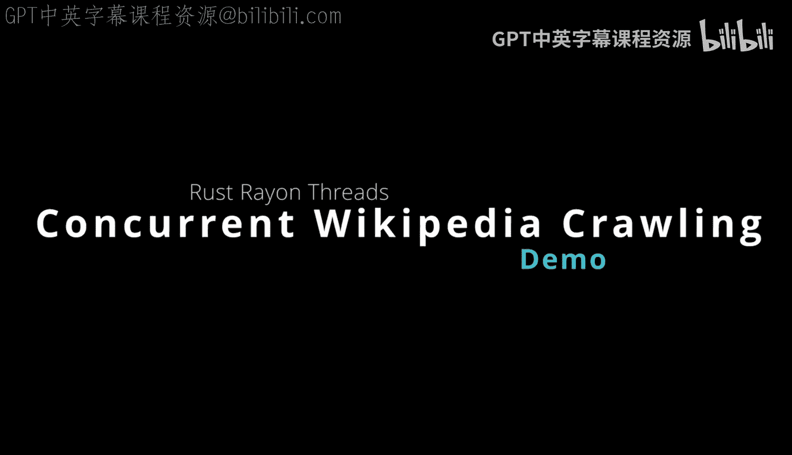
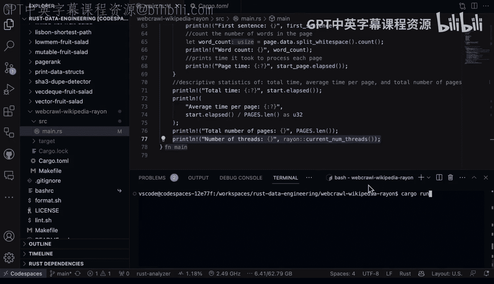

# 041：使用Rayon并行爬取维基百科 🚀



在本节课中，我们将学习如何利用Rust的Rayon库，通过多线程并行处理来加速网络请求任务。我们将通过一个具体的例子——并行爬取和处理多个维基百科页面——来演示其工作原理和优势。

## 概述

我们将构建一个程序，该程序能够同时获取多个维基百科页面的内容，并对每个页面的文本进行处理。为了验证并行化带来的性能提升，我们还会收集并输出相关的计时指标。核心在于，我们将使用Rayon库来简化多线程编程的复杂性，让它自动为我们管理线程池和任务分发。

## 项目依赖

首先，我们来看一下实现此功能所需的项目依赖。以下是`Cargo.toml`文件中的关键部分：

```toml
[dependencies]
wikipedia = "..."  # 用于获取维基百科页面
rayon = "..."      # 用于实现并行迭代
```

这里我们引入了两个外部库：`wikipedia`用于获取页面内容，`rayon`则为我们提供了强大的并行迭代能力。

## 核心代码解析

上一节我们介绍了项目依赖，本节中我们来看看具体的代码实现。程序的核心逻辑可以分为三个部分：定义要处理的页面列表、并行获取并处理页面、最后输出性能指标。

### 定义页面列表

我们首先定义一个包含多个维基百科页面标题的列表。在这个例子中，我们选取了九位NBA球员的页面。

```rust
let pages = vec![
    “Michael_Jordan”,
    “LeBron_James”,
    “Kobe_Bryant”,
    // ... 其他六位球员
];
```

### 并行处理页面

这是所有工作发生的地方。我们使用Rayon将普通的迭代转换为并行迭代，从而为每个页面的获取和处理操作启动一个线程。

以下是处理单个页面的函数：

```rust
fn process_page(page_title: &str) -> (String, Duration) {
    let start = Instant::now();
    // 获取页面内容
    let page = wikipedia::page(page_title);
    // 处理页面文本内容（例如提取第一句）
    let content = page.get_content().unwrap();
    let first_sentence = extract_first_sentence(&content);
    let duration = start.elapsed();
    (first_sentence, duration)
}
```

接下来是关键步骤，我们使用Rayon的`par_iter()`方法对页面列表进行并行处理：

```rust
use rayon::prelude::*;

let results: Vec<_> = pages
    .par_iter() // 关键：将顺序迭代转换为并行迭代
    .map(|page_title| process_page(page_title))
    .collect();
```

与普通的`.iter()`相比，`.par_iter()`会自动在后台线程池中并行执行`map`中的操作。Rayon会智能地管理线程数量，以充分利用系统资源。

### 输出性能指标

处理完成后，我们计算并输出各项指标，这对于验证并行化的效果至关重要。

以下是需要计算的指标列表：

*   **单页处理时间**：每个页面获取和处理所花费的时间。
*   **总耗时**：从开始到所有页面处理完毕的总时间。
*   **平均每页耗时**：总耗时除以页面数量。
*   **处理的页面总数**：用于验证所有任务均已完成。
*   **使用的线程数**：这是一个关键指标，用于确认程序确实在并发执行。

```rust
let total_time: Duration = results.iter().map(|(_, d)| *d).sum();
let avg_time = total_time / pages.len() as u32;
let threads_used = rayon::current_num_threads();

println!(“总耗时: {:?}“, total_time);
println!(“平均每页耗时: {:?}“, avg_time);
println!(“处理页面总数: {}“, pages.len());
println!(“实际使用线程数: {}“, threads_used);
```

## 运行与结果分析

现在我们已经完成了所有代码，让我们运行它看看效果。程序执行速度极快，几乎瞬间就处理完了九个维基百科页面。

输出结果会显示从每个页面（例如迈克尔·乔丹页面）提取的句子示例。更重要的是，性能指标会清晰地展示出来：

*   总耗时远小于顺序执行九个任务的时间总和。
*   平均每页耗时提供了一个基准参考。
*   实际使用的线程数证明了并发确实发生。

这些描述性统计数据为我们提供了一个绝佳的基准，帮助我们判断当前的并行方案是否高效。多线程编程中最重要的环节之一就是进行基准测试，以确保你的改进确实提升了性能，而不是增加了不必要的复杂性或反而导致速度变慢。

## 总结

本节课中我们一起学习了如何利用Rust的Rayon库进行并行编程。我们通过一个并行爬取维基百科页面的实例，掌握了以下核心要点：



1.  如何使用`rayon`库的`.par_iter()`方法轻松地将顺序任务并行化。
2.  如何构建一个包含网络请求和数据处理的任务单元（`process_page`函数）。
3.  如何收集和计算关键的计时与性能指标，以科学地评估并行化效果。

Rayon库的强大之处在于，它抽象了线程管理的复杂性，让开发者能够专注于业务逻辑，同时智能地利用多核CPU资源来提升程序性能。