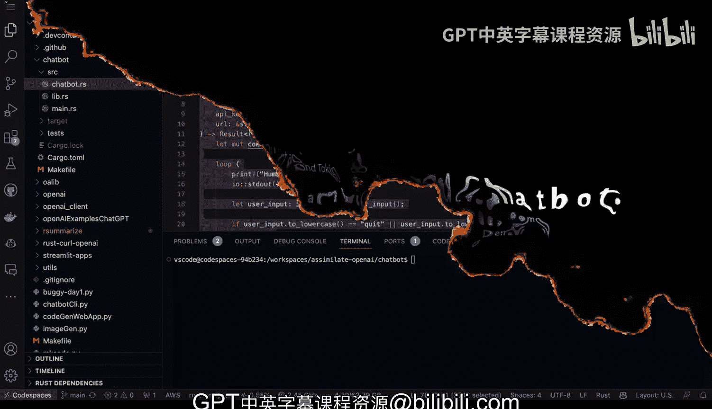
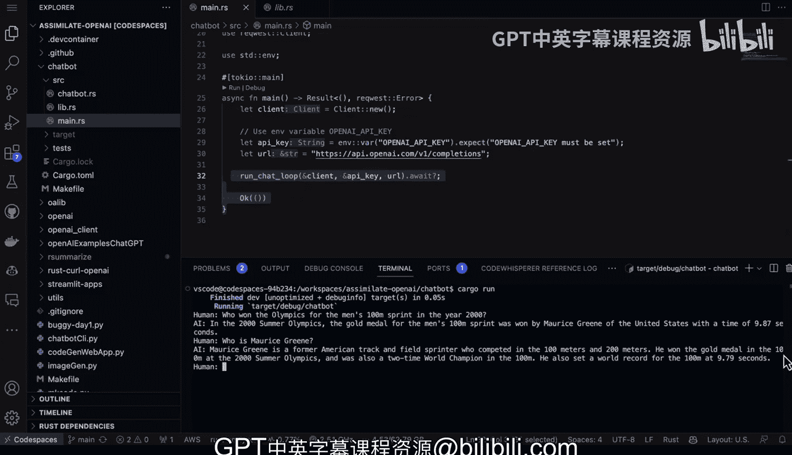

# 042：基于Tokio的智能聊天机器人


在本节课中，我们将学习如何使用Rust语言及其强大的异步运行时库Tokio，构建一个能够与大型语言模型（如OpenAI API）交互的智能聊天机器人。我们将分析一个示例项目的核心代码结构，了解其如何实现对话循环、处理异步请求，并最终运行一个功能完整的聊天程序。

## 概述

这个聊天机器人项目利用了Rust生态系统中一些优秀的库。它实现了一个与AI助手进行对话的循环。虽然本示例使用的是OpenAI API，但其代码结构可以适配任何提供类似接口的大型语言模型。

## 核心代码结构分析

接下来，我们深入查看代码的主要组成部分。程序的核心是一个处理对话的主循环。



### 主循环：`run_chat_loop`

主循环负责管理整个对话流程。它的逻辑如下：
1.  首先，请求用户输入。
2.  接着，将输入发送给API。
3.  然后，打印出API的响应。
4.  最后，将用户输入和AI响应都追加到对话历史中。

以下是该循环的简化逻辑描述：
```rust
async fn run_chat_loop(api_client: &ApiClient) -> Result<()> {
    let mut conversation_history = Vec::new();
    loop {
        let user_input = read_user_input()?;
        let ai_response = call_api(&api_client, &conversation_history, &user_input).await?;
        println!("AI: {}", ai_response);
        conversation_history.push((user_input, ai_response));
    }
}
```

### 异步API调用：`call_api`

上一节我们介绍了对话循环，本节中我们来看看如何与外部服务通信。这是进行API调用的关键部分。

这个函数是异步的，这使得程序高效且可扩展。借助Tokio库，我们可以轻松处理大量并发请求。此部分代码不限于OpenAI，可以替换为任何云服务商、本地部署或开源的大型语言模型API。

### 辅助功能

在`call_api`函数获取到原始响应后，我们需要对其进行解析。`get_ai_response`函数负责从API返回的JSON数据中提取出我们需要的文本内容。

此外，`read_user_input`函数用于从命令行获取用户输入的字符串。

## 项目依赖与组织

了解核心函数后，我们还需要关注项目的整体依赖和文件组织方式。

### 依赖项 (`Cargo.toml`)

以下是项目依赖的关键库：
*   **`reqwest`**：用于发起HTTP请求。
*   **`tokio`**：提供异步运行时。
*   **`serde`**：协助进行数据的序列化与反序列化。
*   **`serde_json`**：专门处理JSON格式。

这些依赖在`Cargo.toml`文件中定义，例如：
```toml
[dependencies]
reqwest = { version = "0.11", features = ["json"] }
tokio = { version = "1.0", features = ["full"] }
serde = { version = "1.0", features = ["derive"] }
serde_json = "1.0"
```

### 项目文件结构

该项目采用了一种可扩展的代码组织风格。
*   **`lib.rs`**：作为库文件，它暴露了主要的`chatbot`模块。这对于构建更大规模的项目非常有用。
*   **`main.rs`**：主程序文件。它非常简洁，主要作用是引入`chatbot`模块中的`run_loop`函数，配置API密钥和端点URL，然后异步地启动聊天循环。

这种结构使得`main.rs`中的代码极其精简：
```rust
use chatbot::run_loop;

#[tokio::main]
async fn main() -> Result<()> {
    let api_key = std::env::var("OPENAI_API_KEY")?;
    let endpoint = "https://api.openai.com/v1/chat/completions";
    run_loop(&api_key, endpoint).await
}
```

## 运行示例

现在，让我们将这个程序运行起来。首先，在项目根目录执行命令：
```
cargo run
```
程序启动后，会提示我们输入问题。例如，我们可以提问：“2000年奥运会男子100米短跑冠军是谁？”

AI会回答：“在2000年夏季奥运会上，男子100米短跑金牌由莫里斯·格林获得，成绩为9.87秒。”

我们可以继续追问：“莫里斯·格林是谁？”

AI会给出更详细的介绍：“他是一位前田径短跑运动员，主攻100米和200米项目。他在2000年夏季奥运会上以9.87秒的成绩赢得了100米金牌，同时也是100米项目的两届世界冠军。”

## 总结



本节课中我们一起学习了如何使用Rust构建一个基于Tokio的智能聊天机器人。我们分析了对话循环、异步API调用等核心组件的实现，了解了项目的依赖管理和文件组织。借助Rust语言的安全性和异步编程能力，以及Tokio运行时的高性能，我们能够用相对简洁的代码构建出功能强大且高效的聊天工具。Rust是构建聊天机器人的绝佳选择，它不仅性能优异，而且在完成初步验证后，可以轻松地扩展到生产环境中。