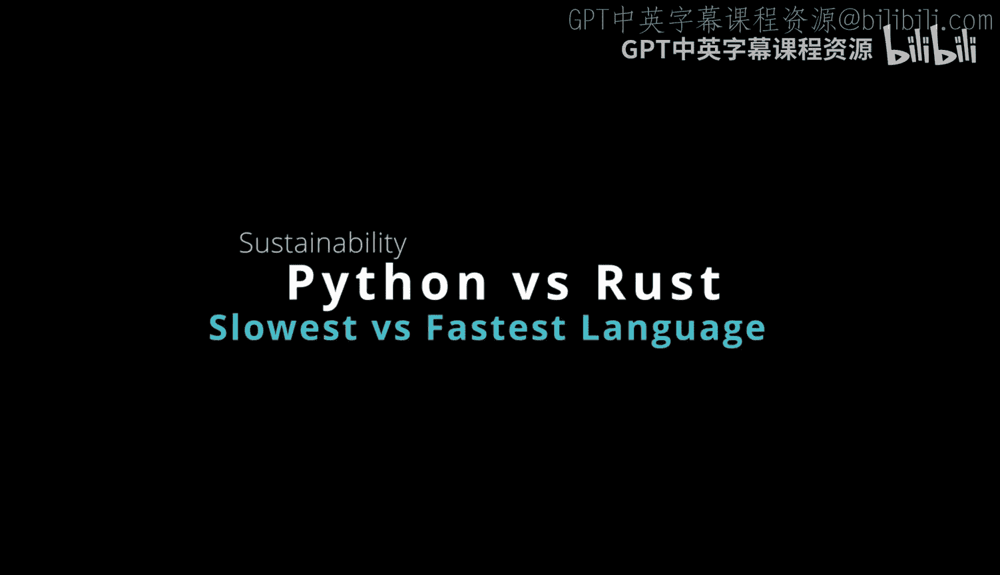
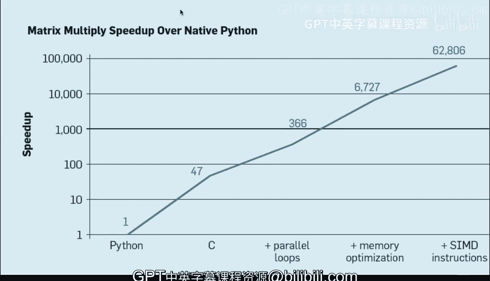

# 044：Python与Rust能效对比 💡⚡

在本节课中，我们将要学习一个关于编程语言选择的重要考量因素：能源效率与计算性能。我们将通过具体的研究数据，对比Python与Rust（及C语言）在这两方面的表现，并探讨这对于开发者和组织的实际意义。

## 概述

从Python转向Rust时，一个常见的误解是：“Python已经能用了，我不想节外生枝，还是继续用我熟悉的高效语言吧。”然而，本节将展示一个实际用例，说明在许多情况下，明智的开发者应当考虑Python语言的能效问题。我们将主要讨论两点：一项关于各语言能耗与时间对比的研究，以及Python在能效和计算性能上的排名。你会发现，在许多场景下，尤其是处理繁重的计算负载（如Web微服务中频繁序列化/反序列化JSON）时，并没有充分的理由坚持使用Python。考虑到地球正面临的明确问题，我们应当思考所编写代码的碳足迹。如果能够轻松地从一种语言切换到另一种（特别是借助Copilot等工具），至少值得考虑。本节的目标正是帮助你思考个人所用语言的能效问题，以便对未来行动做出明智决策。

## 能效排名研究 📊

以下是一项关于按能源效率对编程语言进行排名的非常引人入胜的研究。该领域已有大量研究，主要从能量角度比较编程语言的效率。

如果我们直接切入核心，可以看到两种最节能的语言（在对全局结果和不同操作进行标准化后）是C和Rust。

因此，实际上它们是等效的。就所有实际目的而言，提到C就等同于提到Rust，它们大致相同。

在计算时间方面，同样可以看到C和Rust之间的差异基本可以忽略不计。

## Python的表现如何？ 🐍

那么，这与地球上最流行的语言Python相比如何呢？

我们可以看到，事实上，就所有实际目的而言，Ruby、Python和Perl在能耗方面非常接近，在耗时方面也相当接近。

**基本上，Python消耗的能源要多出约70倍。**

在等效的解释型语言中也是如此。

在计算时间方面，可以看到在Python中完成某项任务所需的时间大约要长70倍。

在内存方面，Python也存在一些问题。与Rust相比，其内存使用量大约是两倍。这甚至还没有涉及多线程编程——由于全局解释器锁（GIL），Python无法跨多个核心进行真正的多线程操作，因此人们转而使用内存密集型操作“多进程”。

简而言之，如果你关心能源消耗和计算时间，Python在这两方面都是表现最差的语言之一。从可持续性角度来看，如果你的组织能够轻松切换到Rust，这应当成为一个考量因素。你是否会这样做？我认为这确实是组织应该提出的问题之一。

## 计算性能的考量 ⚙️

接下来，让我们深入探讨另一个关于计算性能的研究。

最近，我参加了谷歌David Patterson博士的一个讲座，他展示了这张完全相同的幻灯片，内容是关于矩阵乘法相对于原生Python的加速。

我实际上就这张幻灯片向他提了一个问题。他在这里提到，矩阵乘法的速度提升取决于你如何编写代码以及具体执行的操作，**相对于原生Python代码，速度最高可提升62,000倍**。

因此，我们在这里真正看到的是，就计算性能而言，Python并不是一个理想的选择。人们应该考虑替代方案：我能否做到？我的组织能否做到？例如，我能否使用像Copilot这样的工具来帮助我提升到像Rust这样的语言？

如果我们观察语法，会发现Rust与Python并没有太大不同。而通过深入考虑速度提升和能源效率，你获得的收益不仅是可能影响预算——或许能为云服务节省50到70倍的计算成本——还能体现你对组织可持续性目标的深思熟虑。

## 总结

本节课中，我们一起学习了Python与Rust在能源效率和计算性能上的显著差异。通过具体的研究数据，我们了解到在同等任务下，Python的能耗可能是Rust/C语言的约70倍，计算时间也可能长达70倍，并且内存占用更高。对于处理繁重、静态计算负载（如Web微服务）的场景，从可持续发展和成本效益角度出发，考虑切换到像Rust这样高效的语言是明智的。工具（如Copilot）的辅助使得这种转换变得更加可行。希望本节能帮助你更全面地评估编程语言选择，做出更负责任的技术决策。