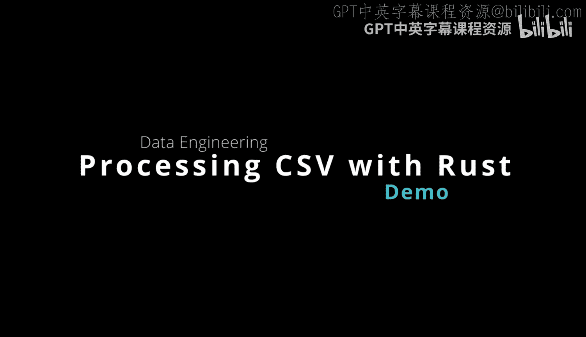
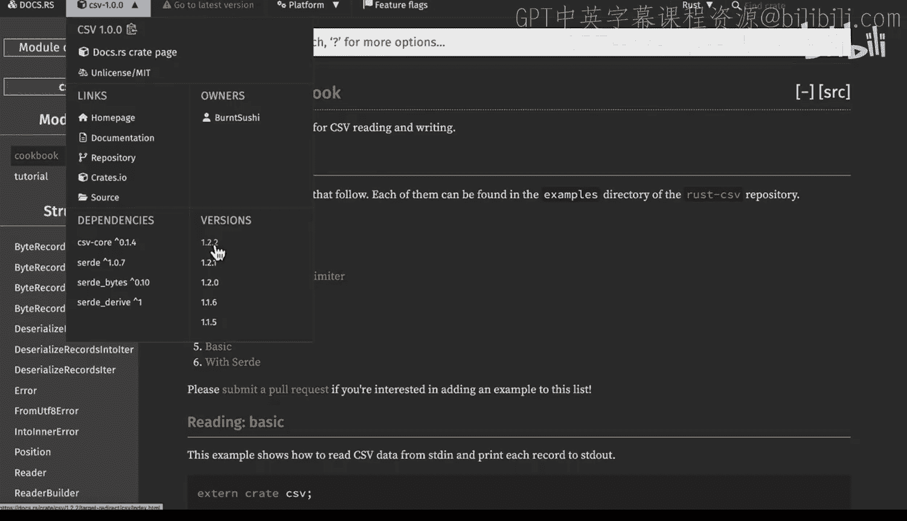

# Rust编程：2-3：使用Rust处理CSV文件 📄



在本节课中，我们将学习如何使用Rust编程语言来读取和处理CSV文件。我们将创建一个简单的项目，使用`csv`库来读取一个包含示例数据的文件，并输出其内容。

---

## 概述

Rust提供了强大的库支持来处理各种数据格式，包括CSV文件。通过使用`csv`库，我们可以轻松地读取、解析和操作CSV数据。本节将引导你完成一个简单的CSV文件读取示例。

---

## 创建新项目

首先，我们需要创建一个新的Rust项目。在AWS Cloud9环境中，我们可以使用`cargo new`命令来初始化项目。

```bash
cargo new csv_demo
```

创建项目后，进入项目目录。

```bash
cd csv_demo
```

---

## 添加依赖库

接下来，我们需要在项目的`Cargo.toml`文件中添加`csv`库作为依赖。Rust的一个优点是我们可以方便地查阅库的文档，以确定所需的版本。

打开`Cargo.toml`文件，在`[dependencies]`部分添加以下内容：

```toml
csv = "1.1"
```

保存文件后，Cargo会自动下载并管理这个依赖。

---




## 准备数据文件

为了演示CSV文件的读取，我们需要一个包含数据的CSV文件。在项目根目录下创建一个名为`data`的目录，用于存放数据文件。

```bash
mkdir data
```

然后，在`data`目录中创建一个名为`text.txt`的文件，并粘贴以下示例数据：

```
name,age,city
Alice,30,New York
Bob,25,Los Angeles
Charlie,35,Chicago
```

---

## 编写代码

现在，我们来编写读取CSV文件的代码。打开`src/main.rs`文件，将默认的“Hello, World!”代码替换为以下内容：

```rust
use std::error::Error;
use std::fs::File;
use std::io;
use csv::Reader;

fn main() -> Result<(), Box<dyn Error>> {
    // 创建CSV读取器
    let file_path = "data/text.txt";
    let file = File::open(file_path)?;
    let mut rdr = Reader::from_reader(file);

    // 遍历并输出每一行记录
    for result in rdr.records() {
        let record = result?;
        println!("{:?}", record);
    }

    Ok(())
}
```

### 代码解析

以下是代码的关键部分解析：

1.  **导入依赖**：我们导入了必要的模块，包括处理错误的`Error`、文件操作的`File`、输入输出的`io`以及CSV读取的`Reader`。
2.  **打开文件**：使用`File::open`打开指定路径的CSV文件。
3.  **创建读取器**：通过`Reader::from_reader`创建一个CSV读取器。
4.  **遍历记录**：使用`for`循环遍历CSV文件中的每一行记录，并打印出来。

---

## 运行程序

代码编写完成后，我们可以使用`cargo run`命令来运行程序。确保终端当前位于项目根目录下，然后执行：

```bash
cargo run
```

如果一切正常，程序将输出CSV文件中的每一行记录，类似于以下内容：

```
StringRecord(["name", "age", "city"])
StringRecord(["Alice", "30", "New York"])
StringRecord(["Bob", "25", "Los Angeles"])
StringRecord(["Charlie", "35", "Chicago"])
```

---

## 总结

在本节课中，我们一起学习了如何使用Rust处理CSV文件。我们创建了一个新项目，添加了`csv`库依赖，准备了一个示例数据文件，并编写了读取和输出CSV文件内容的代码。通过这个简单的示例，你可以看到Rust在数据处理方面的强大能力和简洁性。


如果你想进一步探索CSV文件的处理，`csv`库还提供了许多高级功能，如写入CSV文件、处理自定义分隔符等。希望本节内容对你有所帮助！