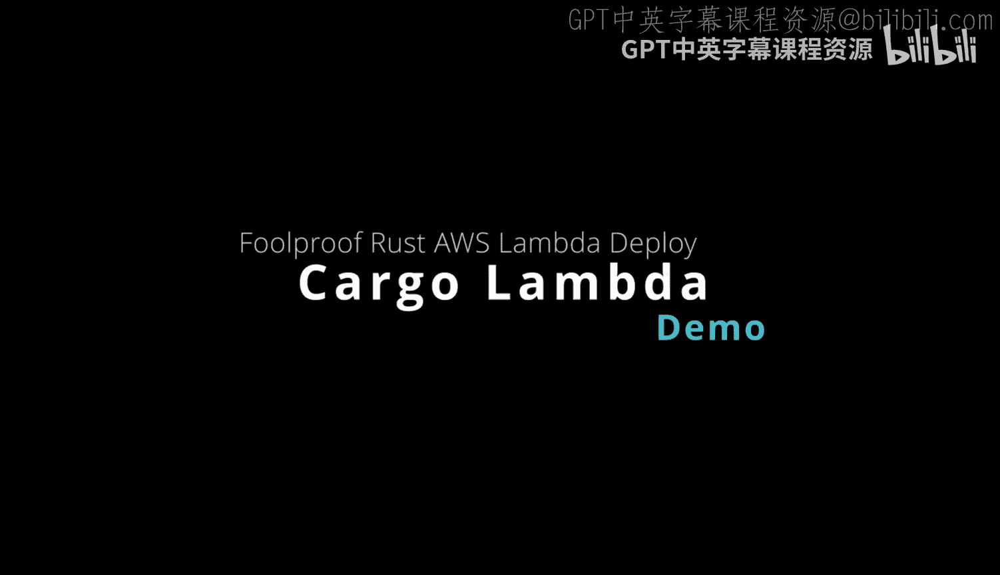
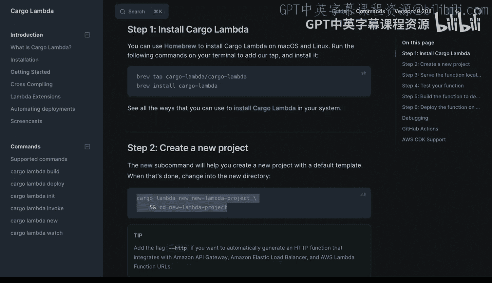
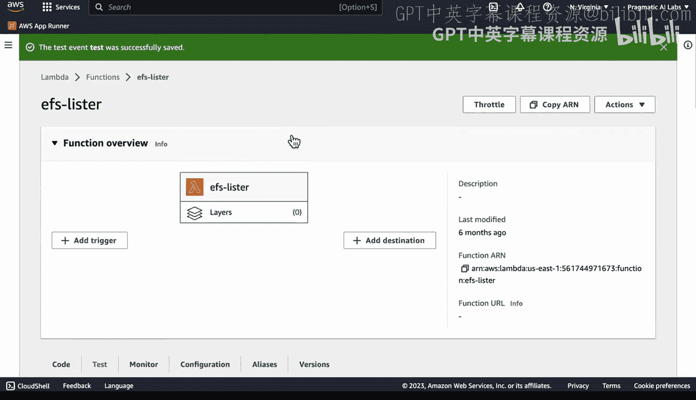
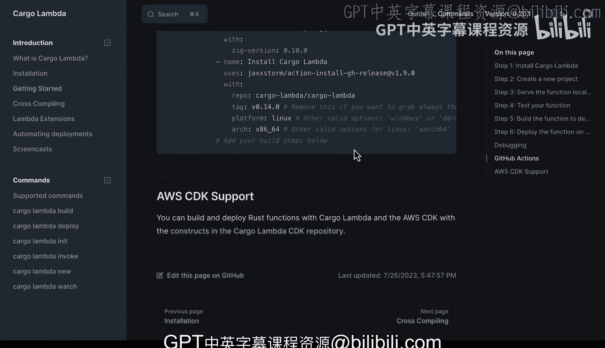

# Rust编程2-3（数据工程、DevOps）：48：使用Cargo Lambda与Rust 🚀



在本节课中，我们将要学习如何使用 **Cargo Lambda** 工具，以极其简单的方式在 AWS Lambda 上部署和运行 Rust 函数。我们将涵盖从安装、本地开发测试到最终部署的完整流程。

---

## 概述

Cargo Lambda 是一个专门为 Rust 语言设计的工具，它极大地简化了在 AWS Lambda 上开发和部署无服务器函数的过程。它消除了复杂的配置和繁琐的工作流，使得 Rust 成为开发 Lambda 函数最便捷的语言之一。

## 安装 Cargo Lambda

要开始使用 Cargo Lambda，首先需要安装它。一种推荐的方式是通过 Homebrew 包管理器进行安装。

以下是安装步骤：
1.  确保你的机器（例如 Cloud9 环境）上已安装 Homebrew。
2.  通过 Homebrew 安装 Cargo Lambda。

安装完成后，你就可以使用 `cargo lambda new` 命令来创建一个新的 Lambda 项目。

## 项目结构与本地开发

上一节我们介绍了如何安装 Cargo Lambda，本节中我们来看看如何创建项目并进行本地开发。

我已经预先设置好了一个项目示例。这个项目名为 `EFs_lister`，其功能是列出挂载的 Elastic File System (EFS) 中的文件。所有代码都位于这个项目目录中。

Cargo Lambda 最强大的功能之一是支持本地测试和仿真。你无需部署到云端，就能在本地环境中运行和调试你的 Lambda 函数代码。

### 启动本地仿真服务





为了在本地测试函数，我们需要启动 Cargo Lambda 的监视模式。这个模式会运行一个本地仿真环境。

以下是启动命令：
```bash
cargo lambda watch
```
执行此命令后，一个本地 Lambda 仿真服务就会启动。由于 Rust 是编译型语言，直接生成二进制文件，因此这个过程非常轻量，无需依赖 Docker 等复杂容器。

### 本地调用函数

本地服务运行起来后，我们就可以像调用真实 Lambda 函数一样来测试它。

以下是调用命令：
```bash
cargo lambda invoke
```
在我的示例中，函数接受一个 `name` 参数。执行上述命令后，函数会运行其生产环境中的逻辑——即列出我的 EFS 文件系统中的文件。我可以通过在终端执行 `ls -l /mnt/efs` 命令来验证输出结果，两者是完全一致的。

## 构建与部署

我们已经学会了如何在本地开发和测试函数，接下来看看如何将其构建并部署到 AWS Lambda。

### 构建发布版本

首先，我们需要为生产环境构建一个优化的发布版本。

以下是构建命令：
```bash
cargo lambda build --release
```
这个命令会编译项目中的所有依赖，并生成一个可用于部署的二进制文件。对于 AWS Lambda 这类服务，直接部署二进制文件是最高效的方式。

### 部署到 AWS Lambda

构建完成后，最后一步就是将函数部署到云端。

以下是部署命令：
```bash
cargo lambda deploy
```
值得注意的是，Cargo Lambda 支持部署到 **ARM64** 架构，这可以为你节省大量的运行成本。执行部署命令后，你的 Rust 函数就会被快速上传并配置到 AWS Lambda 上。使用 Cargo Lambda 部署代码的速度极快，流程也非常简单。

## 其他功能与总结

除了我们介绍的核心功能，Cargo Lambda 还支持更多高级特性，例如集成调试、设置 GitHub Actions 工作流以及配置各种事件源（Event Sources）等。

总而言之，Cargo Lambda 将原本在其他脚本语言中可能有些令人畏惧的 AWS Lambda 开发流程变得非常简单直接。它提供了从本地仿真到云端部署的一站式解决方案。

本节课中我们一起学习了：
1.  **Cargo Lambda 的安装方法**。
2.  如何创建项目并使用 **`cargo lambda watch`** 进行本地仿真开发。
3.  如何通过 **`cargo lambda invoke`** 在本地测试函数逻辑。
4.  使用 **`cargo lambda build --release`** 构建发布版本。
5.  使用 **`cargo lambda deploy`** 一键部署到 AWS Lambda。



我强烈推荐你尝试使用 Cargo Lambda，其代码实现也相当直观易懂。我们将在另一个演示视频中再见。