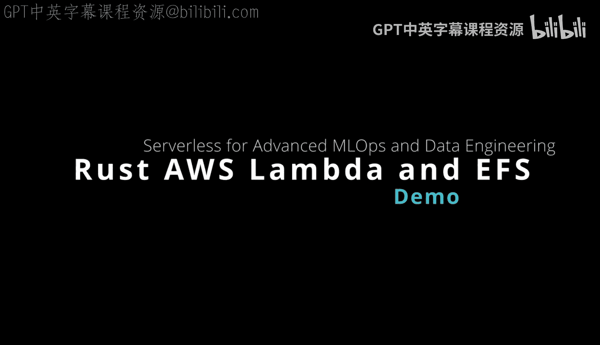
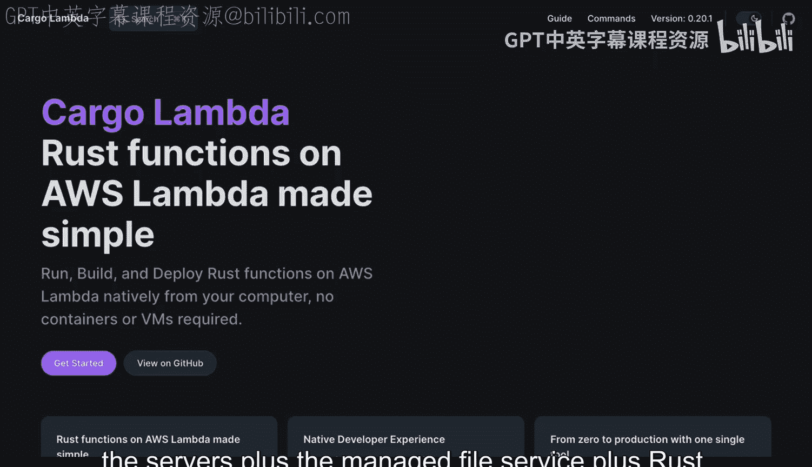
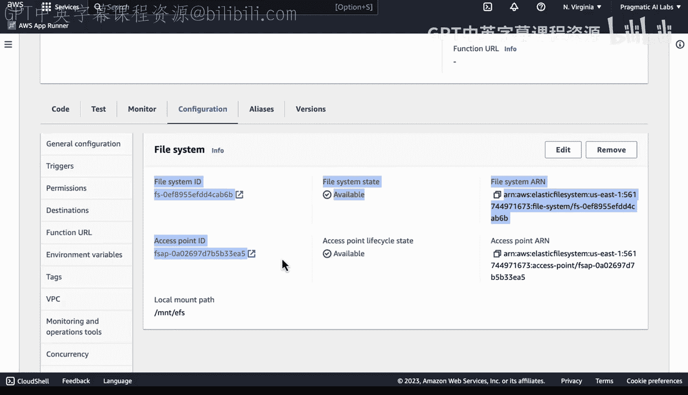
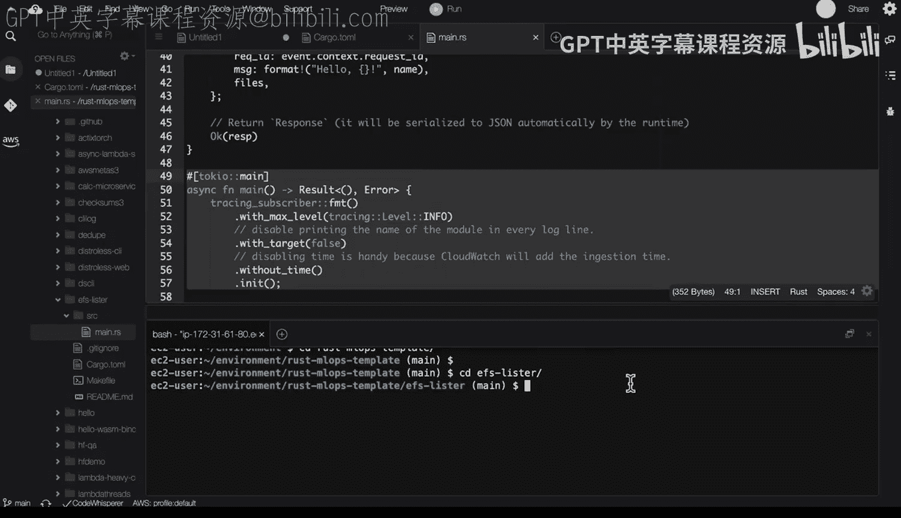
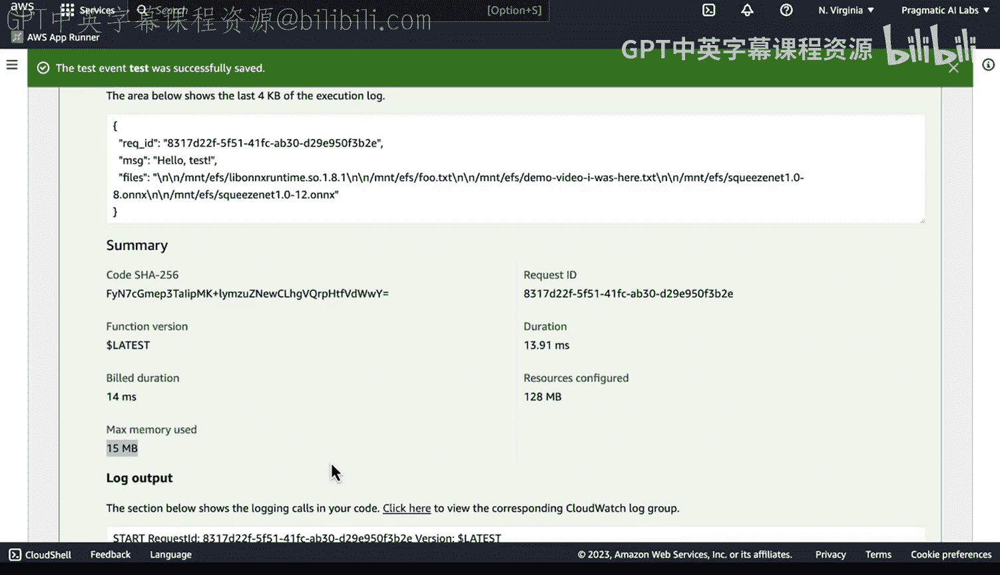
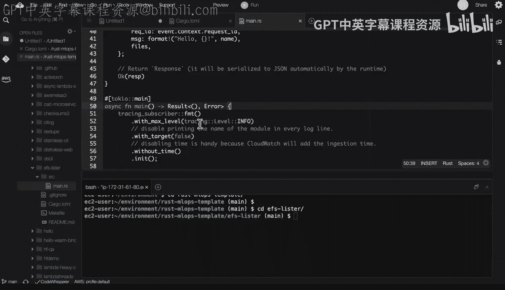

# 049：49_03_04_Rust列出AWS EFS文件 📂



在本节课中，我们将学习如何结合使用Rust、AWS Lambda和AWS EFS（弹性文件系统）来构建一个高效、按需付费的文件列表服务。我们将看到Cargo Lambda如何简化部署流程，以及EFS如何为无服务器工作流提供可扩展的共享存储。

---

## 概述：Rust、Lambda与EFS的强大组合 💪

Cargo Lambda是一个将Rust函数部署到AWS Lambda的优秀工具。它极大地简化了现代编译语言（如Rust）在无服务器环境下的工作流程。在本演示中，我将展示Cargo Lambda如何与AWS EFS结合使用。EFS是AWS提供的托管挂载文件系统。这三者的结合——无服务器计算、托管文件服务和Rust语言——能够实现一些前所未有的新功能。

上一节我们介绍了这个组合的潜力，本节中我们来看看具体的实现。



---

## 认识AWS EFS（弹性文件系统） ☁️

首先，让我们了解一下EFS。如上图所示，弹性文件系统非常出色。在这个例子中，我只使用了17兆字节的存储，但它可以自动扩展到TB级别。更重要的是，它是一种按需付费的资源，我不需要一次性为TB级别的容量付费，只需为实际使用的部分付费。这使得它成为无服务器工作流中理想的临时性资源。

了解了EFS的基本概念后，接下来我们看看如何在Lambda中配置和使用它。

---

## 配置Lambda访问EFS 🛠️

接下来，我将使用一个已经部署好的Lambda函数，名为“EFS Lister”。这个函数的精妙之处在于，我已经配置好，使得EFS文件系统可以直接挂载到这个Lambda函数内部。当Lambda启动并执行任务时，它已经具备了直接访问该文件系统的能力。

这是一个非常有趣的模式：在不需要时，我不需要为文件系统或Lambda支付任何费用；只有在实际使用时才产生成本。并且，由于使用了Rust，它的运行效率将非常高。



那么，问题来了：我该如何针对这个环境进行开发呢？

---

## 使用AWS Cloud9进行开发 💻

一种方法是使用AWS Cloud9。如上图所示，我已经在Cloud9中设置好了一些Rust开发环境。运行 `rustc --version` 可以看到Rust已经安装完毕。另一个好处是，我可以查看历史命令，了解之前是如何挂载文件系统的。

回顾历史，我只需要按照这些指示操作即可。为了简便，我可以创建一个新文件，将这些命令粘贴进去然后执行。

以下是挂载EFS的具体步骤：

1.  **创建挂载点目录**：首先，我们需要创建一个目录作为EFS的本地挂载点。
    ```bash
    mkdir /mnt/efs
    ```
    （如果目录已存在，此命令会提示，但无妨。）

2.  **挂载EFS文件系统**：使用正确的命令将远程的EFS挂载到上一步创建的本地目录。
    ```bash
    sudo mount -t nfs4 -o nfsvers=4.1,rsize=1048576,wsize=1048576,hard,timeo=600,retrans=2,noresvport fs-xxxxxxxx.efs.region.amazonaws.com:/ /mnt/efs
    ```
    （请将 `fs-xxxxxxxx` 和 `region` 替换为你自己的EFS文件系统ID和区域。）

3.  **验证挂载**：我们可以运行命令检查挂载是否成功，并查看目录内容。
    ```bash
    ls /mnt/efs
    ```
    如果成功，我们将能看到EFS中存储的文件，例如一些大型语言模型的预训练文件等。

现在，我们可以在该目录下创建新文件进行测试：
```bash
echo "Hello from EFS" > /mnt/efs/demo_video_i_was_here.txt
ls /mnt/efs
```
可以看到新文件 `demo_video_i_was_here.txt` 已经存在。这证明了我们的开发环境已经能够正常访问EFS。

环境准备就绪后，让我们把目光转向实现这一功能的Rust代码。

---

## 解析Rust Lambda代码 🦀

现在，让我们查看实际与EFS交互的代码。这是一个名为“EFS Lister”的项目。

首先，我们看一下 `Cargo.toml` 文件，它定义了项目的依赖关系：
```toml
[package]
name = "efs-lister"
version = "0.1.0"

[dependencies]
tokio = { version = "1", features = ["full"] }
lambda_runtime = "0.7"
tracing = "0.1"
tracing-subscriber = { version = "0.3", features = ["env-filter"] }
```
关键依赖包括 `lambda_runtime`（用于构建Lambda函数）以及Tokio和Tracing（AWS推荐用于Lambda的异步运行时和日志记录库）。我们使用Cargo Lambda系统来部署它。

接下来，我们查看主要的源代码 `src/main.rs`。代码主要包含三部分：

1.  **数据结构**：用于序列化和反序列化Lambda事件与响应的数据。
    ```rust
    use serde::{Deserialize, Serialize};

    #[derive(Deserialize)]
    struct Request {
        name: String,
    }

    #[derive(Serialize)]
    struct Response {
        req_id: String,
        files: Vec<String>,
    }
    ```

2.  **核心辅助函数**：一个异步函数，用于列出EFS卷中的文件。
    ```rust
    async fn list_files_in_efs(path: &str) -> Result<Vec<String>, std::io::Error> {
        let mut entries = tokio::fs::read_dir(path).await?;
        let mut file_names = Vec::new();
        while let Some(entry) = entries.next_entry().await? {
            let file_name = entry.file_name().into_string().unwrap_or_default();
            file_names.push(file_name);
        }
        Ok(file_names)
    }
    ```
    这个函数异步读取指定目录，并将文件名收集到一个列表中。



3.  **Lambda处理函数**：将以上部分组合起来，形成完整的Lambda处理器。
    ```rust
    async fn function_handler(event: LambdaEvent<Request>) -> Result<Response, Error> {
        let path = "/mnt/efs"; // EFS在Lambda中的挂载路径
        let files = list_files_in_efs(path).await?;
        let resp = Response {
            req_id: event.context.request_id,
            files,
        };
        Ok(resp)
    }

    #[tokio::main]
    async fn main() -> Result<(), Error> {
        tracing_subscriber::fmt().init();
        let func = service_fn(function_handler);
        lambda_runtime::run(func).await?;
        Ok(())
    }
    ```
    主函数初始化日志，并启动Lambda运行时来运行我们的处理函数。

这段代码在功能上类似于用Python等脚本语言编写的AWS Lambda，但其效率极高，并且部署过程（通过Cargo Lambda）非常简单。

理解了代码结构，最后我们来测试这个已部署的Lambda函数。

---

## 测试与性能分析 ⚡

我们可以通过AWS Lambda控制台来测试这个函数。如上图所示，我们创建一个测试事件。

由于我们的 `Request` 结构需要一个 `name` 字段，测试事件内容如下：
```json
{
  "name": "test"
}
```
保存并执行测试后，Lambda成功返回了响应。在响应体中，我们看到了文件列表，其中就包含我们之前创建的 `demo_video_i_was_here.txt` 文件。

这里有几个关键指标值得注意：
*   **构建持续时间**：14毫秒。这展现了惊人的效率。
*   **内存使用**：也极为高效。

这种级别的性能是脚本语言难以企及的。Rust在提供接近C语言性能的同时，还通过其所有权模型保证了内存安全。此外，部署也非常简单，只需要推送编译后的二进制文件即可。

---

## 总结 🎯



本节课中，我们一起学习了如何将EFS这一新兴标准与Rust及AWS Lambda生态系统相结合。这种组合特别适用于大型语言模型、数据工程等场景，值得各个组织深入研究和探索。



回顾我们的代码，它非常简洁明了，不到50行就实现了一个功能完整的Lambda。我们知道，Rust是最安全的语言之一，能提供媲美C语言的性能。因此，请尝试在你的组织中探索EFS、Lambda和Rust的结合使用，它们将为你带来高效、安全且成本优化的无服务器解决方案。