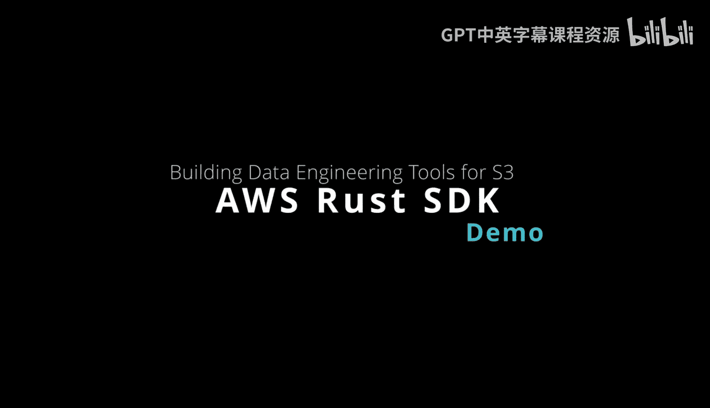
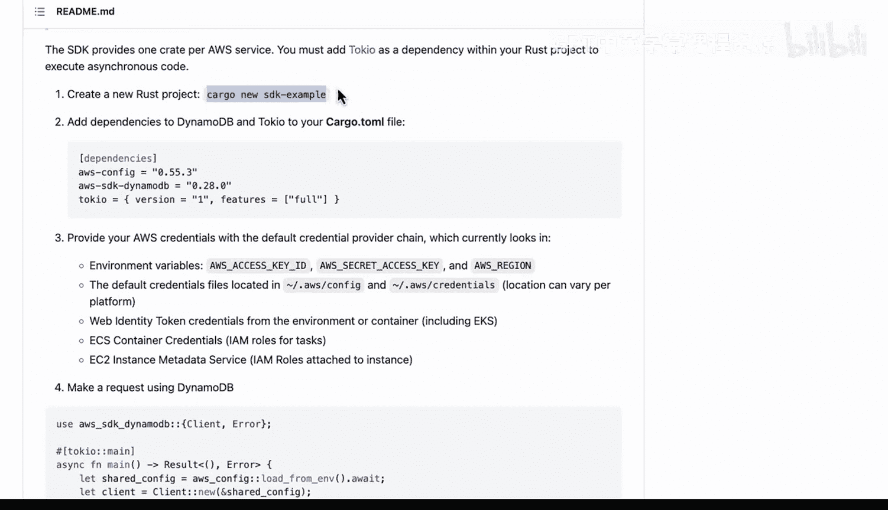
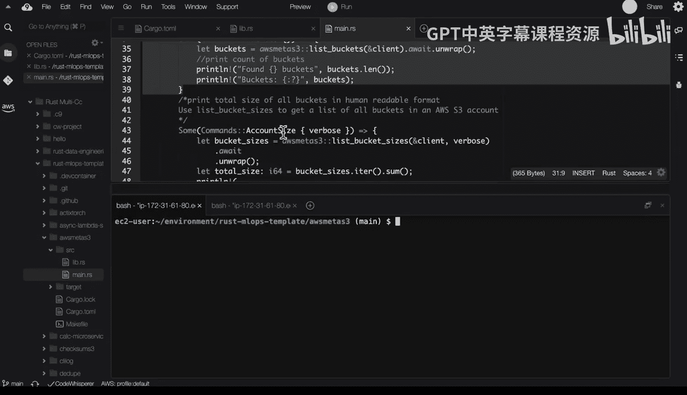

# 051：使用Rust调用AWS S3存储 🚀



在本节课中，我们将学习如何使用Rust编程语言调用AWS S3存储服务。我们将探讨AWS SDK for Rust的优势，并通过一个实际示例来演示如何创建项目、配置依赖以及执行S3操作。课程内容旨在让初学者能够理解并上手使用Rust进行AWS开发。

---

## 概述 📋

AWS SDK for Rust是一个强大的工具，用于在AWS云平台上进行开发。Rust作为一种现代编译型语言，在线程、异步编程、安全性和部署等方面具有天然优势，使其成为处理像AWS这样的云服务提供商的理想工具。



## Rust与AWS SDK的优势 ⚡

上一节我们介绍了课程概述，本节中我们来看看为什么选择Rust和AWS SDK进行开发。Rust语言提供了许多其他脚本语言或旧式编译语言所不具备的解决方案。

以下是Rust的一些核心优势：
*   **现代编译语言**：提供高性能和安全性。
*   **原生支持异步编程**：通过`async/await`语法高效处理网络请求。
*   **出色的线程安全**：借助所有权和借用检查器，避免数据竞争。
*   **部署简便**：编译为单一可执行文件，易于分发和运行。

## 项目示例与实践 🛠️

现在，让我们通过一个具体的例子来看看如何使用这个SDK。首先，我们需要创建一个新的Rust项目并添加必要的依赖。

创建一个新项目的命令如下：
```bash
cargo new sdk_example
```

然后，需要在项目的`Cargo.toml`文件中添加依赖。以下是一个示例配置：
```toml
[package]
name = "aws_meta_s3"

[dependencies]
aws-config = "0.55"
aws-sdk-s3 = "0.28"
tokio = { version = "1", features = ["full"] }
clap = { version = "4.0", features = ["derive"] }
```

## 代码解析与功能实现 💻

在配置好依赖之后，我们来看看项目的主要代码实现。代码库中包含几个关键函数。

以下是核心功能的简要说明：
*   **创建客户端**：一个`async`的公共函数，用于初始化AWS S3客户端。
*   **列出存储桶**：一个`async`函数，用于高效地列出账户中的所有S3存储桶。
*   **计算存储桶大小**：通过累加存储桶内所有对象的大小来计算总容量。对于包含大量文件的存储桶，这是一个计算密集型操作，但得益于Rust的高效性，它可以快速完成。

此外，项目还使用`clap`库包装了一个命令行工具前端，方便用户通过命令调用这些功能。

## 运行与测试 ▶️

在理解了代码结构后，我们可以在Cloud 9环境中运行这个项目。由于Cloud 9实例通常性能较强，且已配置好安全令牌和API调用权限，因此编译和运行过程会非常顺畅。

使用以下命令运行项目：
```bash
cargo run -- --help
```

此命令会编译项目并显示命令行工具的帮助信息。工具主要提供两个子命令。

以下是可用的命令选项：
*   **buckets**：列出AWS账户中的所有S3存储桶。
*   **account-size**：计算并汇总账户中所有存储桶的总数据量。

我们可以分别测试这两个功能。首先测试列出存储桶：
```bash
cargo run -- buckets
```

然后测试计算账户总容量。这是一个潜在的重度操作，但由于Rust的异步特性和与AWS的良好集成，执行速度非常快：
```bash
cargo run -- account-size
```

## 总结 🎯



本节课中我们一起学习了如何使用Rust和AWS SDK进行S3存储操作。我们了解了Rust语言在云开发中的优势，逐步实践了从创建项目、添加依赖、编写核心功能代码到最终运行和测试的完整流程。AWS Rust SDK是数据工程领域一个新兴且强大的工具，本节课的内容为初学者提供了一个实用的入门起点。