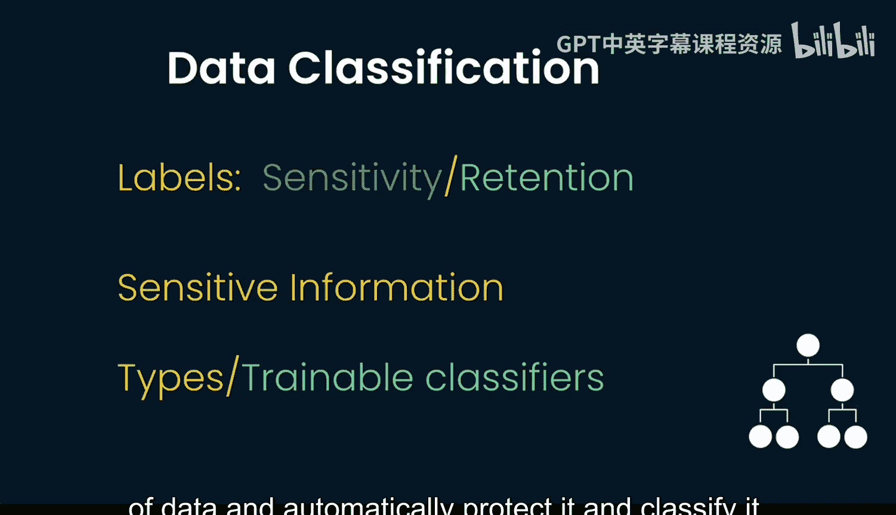
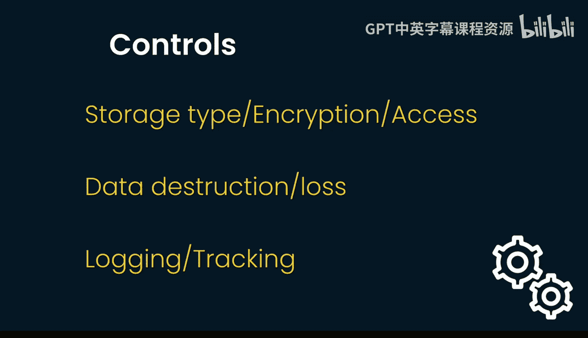

# 056：加载含敏感数据的数据框 🔐

在本节课中，我们将学习如何安全地加载包含敏感信息的数据框。核心在于理解并应用数据分类与保护机制，确保敏感数据在加载时得到妥善处理。

上一节我们介绍了数据框的基本操作，本节中我们来看看如何处理其中的敏感数据。

## 数据分类方法论 📊

首先，需要关注所使用的数据分类方法。最常见的方式之一是使用不同的标签来标记数据。

以下是几种常见的标签类型：

*   **敏感度标签**：适用于特定信息，标识其敏感级别。
*   **保留期标签**：规定数据应保留多长时间。
*   **通用敏感信息标签**：将数据整体标记为敏感。

此外，还有不同的分类器类型，例如**可训练分类器**。这种分类器能够自动检测特定类型的数据并对其进行保护和分类。

## 控制措施设置 🛡️

一旦设置了这些分类控制，就可以进一步配置不同的保护层面。

以下是需要配置的关键方面：

*   **存储类型**：选择安全的存储介质。
*   **加密**：对静态和传输中的数据进行加密。
*   **访问控制**：限制谁可以访问数据。
*   **数据销毁**：安全地删除不再需要的数据。
*   **数据丢失防护与日志记录**：监控数据访问行为，记录谁在何时访问了哪些资源。
*   **资源追踪**：跟踪数据资源的移动路径。

## 安全加载数据框 ✅

最后，在完成所有上述准备工作后，就可以安全地从数据框加载信息了，因为数据已被正确分类和保护。

被编辑的敏感信息，在数据框实际加载时，要么会被置为**null**值，要么根本不会显示出来。因此，安全加载数据框的一个关键方面在于背后的分类工作、成功的模型训练。这些前期工作完成后，在加载数据框时就不需要额外的操作了，数据已经是预先处理好的状态。

本节课中我们一起学习了安全加载含敏感数据数据框的完整流程：从理解数据分类方法论，到设置各项安全控制措施，最终实现数据的安全加载。关键在于通过前期完善的分类和保护机制，确保敏感信息在访问时自动得到屏蔽或处理。